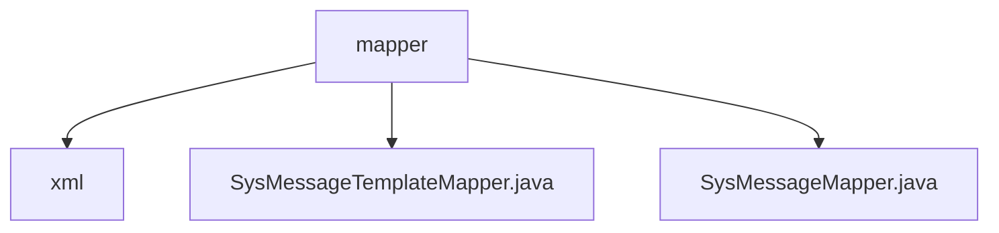

# 基础信息

|      |      |
|------|------|
| 名称 | mapper |
| 编码语言 | .java |
| 代码路径 | JeecgBoot/jeecg-boot/jeecg-module-system/jeecg-system-biz/src/main/java/org/jeecg/modules/message/mapper |
| 包名 | JeecgBoot.jeecg-boot.jeecg-module-system.jeecg-system-biz.src.main.java.org.jeecg.modules.message.mapper |
| 概述说明 | 输入内容为空，无法生成总结描述。 |

# 说明

## 概述
该代码模块属于JeecgBoot项目中的`jeecg-module-system`模块，主要涉及消息管理相关的功能。模块中包含两个关键的Mapper接口文件：`SysMessageTemplateMapper.java`和`SysMessageMapper.java`。这些Mapper接口负责与数据库进行交互，处理消息模板和消息数据的持久化操作。

## 主要业务场景
1. **消息模板管理**：通过`SysMessageTemplateMapper.java`接口，系统可以对消息模板进行增删改查操作。消息模板用于定义消息的格式和内容，支持多种消息类型（如短信、邮件等）的模板配置。
2. **消息管理**：通过`SysMessageMapper.java`接口，系统可以对发送的消息进行管理。包括消息的创建、查询、更新和删除等操作，确保消息能够准确、及时地发送给目标用户。
3. **消息发送与记录**：该模块支持消息的发送功能，并通过Mapper接口将发送记录存储到数据库中，便于后续的查询和统计。

总的来说，该模块为JeecgBoot系统提供了强大的消息管理能力，支持多种消息类型的模板配置和发送记录管理，适用于需要高效消息处理的业务场景。

### 包内部结构视图

该流程图展示了JeecgBoot项目中`message`模块下的`mapper`目录的层级结构。`mapper`目录包含两个Java文件（`SysMessageTemplateMapper.java`和`SysMessageMapper.java`）以及一个子目录`xml`。通过该图可以清晰地看到`mapper`目录下的文件和组织结构。

# 文件列表 File List

| 名称   | 类型  | 说明 |
|-------|------|-------------|
| [SysMessageMapper.java](SysMessageMapper.md) | file | 信息为空，无法生成概要描述。 |
| [SysMessageTemplateMapper.java](SysMessageTemplateMapper.md) | file | 无内容，无法生成概要描述。 |
| [xml](xml/_module.md) | package | None |

