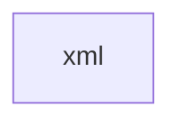

# 基础信息

|      |      |
|------|------|
| 名称 | xml |
| 编码语言 | .java |
| 代码路径 | JeecgBoot/jeecg-boot/jeecg-module-system/jeecg-system-biz/src/main/java/org/jeecg/modules/message/mapper/xml |
| 包名 | JeecgBoot.jeecg-boot.jeecg-module-system.jeecg-system-biz.src.main.java.org.jeecg.modules.message.mapper.xml |
| 概述说明 | None |

# 说明

None

### 包内部结构视图

描述：该流程图展示了一个简单的层级关系，路径的最终元素为 `xml`，表示这是一个位于 `mapper` 目录下的文件夹或文件。由于路径中只有一个元素，因此流程图仅包含一个节点。

# 文件列表 File List

| 名称   | 类型  | 说明 |
|-------|------|-------------|

