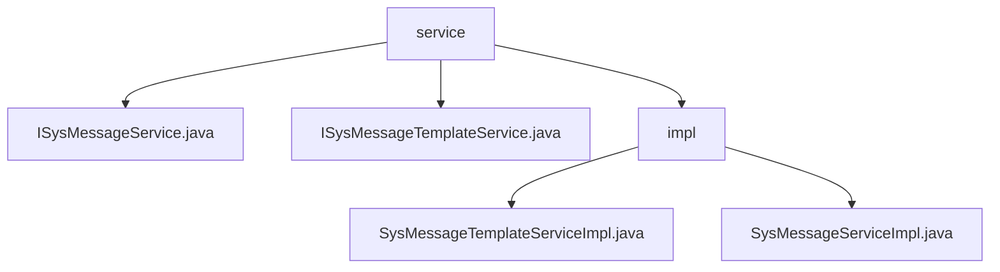

# 基础信息

|      |      |
|------|------|
| 名称 | service |
| 编码语言 | .java |
| 代码路径 | JeecgBoot/jeecg-boot/jeecg-module-system/jeecg-system-biz/src/main/java/org/jeecg/modules/message/service |
| 包名 | JeecgBoot.jeecg-boot.jeecg-module-system.jeecg-system-biz.src.main.java.org.jeecg.modules.message.service |
| 概述说明 | 该模块处理系统消息和模板管理，支持高效消息处理和模板查询。 |

# 说明

## 概述

该代码模块主要处理与系统消息相关的业务逻辑，包括消息模板的管理和系统消息的处理。模块中包含两个核心类：`SysMessageTemplateServiceImpl` 和 `SysMessageServiceImpl`。`SysMessageTemplateServiceImpl` 类负责消息模板的查询和管理，而 `SysMessageServiceImpl` 类则负责系统消息的处理。这两个类通过实现相应的接口，提供了高效的消息管理和检索功能，支持系统在需要时快速获取和使用消息数据。

## 主要业务场景

1. **消息模板管理**：`SysMessageTemplateServiceImpl` 类通过 `selectByCode` 方法实现消息模板的查询功能。系统可以根据指定的模板代码快速获取相应的模板信息，确保在发送消息时能够使用正确的模板格式。这一功能在需要频繁使用消息模板的场景中尤为重要，如批量发送通知、邮件或短信等。

2. **系统消息处理**：`SysMessageServiceImpl` 类继承自 `JeecgServiceImpl` 类，并实现了 `ISysMessageService` 接口，提供了系统消息的处理能力。该类不仅继承了 `JeecgServiceImpl` 的基础功能，还通过接口扩展了特定的消息服务功能，支持系统在运行时处理各种类型的消息，如用户通知、系统警报等。这种设计模式有助于代码的复用和扩展，确保系统能够灵活应对不同的消息处理需求。

通过这些功能，该模块为系统提供了高效、灵活的消息管理和处理能力，支持在各种业务场景中快速、准确地发送和处理消息。

### 包内部结构视图

该流程图展示了`service`目录下的文件结构，`service`包含两个接口文件`ISysMessageService.java`和`ISysMessageTemplateService.java`，以及一个`impl`子目录。`impl`子目录中包含两个实现类文件`SysMessageTemplateServiceImpl.java`和`SysMessageServiceImpl.java`。整个结构清晰地反映了服务接口与其实现类之间的层级关系。

# 文件列表 File List

| 名称   | 类型  | 说明 |
|-------|------|-------------|
| [ISysMessageService.java](ISysMessageService.md) | file | 信息为空，无法生成概要描述。 |
| [ISysMessageTemplateService.java](ISysMessageTemplateService.md) | file | 无内容提供，无法生成概要描述。 |
| [impl](impl/_module.md) | package | SysMessageTemplateServiceImpl实现查询模板功能，SysMessageServiceImpl继承并扩展消息服务功能。 |

