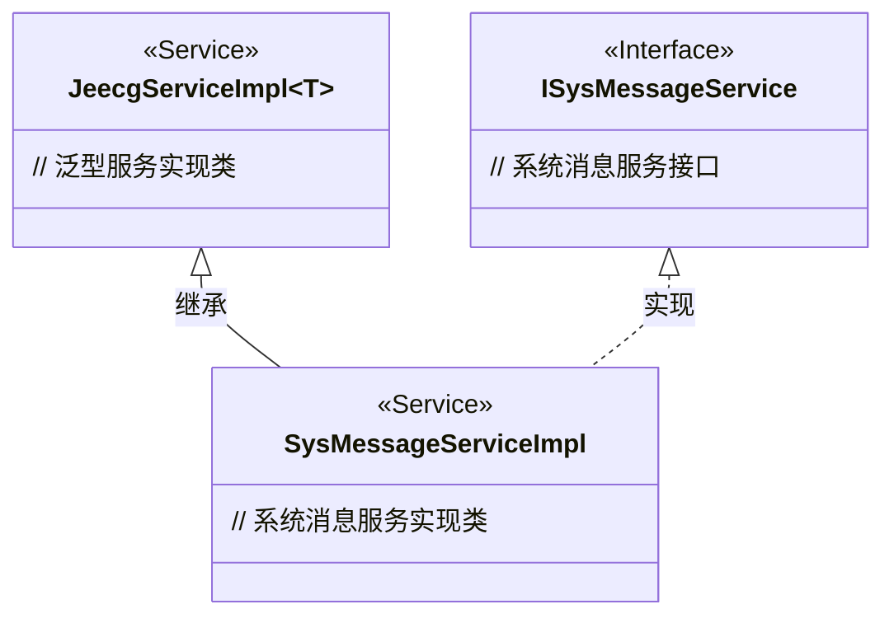
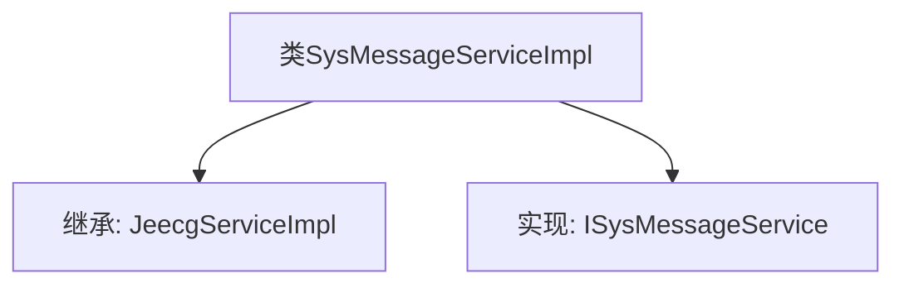

# 基础信息

|      |      |
|------|------|
| 名称 | SysMessageServiceImpl |
| 编码语言 | .java |
| 代码路径 | JeecgBoot/jeecg-boot/jeecg-module-system/jeecg-system-biz/src/main/java/org/jeecg/modules/message/service/impl/SysMessageServiceImpl.java |
| 包名 | org.jeecg.modules.message.service.impl |
| 依赖项 | ['org.jeecg.common.system.base.service.impl.JeecgServiceImpl', 'org.jeecg.modules.message.entity.SysMessage', 'org.jeecg.modules.message.mapper.SysMessageMapper', 'org.jeecg.modules.message.service.ISysMessageService', 'org.springframework.stereotype.Service'] |
| 概述说明 | SysMessageServiceImpl类继承JeecgServiceImpl并实现ISysMessageService接口。 |

# 说明

SysMessageServiceImpl类继承自JeecgServiceImpl类，并实现了ISysMessageService接口。这表明SysMessageServiceImpl类不仅继承了JeecgServiceImpl类的功能，还通过实现ISysMessageService接口提供了特定的消息服务功能。这种设计模式有助于代码的复用和扩展，同时确保类具备处理系统消息的能力。

# 类列表 Class Summary

| 名称   | 类型  | 说明 |
|-------|------|-------------|
| SysMessageServiceImpl | class | SysMessageServiceImpl类继承JeecgServiceImpl并实现ISysMessageService接口。 |

## 类 SysMessageServiceImpl

|      |      |
|------|------|
| 访问范围 | @Service;public |
| 类型 | class |
| 名称 | SysMessageServiceImpl |
| 说明 | SysMessageServiceImpl类继承JeecgServiceImpl并实现ISysMessageService接口。 |

### UML类图

**描述：**
`SysMessageServiceImpl` 是一个系统消息服务实现类，继承自泛型服务实现类 `JeecgServiceImpl`，并实现了 `ISysMessageService` 接口。`JeecgServiceImpl` 是一个通用的服务实现类，支持泛型类型 `T`，而 `ISysMessageService` 是系统消息服务的接口定义。`SysMessageServiceImpl` 通过继承和实现的方式，将通用服务功能与特定业务逻辑结合起来，提供了系统消息的具体实现。

### 内部方法调用关系图

这段代码定义了一个名为 `SysMessageServiceImpl` 的服务类，该类继承自 `JeecgServiceImpl` 并实现了 `ISysMessageService` 接口。`JeecgServiceImpl` 是一个泛型类，接受 `SysMessageMapper` 和 `SysMessage` 作为类型参数。`SysMessageServiceImpl` 类的主要作用是提供与系统消息相关的服务实现，继承和实现的关系确保了类能够复用 `JeecgServiceImpl` 的功能，并满足 `ISysMessageService` 接口的契约。

### 字段列表 Field List

| 名称  | 类型  | 说明 |
|-------|-------|------|

### 方法列表 Method List

| 名称  | 类型  | 说明 |
|-------|-------|------|

