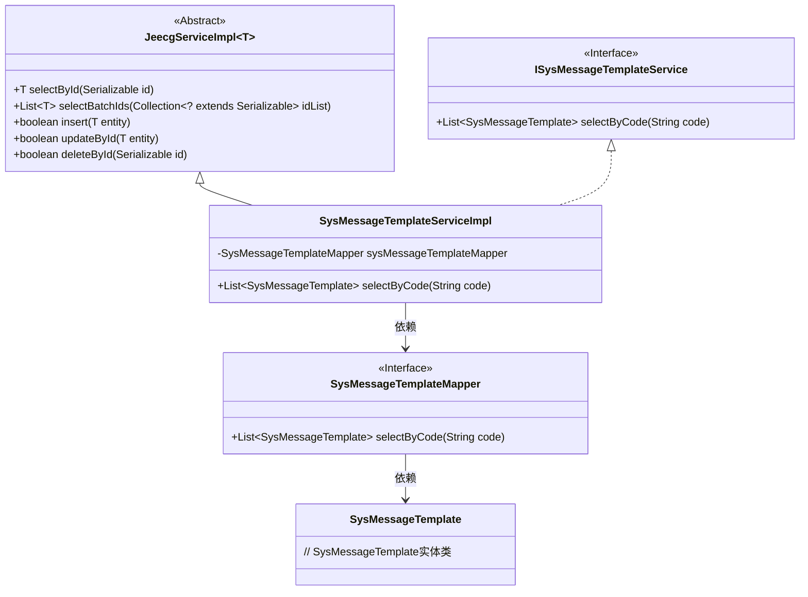
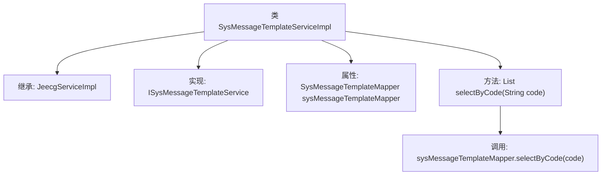

# 基础信息

|      |      |
|------|------|
| 名称 | SysMessageTemplateServiceImpl |
| 编码语言 | .java |
| 代码路径 | JeecgBoot/jeecg-boot/jeecg-module-system/jeecg-system-biz/src/main/java/org/jeecg/modules/message/service/impl/SysMessageTemplateServiceImpl.java |
| 包名 | org.jeecg.modules.message.service.impl |
| 依赖项 | ['org.jeecg.common.system.base.service.impl.JeecgServiceImpl', 'org.jeecg.modules.message.entity.SysMessageTemplate', 'org.jeecg.modules.message.mapper.SysMessageTemplateMapper', 'org.jeecg.modules.message.service.ISysMessageTemplateService', 'org.springframework.beans.factory.annotation.Autowired', 'org.springframework.stereotype.Service', 'java.util.List'] |
| 概述说明 | SysMessageTemplateServiceImpl类实现接口，提供selectByCode方法查询模板。 |

# 说明

SysMessageTemplateServiceImpl类实现了ISysMessageTemplateService接口，主要功能是通过selectByCode方法查询模板。该类负责处理与消息模板相关的业务逻辑，确保能够根据指定的代码获取相应的模板信息。这一实现使得系统能够高效地管理和检索消息模板，支持在需要时快速获取和使用模板数据。

# 类列表 Class Summary

| 名称   | 类型  | 说明 |
|-------|------|-------------|
| SysMessageTemplateServiceImpl | class | SysMessageTemplateServiceImpl类实现ISysMessageTemplateService接口，通过selectByCode方法查询模板。 |

## 类 SysMessageTemplateServiceImpl

|      |      |
|------|------|
| 访问范围 | @Service;public |
| 类型 | class |
| 名称 | SysMessageTemplateServiceImpl |
| 说明 | SysMessageTemplateServiceImpl类实现ISysMessageTemplateService接口，通过selectByCode方法查询模板。 |

### UML类图

这段代码描述了一个服务实现类 `SysMessageTemplateServiceImpl`，它继承了 `JeecgServiceImpl` 并实现了 `ISysMessageTemplateService` 接口。该类通过 `SysMessageTemplateMapper` 来操作 `SysMessageTemplate` 实体类，主要提供了根据代码查询消息模板的功能。类图中清晰地展示了类之间的继承、实现和依赖关系，帮助理解代码的结构和功能。

### 内部方法调用关系图

这段代码定义了一个名为`SysMessageTemplateServiceImpl`的服务类，它继承自`JeecgServiceImpl`并实现了`ISysMessageTemplateService`接口。类中包含一个`SysMessageTemplateMapper`类型的属性，并通过`@Autowired`注解进行依赖注入。`selectByCode`方法用于根据传入的`code`参数查询并返回`SysMessageTemplate`类型的列表，具体查询逻辑由`sysMessageTemplateMapper.selectByCode(code)`实现。

### 字段列表 Field List

| 名称  | 类型  | 说明 |
|-------|-------|------|
| sysMessageTemplateMapper | SysMessageTemplateMapper | 自动注入系统消息模板映射器。 |

### 方法列表 Method List

| 名称  | 类型  | 说明 |
|-------|-------|------|
| selectByCode | List<SysMessageTemplate> | 重写方法，通过代码查询系统消息模板列表。 |

