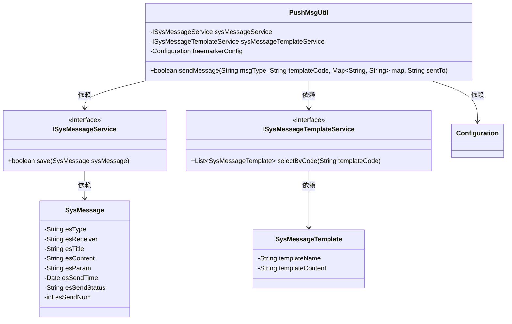
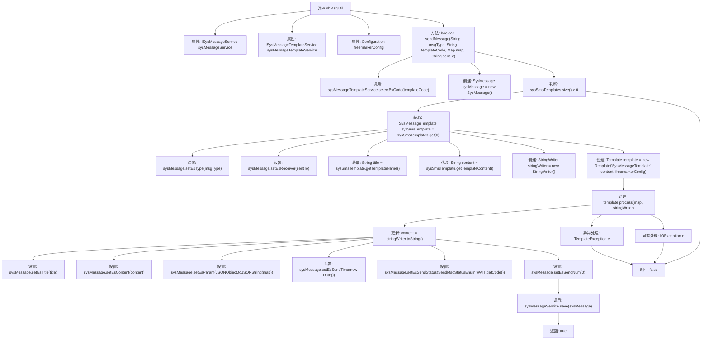

# 基础信息

|      |      |
|------|------|
| 名称 | PushMsgUtil |
| 编码语言 | .java |
| 代码路径 | JeecgBoot/jeecg-boot/jeecg-module-system/jeecg-system-biz/src/main/java/org/jeecg/modules/message/util/PushMsgUtil.java |
| 包名 | org.jeecg.modules.message.util |
| 依赖项 | ['freemarker.template.Configuration', 'freemarker.template.Template', 'freemarker.template.TemplateException', 'org.jeecg.modules.message.entity.SysMessage', 'org.jeecg.modules.message.entity.SysMessageTemplate', 'org.jeecg.modules.message.handle.enums.SendMsgStatusEnum', 'org.jeecg.modules.message.service.ISysMessageService', 'org.jeecg.modules.message.service.ISysMessageTemplateService', 'org.springframework.beans.factory.annotation.Autowired', 'org.springframework.stereotype.Component', 'com.alibaba.fastjson.JSONObject', 'java.io.IOException', 'java.io.StringWriter', 'java.util.Date', 'java.util.List', 'java.util.Map'] |
| 概述说明 | PushMsgUtil类通过模板发送短信、邮件和微信，处理内容并保存记录。 |

# 说明

PushMsgUtil类是一个用于通过模板发送消息的工具，支持短信、邮件和微信等多种消息类型。该类能够处理模板内容，确保消息格式正确，并自动保存发送记录，便于后续查询和管理。其功能全面，适用于多种消息发送场景，提高了消息发送的效率和可靠性。

# 类列表 Class Summary

| 名称   | 类型  | 说明 |
|-------|------|-------------|
| PushMsgUtil | class | PushMsgUtil类通过模板发送消息，支持短信、邮件和微信，处理模板内容并保存消息记录。 |

## 类 PushMsgUtil

|      |      |
|------|------|
| 访问范围 | @Component;public |
| 类型 | class |
| 名称 | PushMsgUtil |
| 说明 | PushMsgUtil类通过模板发送消息，支持短信、邮件和微信，处理模板内容并保存消息记录。 |

### UML类图

**描述：**
`PushMsgUtil` 是一个消息推送工具类，依赖 `ISysMessageService` 和 `ISysMessageTemplateService` 接口来保存消息和获取消息模板。它使用 `Configuration` 来处理模板内容，并根据消息类型、模板代码、参数和接收方发送消息。如果消息保存成功，返回 `true`，否则返回 `false`。

### 内部方法调用关系图

这段代码定义了一个名为 `PushMsgUtil` 的类，用于发送不同类型的消息（短信、邮件、微信）。代码通过调用 `sysMessageTemplateService` 获取消息模板，并使用 FreeMarker 模板引擎处理消息内容。处理后的消息内容被保存到 `SysMessage` 对象中，并通过 `sysMessageService` 进行保存。整个流程包括模板获取、消息内容处理、消息对象设置和保存操作，最终返回操作是否成功的布尔值。

### 字段列表 Field List

| 名称  | 类型  | 说明 |
|-------|-------|------|
| sysMessageService | ISysMessageService | 自动注入系统消息服务实例。 |
| freemarkerConfig | Configuration | 使用Autowired注解自动注入Freemarker配置实例。 |
| sysMessageTemplateService | ISysMessageTemplateService | 自动注入系统消息模板服务实例。 |

### 方法列表 Method List

| 名称  | 类型  | 说明 |
|-------|-------|------|
| sendMessage | boolean | 方法根据模板生成并发送消息，处理异常并返回发送结果。 |

