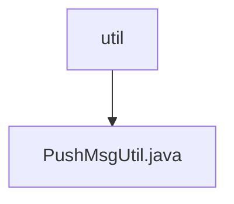

# 基础信息

|      |      |
|------|------|
| 名称 | util |
| 编码语言 | .java |
| 代码路径 | JeecgBoot/jeecg-boot/jeecg-module-system/jeecg-system-biz/src/main/java/org/jeecg/modules/message/util |
| 包名 | JeecgBoot.jeecg-boot.jeecg-module-system.jeecg-system-biz.src.main.java.org.jeecg.modules.message.util |
| 概述说明 | PushMsgUtil类通过模板发送短信、邮件和微信，处理内容并保存记录。 |

# 说明

PushMsgUtil类是一个用于通过模板发送消息的工具，支持短信、邮件和微信等多种消息类型。该类能够处理模板内容，确保消息格式正确，并自动保存发送记录，便于后续查询和管理。其功能全面，适用于多种消息发送场景，提高了消息发送的效率和可靠性。

### 包内部结构视图

流程图展示了`util`文件夹与其包含的`PushMsgUtil.java`文件之间的层级关系。`util`是父节点，`PushMsgUtil.java`是子节点，表示文件位于该文件夹内。

# 文件列表 File List

| 名称   | 类型  | 说明 |
|-------|------|-------------|
| [PushMsgUtil.java](PushMsgUtil.md) | file | PushMsgUtil类通过模板发送短信、邮件和微信，处理内容并保存记录。 |

