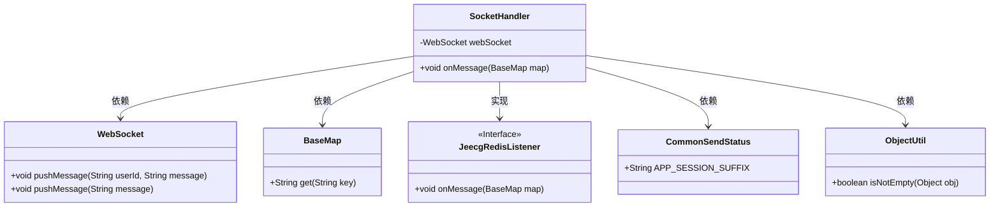

# 基础信息

|      |      |
|------|------|
| 名称 | SocketHandler |
| 编码语言 | .java |
| 代码路径 | JeecgBoot/jeecg-boot/jeecg-module-system/jeecg-system-biz/src/main/java/org/jeecg/modules/message/websocket/SocketHandler.java |
| 包名 | org.jeecg.modules.message.websocket |
| 依赖项 | ['cn.hutool.core.util.ObjectUtil', 'lombok.extern.slf4j.Slf4j', 'org.jeecg.common.base.BaseMap', 'org.jeecg.common.constant.CommonSendStatus', 'org.jeecg.common.modules.redis.listener.JeecgRedisListener', 'org.springframework.beans.factory.annotation.Autowired', 'org.springframework.stereotype.Component'] |
| 概述说明 | SocketHandler类通过Redis订阅消息，按userId推送至PC或APP，无userId则广播所有客户端。 |

# 说明

SocketHandler类利用Redis的订阅模式接收消息，根据提供的userId将消息定向推送到对应的PC或APP端。如果未指定userId，则会将消息广播至所有连接的客户端。这一机制确保了消息的精准传递或全面覆盖，具体取决于userId的存在与否。

# 类列表 Class Summary

| 名称   | 类型  | 说明 |
|-------|------|-------------|
| SocketHandler | class | SocketHandler类通过Redis订阅模式接收消息，根据userId推送至PC或APP端，无userId则广播所有客户端。 |

## 类 SocketHandler

|      |      |
|------|------|
| 访问范围 | @Slf4j;@Component(WebSocket.REDIS_TOPIC_NAME);public |
| 类型 | class |
| 名称 | SocketHandler |
| 说明 | SocketHandler类通过Redis订阅模式接收消息，根据userId推送至PC或APP端，无userId则广播所有客户端。 |

### UML类图

**描述：**  
`SocketHandler`类实现了`JeecgRedisListener`接口，用于处理Redis发布订阅模式的消息。该类通过`WebSocket`对象将消息推送给指定用户或全部用户。`BaseMap`类用于存储消息数据，`ObjectUtil`类用于判断对象是否为空，`CommonSendStatus`类提供了常量`APP_SESSION_SUFFIX`，用于区分PC端和App端的会话。`SocketHandler`类依赖于这些类来完成消息推送功能。

### 内部方法调用关系图

这段代码描述了一个`SocketHandler`类，它实现了`JeecgRedisListener`接口，用于处理从Redis发布订阅模式接收到的消息。当收到消息时，首先记录日志，然后从消息中提取`userId`和`message`。如果`userId`不为空，则将消息推送到指定的PC端和APP端用户；否则，将消息推送给所有用户。流程图展示了类内部的方法调用和逻辑判断过程。

### 字段列表 Field List

| 名称  | 类型  | 说明 |
|-------|-------|------|
| webSocket | WebSocket | 自动注入WebSocket实例。 |

### 方法列表 Method List

| 名称  | 类型  | 说明 |
|-------|-------|------|
| onMessage | void | Redis监听器接收消息，根据userId推送至PC和APP端，若无userId则广播消息。 |

