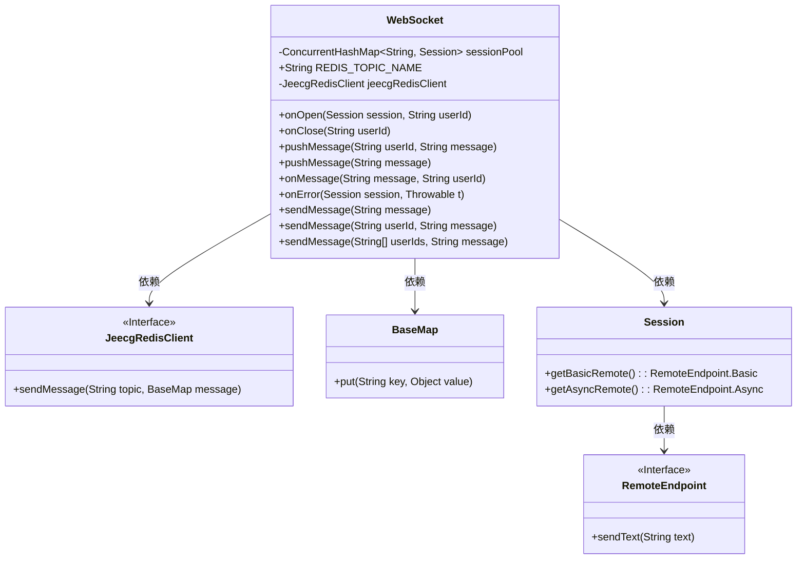

# 基础信息

|      |      |
|------|------|
| 名称 | WebSocket |
| 编码语言 | .java |
| 代码路径 | JeecgBoot/jeecg-boot/jeecg-module-system/jeecg-system-biz/src/main/java/org/jeecg/modules/message/websocket/WebSocket.java |
| 包名 | org.jeecg.modules.message.websocket |
| 依赖项 | ['java.util.Map', 'java.util.concurrent.ConcurrentHashMap', 'javax.websocket', 'javax.websocket.server.PathParam', 'javax.websocket.server.ServerEndpoint', 'com.alibaba.fastjson.JSONObject', 'org.jeecg.common.base.BaseMap', 'org.jeecg.common.constant.WebsocketConst', 'org.jeecg.common.modules.redis.client.JeecgRedisClient', 'org.springframework.beans.factory.annotation.Autowired', 'org.springframework.stereotype.Component', 'lombok.extern.slf4j.Slf4j'] |
| 概述说明 | WebSocket类管理用户连接、推送消息并发布至Redis。 |

# 说明

WebSocket类负责管理用户连接、消息推送以及Redis消息发布功能。该类通过WebSocket协议实现用户与服务器的实时双向通信，确保用户连接的稳定性和高效性。同时，它能够将消息推送给指定用户或群组，实现即时通讯。此外，WebSocket类还集成了Redis消息发布功能，通过Redis的发布订阅机制，实现消息的广播和分发，提升系统的可扩展性和消息处理的灵活性。整体设计旨在提供高效、可靠的实时通信解决方案。

# 类列表 Class Summary

| 名称   | 类型  | 说明 |
|-------|------|-------------|
| WebSocket | class | WebSocket类实现用户连接管理、消息推送及Redis消息发布功能。 |

## 类 WebSocket

|      |      |
|------|------|
| 访问范围 | @Component;@Slf4j;@ServerEndpoint("/websocket/{userId}");public |
| 类型 | class |
| 名称 | WebSocket |
| 说明 | WebSocket类实现用户连接管理、消息推送及Redis消息发布功能。 |

### UML类图

这段代码定义了一个 `WebSocket` 类，用于处理 WebSocket 连接和消息推送。它使用 `ConcurrentHashMap` 来管理用户会话，并通过 `JeecgRedisClient` 与 Redis 进行交互。类中包含了多个方法，如 `onOpen`、`onClose`、`pushMessage` 等，用于处理 WebSocket 的连接、断开、消息推送和错误处理。此外，`WebSocket` 类还通过 Redis 发布订阅模式实现消息的广播和单点推送。代码中使用了多个注解来标记方法和类的行为，如 `@OnOpen`、`@OnClose` 等。

### 内部方法调用关系图

```mermaid
graph TD
    A["类WebSocket"]
    B["属性: ConcurrentHashMap<String, Session> sessionPool"]
    C["属性: String REDIS_TOPIC_NAME"]
    D["属性: JeecgRedisClient jeecgRedisClient"]
    E["方法: setJeecgRedisClient(JeecgRedisClient jeecgRedisClient)"]
    F["方法: onOpen(Session session, String userId)"]
    G["方法: onClose(String userId)"]
    H["方法: pushMessage(String userId, String message)"]
    I["方法: pushMessage(String message)"]
    J["方法: onMessage(String message, String userId)"]
    K["方法: onError(Session session, Throwable t)"]
    L["方法: sendMessage(String message)"]
    M["方法: sendMessage(String userId, String message)"]
    N["方法: sendMessage(String[] userIds, String message)"]

    A --> B
    A --> C
    A --> D
    A --> E
    A --> F
    A --> G
    A --> H
    A --> I
    A --> J
    A --> K
    A --> L
    A --> M
    A --> N
```

这段代码定义了一个WebSocket类，用于处理WebSocket连接的建立、关闭、消息的接收和推送。类中包含多个方法，用于管理会话池、处理客户端消息、推送单人或群发消息，以及与Redis的交互。通过`@OnOpen`、`@OnClose`、`@OnMessage`和`@OnError`注解，分别处理连接打开、关闭、消息接收和错误事件。此外，代码还通过Redis发布订阅模式实现消息的广播和单点推送。整体流程清晰，功能完善，适用于实时消息推送场景。

### 字段列表 Field List

| 名称  | 类型  | 说明 |
|-------|-------|------|
| REDIS_TOPIC_NAME = "socketHandler" | String | Redis主题名称定义为“socketHandler”。 |
| sessionPool = new ConcurrentHashMap<>() | ConcurrentHashMap<String, Session> | 使用ConcurrentHashMap管理会话池，确保线程安全。 |
| jeecgRedisClient | JeecgRedisClient | 私有静态变量jeecgRedisClient。 |

### 方法列表 Method List

| 名称  | 类型  | 说明 |
|-------|-------|------|
| sendMessage | void | 方法批量发送消息给多个用户。 |
| pushMessage | void | 推送指定用户WebSocket消息，确保线程安全。 |
| onError | void | WebSocket错误处理方法，记录错误并打印堆栈信息。 |
| sendMessage | void | 发送消息给指定用户，通过Redis广播。 |
| pushMessage | void | 该方法群发消息至所有WebSocket会话，记录发送结果及错误日志。 |
| sendMessage | void | 发送WebSocket广播消息，包含空用户ID和消息内容。 |
| onOpen | void | WebSocket连接时，将用户ID与会话存入池，并记录连接总数。 |
| setJeecgRedisClient | void | 使用@Autowired注解注入JeecgRedisClient到WebSocket类中。 |
| onMessage | void | WebSocket接收客户端消息，若非ping或心跳检查，则记录日志；否则响应ping。 |
| onClose | void | WebSocket连接断开时移除用户会话并记录日志。 |

