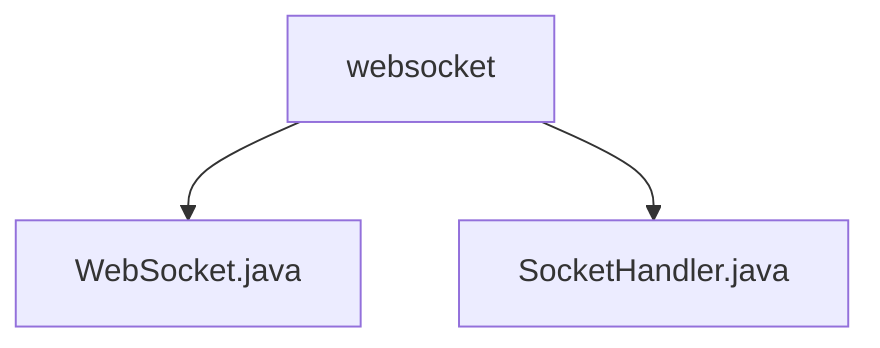

# 基础信息

|      |      |
|------|------|
| 名称 | websocket |
| 编码语言 | .java |
| 代码路径 | JeecgBoot/jeecg-boot/jeecg-module-system/jeecg-system-biz/src/main/java/org/jeecg/modules/message/websocket |
| 包名 | JeecgBoot.jeecg-boot.jeecg-module-system.jeecg-system-biz.src.main.java.org.jeecg.modules.message.websocket |
| 概述说明 | WebSocket类管理连接、消息推送及Redis发布，实现实时通信。SocketHandler类通过Redis订阅定向推送消息。 |

# 说明

## 概述

该代码模块是一个基于WebSocket协议的实时通信解决方案，主要用于管理用户连接、消息推送以及Redis消息发布功能。模块通过WebSocket协议实现用户与服务器之间的实时双向通信，确保连接的稳定性和高效性。同时，模块集成了Redis的发布订阅机制，能够实现消息的广播和分发，提升系统的可扩展性和消息处理的灵活性。整体设计旨在提供高效、可靠的实时通信服务，支持消息的精准传递或全面覆盖，具体取决于业务需求。

## 主要业务场景

1. **用户连接管理**：通过WebSocket协议管理用户的连接，确保用户与服务器之间的实时双向通信稳定高效。
2. **消息推送**：支持将消息推送给指定用户或群组，实现即时通讯功能。消息可以根据userId进行精准推送，或广播至所有连接的客户端。
3. **Redis消息发布**：利用Redis的发布订阅机制，实现消息的广播和分发，提升系统的可扩展性和消息处理的灵活性。Redis订阅模式用于接收消息，并根据业务需求将消息定向推送到对应的PC或APP端。
4. **消息广播**：当未指定userId时，模块会将消息广播至所有连接的客户端，确保消息的全面覆盖。

### 包内部结构视图

该流程图展示了`websocket`文件夹下的文件层级关系，包含`WebSocket.java`和`SocketHandler.java`两个文件。`websocket`作为父节点，直接连接两个子节点，清晰地反映了文件在文件夹中的组织结构。

# 文件列表 File List

| 名称   | 类型  | 说明 |
|-------|------|-------------|
| [WebSocket.java](WebSocket.md) | file | WebSocket类管理用户连接、推送消息并发布至Redis。 |
| [SocketHandler.java](SocketHandler.md) | file | SocketHandler类通过Redis订阅消息，按userId推送至PC或APP，无userId则广播所有客户端。 |

