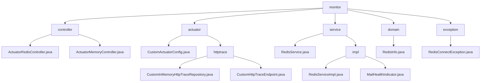

# 基础信息

|      |      |
|------|------|
| 名称 | monitor |
| 编码语言 | .java |
| 代码路径 | JeecgBoot/jeecg-boot/jeecg-module-system/jeecg-system-biz/src/main/java/org/jeecg/modules/monitor |
| 包名 | JeecgBoot.jeecg-boot.jeecg-module-system.jeecg-system-biz.src.main.java.org.jeecg.modules.monitor |
| 概述说明 | 模块监控Redis和系统内存，优化性能，预警资源使用。 |

# 说明

## 概述

该代码模块主要分为两个核心功能：系统监控与健康检查、HTTP请求追踪管理。系统监控部分通过多个控制器和服务类，提供了对Redis和系统内存的监控功能，确保系统的稳定性和性能优化。HTTP请求追踪管理部分则通过自定义的仓库类和端点类，实现了对HTTP请求和响应数据的存储、查询、过滤和排序，适用于需要处理复杂HTTP请求追踪的场景。

## 主要业务场景

1. **Redis监控与优化**：
   - **信息查询**：通过`ActuatorRedisController`和`RedisServiceImpl`，用户可以实时获取Redis服务的状态、配置信息、内存使用情况、键数量以及磁盘状态，帮助管理员进行实时监控和调整。
   - **内存监控**：跟踪和分析Redis实例的内存使用情况，识别潜在的内存问题，防止内存溢出或资源浪费。
   - **历史性能记录**：记录Redis的性能指标，提供历史数据分析支持，优化系统性能和资源分配。

2. **系统内存监控**：
   - **运行时内存监控**：通过`ActuatorMemoryController`，用户可以获取系统内存的详细信息，包括运行时内存和物理内存，评估系统性能，优化资源分配。
   - **物理内存监控**：监控系统物理内存的使用情况，确保系统在高负载下仍能稳定运行。

3. **HTTP请求追踪管理**：
   - **数据存储与检索**：通过`CustomInMemoryHttpTraceRepository`类，模块实现了HTTP追踪数据的存储和检索功能，提供基于特定条件的查询、过滤和排序功能。
   - **HTTP追踪管理**：`CustomHttpTraceEndpoint`类负责处理HTTP跟踪数据的存储和查询操作，确保HTTP请求和响应的跟踪信息能够被有效管理和访问。
   - **高效数据处理**：模块设计旨在提升数据管理的灵活性和效率，适用于需要处理大量HTTP请求追踪信息的业务场景，如系统监控、性能分析等。

4. **系统健康检查**：
   - **错误码分析**：通过`MailHealthIndicator`类，检查错误码来判断系统是否存在异常或故障，确保系统运行状况的实时监控。
   - **健康状态评估**：根据错误码的检查结果返回系统的健康状态，帮助管理员及时发现并处理潜在问题，保障系统的稳定运行。

5. **异常处理**：
   - **Redis连接异常处理**：通过`RedisConnectException`类，捕获并处理与Redis连接相关的异常情况，提高程序的健壮性和可维护性。

6. **性能分析与优化**：
   - **性能瓶颈识别**：通过获取和分析Redis和系统内存的数据，识别性能瓶颈，进行针对性的优化，提高系统的整体性能和稳定性。
   - **资源监控与预警**：模块提供的监控功能可以用于实时监控系统资源的使用情况，及时发现潜在问题，并采取相应的措施，避免系统因资源耗尽而崩溃。

### 包内部结构视图

该流程图展示了`monitor`模块下的层级结构，包括`controller`、`actuator`、`service`、`domain`和`exception`等子目录及其相关文件。每个子目录下进一步细分为具体的控制器、配置、服务实现等文件，清晰地展示了模块的组织结构。

# 文件列表 File List

| 名称   | 类型  | 说明 |
|-------|------|-------------|
| [exception](exception/_module.md) | package | RedisConnectException是处理Redis连接异常的自定义异常类。 |
| [domain](domain/_module.md) | package | RedisInfo类存储Redis服务器版本、内存、连接等关键数据。 |
| [service](service/_module.md) | package | 该模块实现系统监控与健康检查，包含Redis服务监控和系统健康评估功能。 |
| [actuator](actuator/_module.md) | package | 自定义配置类启用HTTP追踪，注册内存存储库，提升系统性能。 |
| [controller](controller/_module.md) | package | ActuatorRedisController提供Redis和磁盘信息查询，ActuatorMemoryController监控系统内存使用。 |

