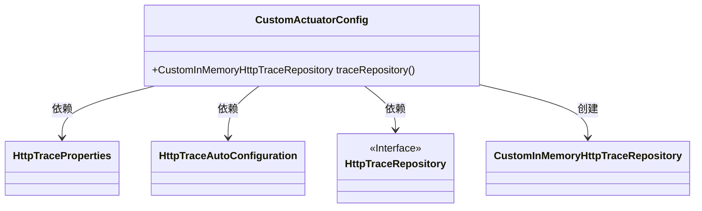
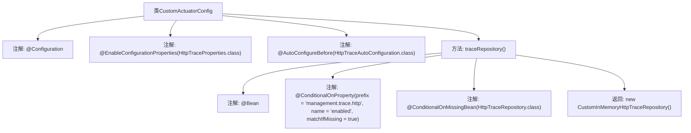

# 基础信息

|      |      |
|------|------|
| 名称 | CustomActuatorConfig |
| 编码语言 | .java |
| 代码路径 | JeecgBoot/jeecg-boot/jeecg-module-system/jeecg-system-biz/src/main/java/org/jeecg/modules/monitor/actuator/CustomActuatorConfig.java |
| 包名 | org.jeecg.modules.monitor.actuator |
| 依赖项 | ['org.jeecg.modules.monitor.actuator.httptrace.CustomInMemoryHttpTraceRepository', 'org.springframework.boot.actuate.autoconfigure.trace.http.HttpTraceAutoConfiguration', 'org.springframework.boot.actuate.autoconfigure.trace.http.HttpTraceProperties', 'org.springframework.boot.actuate.trace.http.HttpTraceRepository', 'org.springframework.boot.autoconfigure.AutoConfigureBefore', 'org.springframework.boot.autoconfigure.condition.ConditionalOnMissingBean', 'org.springframework.boot.autoconfigure.condition.ConditionalOnProperty', 'org.springframework.boot.context.properties.EnableConfigurationProperties', 'org.springframework.context.annotation.Bean', 'org.springframework.context.annotation.Configuration'] |
| 概述说明 | 启用HTTP追踪并注册自定义内存存储库。 |

# 说明

自定义配置类的主要功能是启用HTTP追踪，并注册一个自定义的内存存储库。通过该配置类，系统能够实现对HTTP请求和响应的追踪，确保网络活动的监控和记录。同时，自定义内存存储库的注册允许系统在内存中高效地存储和管理相关数据，提升系统的性能和响应速度。这一配置类为系统提供了灵活的追踪和存储机制，便于后续的调试和优化。

# 类列表 Class Summary

| 名称   | 类型  | 说明 |
|-------|------|-------------|
| CustomActuatorConfig | class | 自定义配置类，启用HTTP追踪并注册自定义内存存储库。 |

## 类 CustomActuatorConfig

|      |      |
|------|------|
| 访问范围 | @Configuration;@EnableConfigurationProperties(HttpTraceProperties.class);@AutoConfigureBefore(HttpTraceAutoConfiguration.class);public |
| 类型 | class |
| 名称 | CustomActuatorConfig |
| 说明 | 自定义配置类，启用HTTP追踪并注册自定义内存存储库。 |

### UML类图

这段代码定义了一个名为 `CustomActuatorConfig` 的配置类，用于自定义 Spring Boot Actuator 的 HTTP 请求追踪功能。该类通过 `@Bean` 注解创建了一个 `CustomInMemoryHttpTraceRepository` 的实例，并在特定条件下（如 `management.trace.http.enabled` 属性为 `true` 且 `HttpTraceRepository` 类型的 Bean 不存在时）才会生效。该类依赖于 `HttpTraceProperties` 和 `HttpTraceAutoConfiguration` 类，并且实现了 `HttpTraceRepository` 接口的功能。

### 内部方法调用关系图

这段代码定义了一个名为 `CustomActuatorConfig` 的配置类，用于自定义 Spring Boot Actuator 的 HTTP 请求追踪功能。通过 `@Bean` 注解，`traceRepository()` 方法创建并返回一个 `CustomInMemoryHttpTraceRepository` 实例。该方法的创建条件由 `@ConditionalOnProperty` 和 `@ConditionalOnMissingBean` 注解控制，确保在特定条件下才会创建该 Bean。流程图展示了类的注解和方法之间的调用关系。

### 字段列表 Field List

| 名称  | 类型  | 说明 |
|-------|-------|------|

### 方法列表 Method List

| 名称  | 类型  | 说明 |
|-------|-------|------|
| traceRepository | CustomInMemoryHttpTraceRepository | 根据配置启用自定义HTTP跟踪存储库。 |

