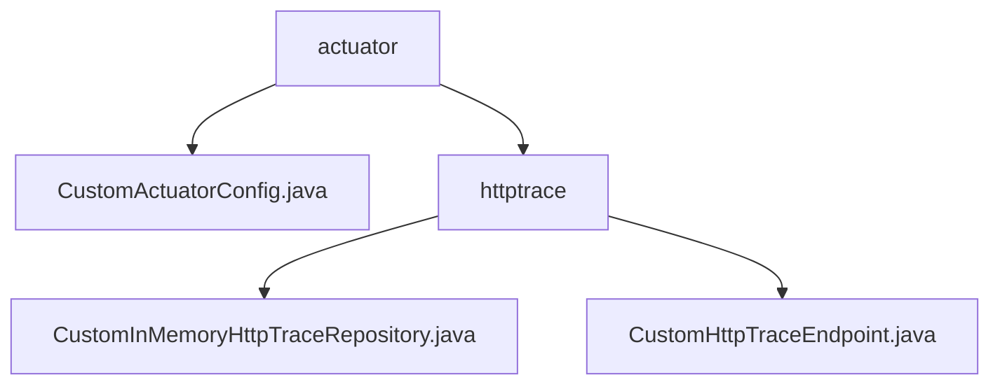

# 基础信息

|      |      |
|------|------|
| 名称 | actuator |
| 编码语言 | .java |
| 代码路径 | JeecgBoot/jeecg-boot/jeecg-module-system/jeecg-system-biz/src/main/java/org/jeecg/modules/monitor/actuator |
| 包名 | JeecgBoot.jeecg-boot.jeecg-module-system.jeecg-system-biz.src.main.java.org.jeecg.modules.monitor.actuator |
| 概述说明 | 自定义配置类启用HTTP追踪，注册内存存储库，提升系统性能。 |

# 说明

## 概述
该代码模块主要专注于管理和处理HTTP请求的追踪数据。通过自定义的HTTP追踪仓库类和端点类，模块提供了对HTTP请求和响应数据的存储、查询、过滤和排序功能。这些功能使得用户能够高效地检索和操作大量的HTTP追踪信息，适用于需要处理复杂HTTP请求追踪的场景。

## 主要业务场景
1. **数据存储与检索**：通过`CustomInMemoryHttpTraceRepository`类，模块实现了HTTP追踪数据的存储和检索功能。该类提供了基于特定条件的查询、过滤和排序功能，使用户能够快速找到所需的追踪记录。
2. **HTTP追踪管理**：`CustomHttpTraceEndpoint`类负责与存储库协作，处理HTTP跟踪数据的存储和查询操作。该类确保HTTP请求和响应的跟踪信息能够被有效管理和访问，适用于需要监控和分析HTTP请求的场景。
3. **高效数据处理**：模块的设计旨在提升数据管理的灵活性和效率，特别适用于需要处理大量HTTP请求追踪信息的业务场景，如系统监控、性能分析等。

### 包内部结构视图

该流程图展示了`actuator`目录下的层级结构。`actuator`包含一个文件`CustomActuatorConfig.java`和一个子目录`httptrace`。`httptrace`目录下包含两个文件：`CustomInMemoryHttpTraceRepository.java`和`CustomHttpTraceEndpoint.java`。该结构清晰地反映了文件与目录之间的从属关系。

# 文件列表 File List

| 名称   | 类型  | 说明 |
|-------|------|-------------|
| [CustomActuatorConfig.java](CustomActuatorConfig.md) | file | 启用HTTP追踪并注册自定义内存存储库。 |
| [httptrace](httptrace/_module.md) | package | 自定义HTTP追踪仓库类管理追踪数据，提供查询、过滤和排序功能，提升数据管理效率。CustomHttpTraceEndpoint类负责数据存储和查询，与仓库协作实现信息管理。 |

