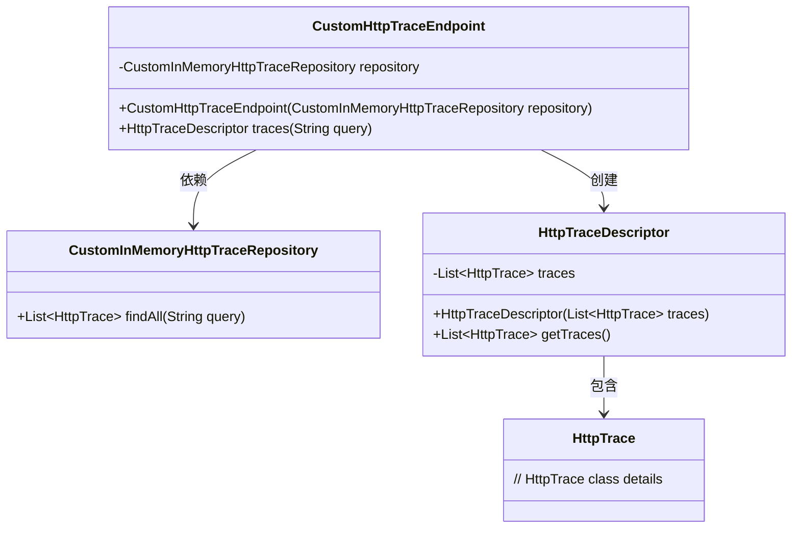
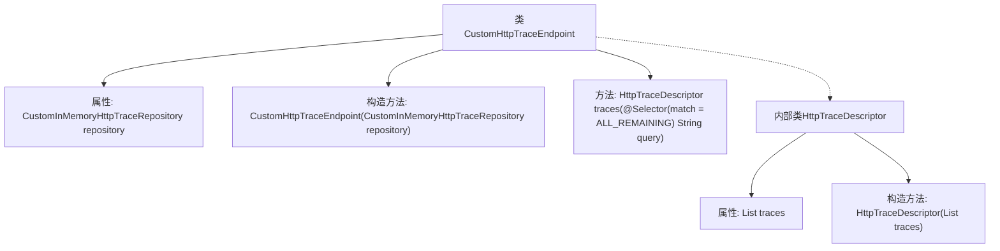
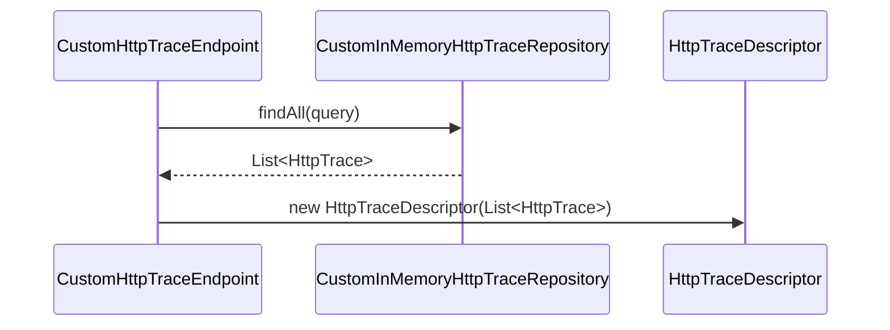

# 基础信息

|      |      |
|------|------|
| 名称 | CustomHttpTraceEndpoint |
| 编码语言 | .java |
| 代码路径 | JeecgBoot/jeecg-boot/jeecg-module-system/jeecg-system-biz/src/main/java/org/jeecg/modules/monitor/actuator/httptrace/CustomHttpTraceEndpoint.java |
| 包名 | org.jeecg.modules.monitor.actuator.httptrace |
| 依赖项 | ['lombok.Getter', 'org.springframework.boot.actuate.endpoint.annotation.Endpoint', 'org.springframework.boot.actuate.endpoint.annotation.ReadOperation', 'org.springframework.boot.actuate.endpoint.annotation.Selector', 'org.springframework.boot.actuate.trace.http.HttpTrace', 'org.springframework.stereotype.Component', 'org.springframework.util.Assert', 'java.util.List', 'org.springframework.boot.actuate.endpoint.annotation.Selector.Match.ALL_REMAINING'] |
| 概述说明 | CustomHttpTraceEndpoint类用CustomInMemoryHttpTraceRepository存储和查询HTTP跟踪数据。 |

# 说明

CustomHttpTraceEndpoint类负责处理HTTP跟踪数据的存储和查询操作，其通过CustomInMemoryHttpTraceRepository实现数据的具体存储和检索功能。该类与存储库的协作确保了HTTP请求和响应的跟踪信息能够被有效管理和访问。

# 类列表 Class Summary

| 名称   | 类型  | 说明 |
|-------|------|-------------|
| CustomHttpTraceEndpoint | class | CustomHttpTraceEndpoint类通过CustomInMemoryHttpTraceRepository存储和查询HTTP跟踪数据。 |

## 类 CustomHttpTraceEndpoint

|      |      |
|------|------|
| 访问范围 | @Component;@Endpoint(id = "jeecghttptrace");public |
| 类型 | class |
| 名称 | CustomHttpTraceEndpoint |
| 说明 | CustomHttpTraceEndpoint类通过CustomInMemoryHttpTraceRepository存储和查询HTTP跟踪数据。 |

### UML类图

这段代码定义了一个名为 `CustomHttpTraceEndpoint` 的类，它依赖于 `CustomInMemoryHttpTraceRepository` 来获取 HTTP 跟踪信息。`CustomHttpTraceEndpoint` 通过 `traces` 方法返回一个 `HttpTraceDescriptor` 对象，该对象包含一组 `HttpTrace` 实例。`HttpTraceDescriptor` 是一个内部类，用于封装 HTTP 跟踪信息列表，并提供了获取这些信息的方法。整个设计体现了依赖注入和封装的思想，确保代码的可维护性和可扩展性。

### 内部方法调用关系图

这段代码定义了一个名为 `CustomHttpTraceEndpoint` 的类，该类包含一个 `CustomInMemoryHttpTraceRepository` 类型的属性 `repository`，并通过构造函数进行初始化。类中定义了一个 `traces` 方法，该方法通过调用 `repository.findAll(query)` 获取 `HttpTrace` 列表，并将其封装在 `HttpTraceDescriptor` 内部类中返回。`HttpTraceDescriptor` 类包含一个 `List<HttpTrace>` 类型的属性 `traces`，并通过构造函数进行初始化。整个流程展示了如何通过 `CustomHttpTraceEndpoint` 类获取并封装 HTTP 跟踪信息。

### 字段列表 Field List

| 名称  | 类型  | 说明 |
|-------|-------|------|
| repository | CustomInMemoryHttpTraceRepository | 私有且不可变的CustomInMemoryHttpTraceRepository实例。 |

### 方法列表 Method List

| 名称  | 类型  | 说明 |
|-------|-------|------|
| traces | HttpTraceDescriptor | 该代码定义了一个公共方法，用于查询HTTP跟踪记录并返回描述符。 |

