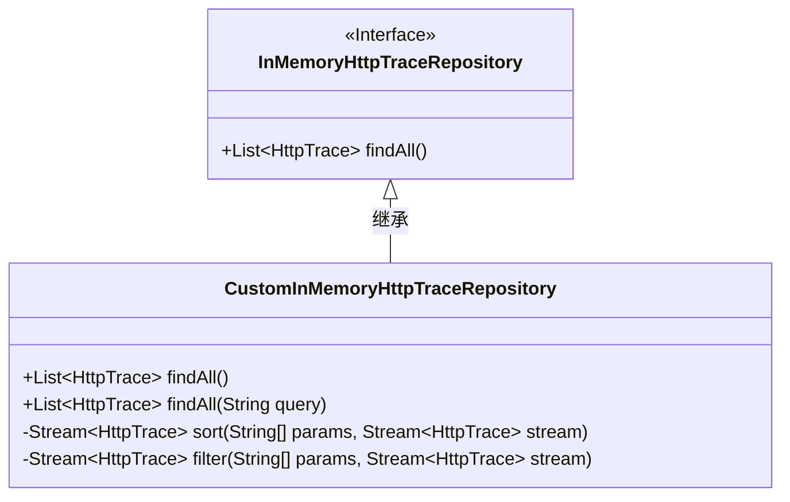
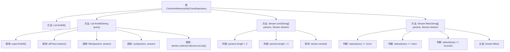

# 基础信息

|      |      |
|------|------|
| 名称 | CustomInMemoryHttpTraceRepository |
| 编码语言 | .java |
| 代码路径 | JeecgBoot/jeecg-boot/jeecg-module-system/jeecg-system-biz/src/main/java/org/jeecg/modules/monitor/actuator/httptrace/CustomInMemoryHttpTraceRepository.java |
| 包名 | org.jeecg.modules.monitor.actuator.httptrace |
| 依赖项 | ['org.springframework.boot.actuate.trace.http.HttpTrace', 'org.springframework.boot.actuate.trace.http.InMemoryHttpTraceRepository', 'java.util.List', 'java.util.stream.Collectors', 'java.util.stream.Stream'] |
| 概述说明 | 自定义HTTP追踪仓库类，具备查询、过滤和排序功能。 |

# 说明

自定义HTTP追踪仓库类是一个专门设计用于管理和处理HTTP请求追踪数据的工具。它提供了查询、过滤和排序功能，使用户能够高效地检索和操作追踪记录。通过查询功能，用户可以基于特定条件搜索追踪数据；过滤功能允许用户筛选出符合特定标准的数据；排序功能则使用户能够按照指定的字段对数据进行排序。这些功能共同提升了数据管理的灵活性和效率，适用于需要处理大量HTTP请求追踪信息的场景。

# 类列表 Class Summary

| 名称   | 类型  | 说明 |
|-------|------|-------------|
| CustomInMemoryHttpTraceRepository | class | 自定义HTTP追踪仓库类，支持查询、过滤和排序功能。 |

## 类 CustomInMemoryHttpTraceRepository

|      |      |
|------|------|
| 访问范围 | public |
| 类型 | class |
| 名称 | CustomInMemoryHttpTraceRepository |
| 说明 | 自定义HTTP追踪仓库类，支持查询、过滤和排序功能。 |

### UML类图

这段代码定义了一个 `CustomInMemoryHttpTraceRepository` 类，该类继承自 `InMemoryHttpTraceRepository` 接口。`CustomInMemoryHttpTraceRepository` 类重写了 `findAll()` 方法，并新增了一个 `findAll(String query)` 方法，用于根据查询条件过滤和排序 `HttpTrace` 对象。`sort()` 方法根据传入的参数对 `HttpTrace` 流进行排序，而 `filter()` 方法则根据状态查询参数对 `HttpTrace` 流进行过滤。这些方法共同实现了对 `HttpTrace` 对象的灵活查询和排序功能。

### 内部方法调用关系图

这段代码定义了一个`CustomInMemoryHttpTraceRepository`类，继承自`InMemoryHttpTraceRepository`。该类提供了两个`findAll`方法，一个用于获取所有`HttpTrace`记录，另一个支持根据查询字符串进行过滤和排序。`filter`方法根据状态码过滤记录，`sort`方法根据时间戳或耗时进行排序。流程图展示了方法的调用关系和逻辑判断流程。

### 字段列表 Field List

| 名称  | 类型  | 说明 |
|-------|-------|------|

### 方法列表 Method List

| 名称  | 类型  | 说明 |
|-------|-------|------|
| findAll | List<HttpTrace> | 重写父类方法，返回所有HTTP跟踪记录。 |
| filter | Stream<HttpTrace> | 根据状态参数过滤HTTP跟踪流。 |
| findAll | List<HttpTrace> | 该方法根据查询条件筛选并排序HttpTrace列表，返回处理后的结果。 |
| sort | Stream<HttpTrace> | 根据参数对HttpTrace流进行排序，支持按时间和时间戳排序，默认降序。 |

