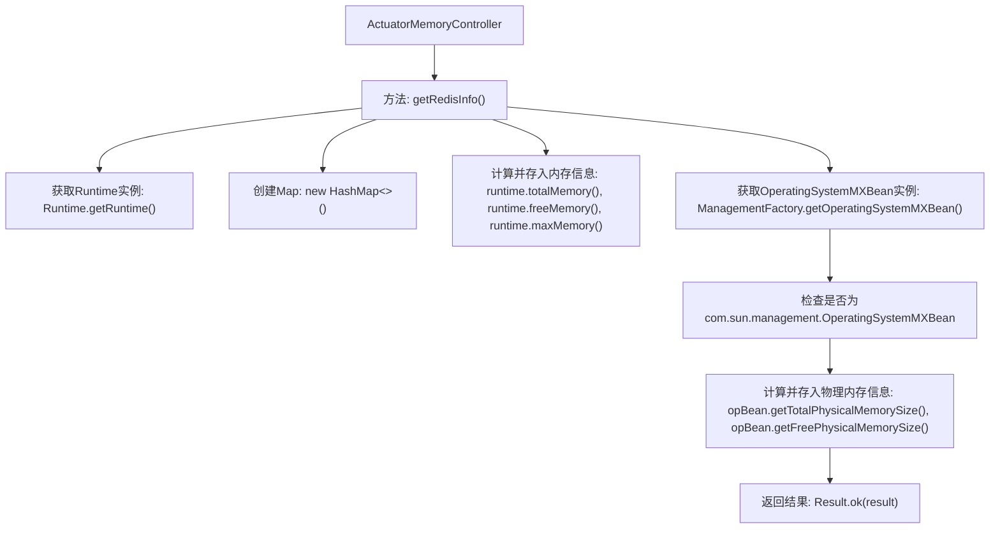

# 基础信息

|      |      |
|------|------|
| 名称 | ActuatorMemoryController |
| 编码语言 | .java |
| 代码路径 | JeecgBoot/jeecg-boot/jeecg-module-system/jeecg-system-biz/src/main/java/org/jeecg/modules/monitor/controller/ActuatorMemoryController.java |
| 包名 | org.jeecg.modules.monitor.controller |
| 依赖项 | ['cn.hutool.core.util.NumberUtil', 'com.alibaba.fastjson.JSONObject', 'lombok.extern.slf4j.Slf4j', 'org.jeecg.common.api.vo.Result', 'org.springframework.web.bind.annotation.GetMapping', 'org.springframework.web.bind.annotation.RequestMapping', 'org.springframework.web.bind.annotation.RestController', 'java.lang.management.ManagementFactory', 'java.lang.management.OperatingSystemMXBean', 'java.util.HashMap', 'java.util.Map'] |
| 概述说明 | 控制器获取运行时和物理内存详情。 |

# 说明

控制器通过获取内存详情，包括运行时和物理内存信息，来监控系统内存的使用情况。运行时内存信息涉及程序执行时的内存占用，而物理内存信息则反映实际硬件内存的状态。这些数据有助于评估系统性能，优化资源分配，并确保系统稳定运行。

# 类列表 Class Summary

| 名称   | 类型  | 说明 |
|-------|------|-------------|
| ActuatorMemoryController | class | 控制器获取内存详情，包括运行时和物理内存信息。 |


## 类 ActuatorMemoryController

|      |      |
|------|------|
| 访问范围 | @Slf4j;@RestController;@RequestMapping("/sys/actuator/memory");public |
| 类型 | class |
| 名称 | ActuatorMemoryController |
| 说明 | 控制器获取内存详情，包括运行时和物理内存信息。 |


### UML类图

```mermaid
classDiagram
    class ActuatorMemoryController {
        +Result~?~ getRedisInfo()
    }

    class Runtime {
        +long totalMemory()
        +long freeMemory()
        +long maxMemory()
    }

    class ManagementFactory {
        +OperatingSystemMXBean getOperatingSystemMXBean()
    }

    class OperatingSystemMXBean {
        <<Interface>>
    }

    class com~sun~management~OperatingSystemMXBean {
        <<Interface>>
        +long getTotalPhysicalMemorySize()
        +long getFreePhysicalMemorySize()
    }

    class NumberUtil {
        +double div(long numerator, long denominator)
    }

    class Result~T~ {
        +static Result~T~ ok(T data)
    }

    ActuatorMemoryController --> Runtime : 获取内存信息
    ActuatorMemoryController --> ManagementFactory : 获取操作系统信息
    ManagementFactory --> OperatingSystemMXBean : 依赖
    OperatingSystemMXBean <|-- com~sun~management~OperatingSystemMXBean : 实现
    ActuatorMemoryController --> NumberUtil : 计算内存使用率
    ActuatorMemoryController --> Result~?~ : 返回结果
```

**描述：**  
`ActuatorMemoryController` 是一个控制器类，用于获取系统的内存信息。它通过 `Runtime` 类获取JVM的内存使用情况，并通过 `ManagementFactory` 获取操作系统的内存信息。`OperatingSystemMXBean` 是一个接口，`com.sun.management.OperatingSystemMXBean` 是其实现类，用于获取物理内存信息。`NumberUtil` 类用于计算内存使用率，最终结果通过 `Result` 类返回。该控制器主要用于监控系统的内存使用情况。


### 内部方法调用关系图



这段代码是一个Spring Boot控制器，用于获取系统的内存信息。它首先通过`Runtime`类获取JVM的内存使用情况，包括总内存、已使用内存、最大内存和空闲内存等。然后，它通过`OperatingSystemMXBean`获取物理内存的总大小、空闲大小和已使用大小，并将这些信息存储在一个`Map`中。最后，它将这些信息封装在`Result`对象中并返回。这段代码主要用于监控系统的内存使用情况，帮助开发者了解系统的内存状态。

### 字段列表 Field List

| 名称  | 类型  | 说明 |
|-------|-------|------|

### 方法列表 Method List

| 名称  | 类型  | 说明 |
|-------|-------|------|
| getRedisInfo | Result<?> | 获取系统内存信息并返回结果。 |


