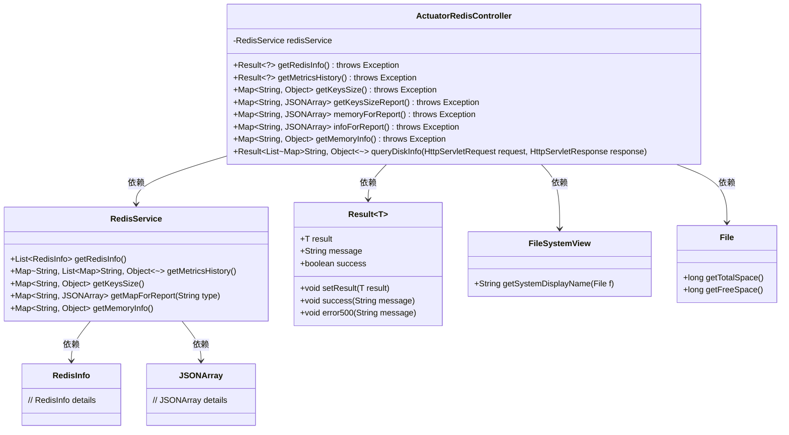
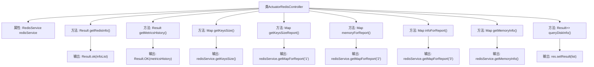

# 基础信息

|      |      |
|------|------|
| 名称 | ActuatorRedisController |
| 编码语言 | .java |
| 代码路径 | JeecgBoot/jeecg-boot/jeecg-module-system/jeecg-system-biz/src/main/java/org/jeecg/modules/monitor/controller/ActuatorRedisController.java |
| 包名 | org.jeecg.modules.monitor.controller |
| 依赖项 | ['com.alibaba.fastjson.JSONArray', 'lombok.extern.slf4j.Slf4j', 'org.jeecg.common.api.vo.Result', 'org.jeecg.modules.monitor.domain.RedisInfo', 'org.jeecg.modules.monitor.service.RedisService', 'org.springframework.beans.factory.annotation.Autowired', 'org.springframework.web.bind.annotation.GetMapping', 'org.springframework.web.bind.annotation.RequestMapping', 'org.springframework.web.bind.annotation.RestController', 'javax.servlet.http.HttpServletRequest', 'javax.servlet.http.HttpServletResponse', 'javax.swing.filechooser.FileSystemView', 'java.io.File', 'java.util.ArrayList', 'java.util.HashMap', 'java.util.List', 'java.util.Map'] |
| 概述说明 | ActuatorRedisController提供Redis及磁盘信息查询接口，涵盖详情、性能、内存、键数和磁盘状态。 |

# 说明

ActuatorRedisController是一个提供Redis和磁盘信息查询功能的接口，能够获取Redis的详细信息、性能指标、内存使用情况、键数量以及磁盘状态。该接口全面涵盖了Redis和磁盘的相关数据，便于用户进行监控和分析。

# 类列表 Class Summary

| 名称   | 类型  | 说明 |
|-------|------|-------------|
| ActuatorRedisController | class | ActuatorRedisController提供Redis和磁盘信息查询接口，包括详情、性能指标、内存、键数量及磁盘状态。 |

## 类 ActuatorRedisController

|      |      |
|------|------|
| 访问范围 | @Slf4j;@RestController;@RequestMapping("/sys/actuator/redis");public |
| 类型 | class |
| 名称 | ActuatorRedisController |
| 说明 | ActuatorRedisController提供Redis和磁盘信息查询接口，包括详情、性能指标、内存、键数量及磁盘状态。 |

### UML类图

这段代码定义了一个名为 `ActuatorRedisController` 的控制器类，用于处理与Redis相关的监控和报告请求。该类依赖于 `RedisService` 来获取Redis的详细信息、性能指标、键数量、内存信息等。此外，`ActuatorRedisController` 还包含一个方法 `queryDiskInfo`，用于查询磁盘信息并返回结果。`RedisService` 类提供了多个方法，用于获取Redis的不同类型数据。`Result` 类是一个泛型类，用于封装返回结果和状态信息。`FileSystemView` 和 `File` 类用于获取磁盘信息。

### 内部方法调用关系图

这段代码定义了一个名为 `ActuatorRedisController` 的控制器类，主要用于处理与 Redis 相关的监控和查询请求。类中包含多个方法，分别用于获取 Redis 的详细信息、历史性能指标、键数量、内存信息等。此外，还包含一个方法用于查询磁盘信息。每个方法通过调用 `redisService` 的相关方法获取数据，并返回相应的结果。代码结构清晰，功能明确，适用于系统监控和报表生成等场景。

### 字段列表 Field List

| 名称  | 类型  | 说明 |
|-------|-------|------|
| redisService | RedisService | 自动注入RedisService实例。 |

### 方法列表 Method List

| 名称  | 类型  | 说明 |
|-------|-------|------|
| getKeysSizeReport | Map<String, JSONArray> | 获取报告键值大小的映射接口。 |
| getKeysSize | Map<String, Object> | 获取Redis键数量接口，返回键数量信息。 |
| queryDiskInfo | Result<List<Map<String,Object>>> | 查询磁盘信息并返回名称、总空间、剩余空间及使用率。 |
| getMetricsHistory | Result<?> | 通过GET请求获取Redis中的历史指标数据并返回结果。 |
| infoForReport | Map<String, JSONArray> | 获取报告信息的API，调用Redis服务返回指定键的数据。 |
| memoryForReport | Map<String, JSONArray> | 获取报告内存数据的GET接口，返回Redis中的映射信息。 |
| getMemoryInfo | Map<String, Object> | 获取内存信息的GET请求接口，返回Redis服务的内存数据。 |
| getRedisInfo | Result<?> | 通过GET请求获取Redis信息并返回结果。 |

