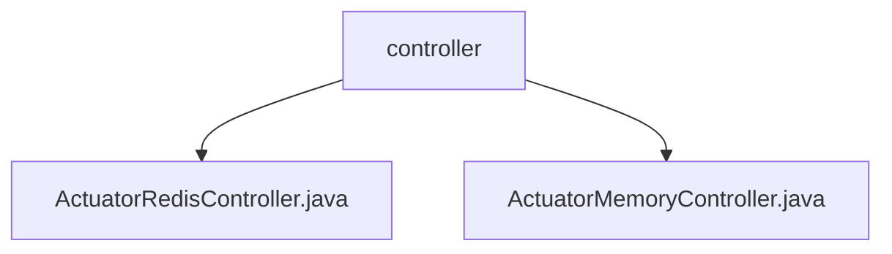

# 基础信息

|      |      |
|------|------|
| 名称 | controller |
| 编码语言 | .java |
| 代码路径 | JeecgBoot/jeecg-boot/jeecg-module-system/jeecg-system-biz/src/main/java/org/jeecg/modules/monitor/controller |
| 包名 | JeecgBoot.jeecg-boot.jeecg-module-system.jeecg-system-biz.src.main.java.org.jeecg.modules.monitor.controller |
| 概述说明 | ActuatorRedisController提供Redis和磁盘信息查询，ActuatorMemoryController监控系统内存使用。 |

# 说明

## 概述

该代码模块主要提供了对Redis和系统内存的监控功能。通过两个控制器，`ActuatorRedisController`和`ActuatorMemoryController`，模块能够获取Redis的详细信息、性能指标、内存使用情况、键数量以及磁盘状态，同时也能够监控系统内存的使用情况，包括运行时内存和物理内存信息。这些功能有助于用户全面了解系统状态，进行性能评估和资源优化。

## 主要业务场景

1. **Redis监控**：通过`ActuatorRedisController`，用户可以获取Redis的详细信息、性能指标、内存使用情况、键数量以及磁盘状态。这些数据对于监控Redis的健康状态、优化Redis配置以及确保Redis的稳定运行至关重要。

2. **系统内存监控**：通过`ActuatorMemoryController`，用户可以获取系统内存的详细信息，包括运行时内存和物理内存。这些数据有助于评估系统性能，优化资源分配，并确保系统在高负载下仍能稳定运行。

3. **性能分析与优化**：通过获取和分析Redis和系统内存的数据，用户可以识别性能瓶颈，进行针对性的优化，从而提高系统的整体性能和稳定性。

4. **资源监控与预警**：该模块提供的监控功能可以用于实时监控系统资源的使用情况，及时发现潜在问题，并采取相应的措施，避免系统因资源耗尽而崩溃。

### 包内部结构视图

该流程图展示了路径中的层级关系，`controller`文件夹下包含两个文件：`ActuatorRedisController.java`和`ActuatorMemoryController.java`。路径结构简洁明了，体现了文件在`controller`目录下的直接归属关系。

# 文件列表 File List

| 名称   | 类型  | 说明 |
|-------|------|-------------|
| [ActuatorMemoryController.java](ActuatorMemoryController.md) | file | 控制器获取运行时和物理内存详情。 |
| [ActuatorRedisController.java](ActuatorRedisController.md) | file | ActuatorRedisController提供Redis及磁盘信息查询接口，涵盖详情、性能、内存、键数和磁盘状态。 |

