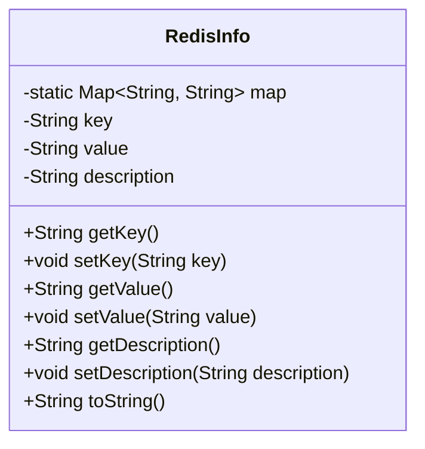
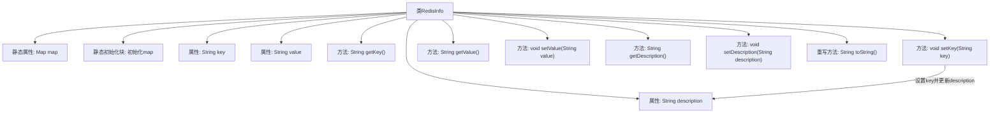

# 基础信息

|      |      |
|------|------|
| 名称 | RedisInfo |
| 编码语言 | .java |
| 代码路径 | JeecgBoot/jeecg-boot/jeecg-module-system/jeecg-system-biz/src/main/java/org/jeecg/modules/monitor/domain/RedisInfo.java |
| 包名 | org.jeecg.modules.monitor.domain |
| 依赖项 | ['java.util.HashMap', 'java.util.Map'] |
| 概述说明 | RedisInfo类存储Redis服务器版本、内存、连接等关键数据。 |

# 说明

RedisInfo类用于存储Redis服务器的关键信息，包括版本号、内存使用情况以及连接状态等核心数据。该类旨在提供一个结构化的方式来管理和访问这些重要信息，以便用户能够全面了解Redis服务器的运行状态和配置情况。通过该类的实例，用户可以方便地获取和分析Redis服务器的各项指标，从而进行有效的监控和优化。

# 类列表 Class Summary

| 名称   | 类型  | 说明 |
|-------|------|-------------|
| RedisInfo | class | RedisInfo类存储Redis服务器信息，包含版本、内存、连接等关键数据。 |

## 类 RedisInfo

|      |      |
|------|------|
| 访问范围 | public |
| 类型 | class |
| 名称 | RedisInfo |
| 说明 | RedisInfo类存储Redis服务器信息，包含版本、内存、连接等关键数据。 |

### UML类图

**描述：**  
`RedisInfo` 类用于存储与 Redis 服务器相关的信息。该类包含一个静态的 `Map` 对象 `map`，用于存储 Redis 的各种配置项及其描述。类中的 `key`、`value` 和 `description` 属性分别表示 Redis 配置项的键、值及其描述。`setKey` 方法在设置 `key` 的同时，会根据 `key` 从 `map` 中获取对应的描述并赋值给 `description`。`toString` 方法返回对象的字符串表示，包含 `key`、`value` 和 `description` 信息。

### 内部方法调用关系图

这段代码定义了一个名为 `RedisInfo` 的类，用于存储 Redis 相关的信息。类中包含一个静态的 `Map` 对象 `map`，用于存储 Redis 配置项及其描述。类还包含三个属性 `key`、`value` 和 `description`，分别表示 Redis 配置项的键、值和描述。类中提供了对这些属性的 getter 和 setter 方法，并在 `setKey` 方法中根据 `key` 更新 `description`。最后，类重写了 `toString` 方法，用于返回对象的字符串表示。

### 字段列表 Field List

| 名称  | 类型  | 说明 |
|-------|-------|------|
| value | String | 定义私有字符串变量value。 |
| key | String | 声明一个私有的字符串类型变量key。 |
| description | String | 私有字符串变量描述。 |
| map = new HashMap(5) | Map<String, String> | 定义一个私有的静态Map变量，初始容量为5。 |

### 方法列表 Method List

| 名称  | 类型  | 说明 |
|-------|-------|------|
| setDescription | void | 设置描述信息的公共方法。 |
| getDescription | String | 该方法返回描述字符串。 |
| setValue | void | 设置字符串值的方法。 |
| setKey | void | 设置键值并更新描述。 |
| getKey | String | 该方法返回字符串类型的key值。 |
| getValue | String | 方法`getValue`返回变量`value`的值。 |
| toString | String | RedisInfo类toString方法返回包含key、value和description的字符串。 |

