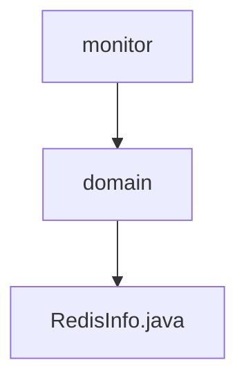

# 基础信息

|      |      |
|------|------|
| 名称 | domain |
| 编码语言 | .java |
| 代码路径 | JeecgBoot/jeecg-boot/jeecg-module-system/jeecg-system-biz/src/main/java/org/jeecg/modules/monitor/domain |
| 包名 | JeecgBoot.jeecg-boot.jeecg-module-system.jeecg-system-biz.src.main.java.org.jeecg.modules.monitor.domain |
| 概述说明 | RedisInfo类存储Redis服务器版本、内存、连接等关键数据。 |

# 说明

RedisInfo类用于存储Redis服务器的关键信息，包括版本号、内存使用情况以及连接状态等核心数据。该类旨在提供一个结构化的方式来管理和访问这些重要信息，以便用户能够全面了解Redis服务器的运行状态和配置情况。通过该类的实例，用户可以方便地获取和分析Redis服务器的各项指标，从而进行有效的监控和优化。

### 包内部结构视图

该流程图展示了路径的层级关系，从`monitor`目录到`domain`子目录，再到具体的文件`RedisInfo.java`。整个结构清晰简洁，反映了文件在项目中的组织方式。

# 文件列表 File List

| 名称   | 类型  | 说明 |
|-------|------|-------------|
| [RedisInfo.java](RedisInfo.md) | file | RedisInfo类存储Redis服务器版本、内存、连接等关键数据。 |

