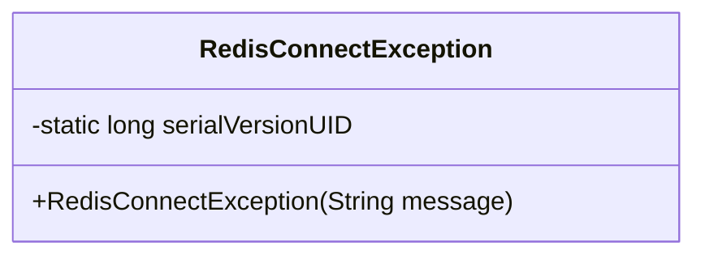
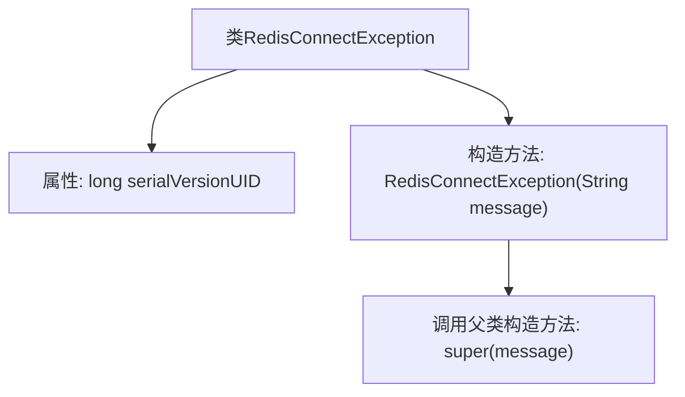

# 基础信息

|      |      |
|------|------|
| 名称 | RedisConnectException |
| 编码语言 | .java |
| 代码路径 | JeecgBoot/jeecg-boot/jeecg-module-system/jeecg-system-biz/src/main/java/org/jeecg/modules/monitor/exception/RedisConnectException.java |
| 包名 | org.jeecg.modules.monitor.exception |
| 依赖项 | [] |
| 概述说明 | RedisConnectException是处理Redis连接异常的自定义异常类。 |

# 说明

RedisConnectException是一个自定义的异常类，它继承自Exception类，专门用于处理与Redis连接相关的异常情况。通过定义这个异常类，开发者可以在Redis连接出现问题时，捕获并处理这些异常，从而提高程序的健壮性和可维护性。

# 类列表 Class Summary

| 名称   | 类型  | 说明 |
|-------|------|-------------|
| RedisConnectException | class | RedisConnectException是继承Exception的自定义异常类，用于处理Redis连接异常。 |

## 类 RedisConnectException

|      |      |
|------|------|
| 访问范围 | public |
| 类型 | class |
| 名称 | RedisConnectException |
| 说明 | RedisConnectException是继承Exception的自定义异常类，用于处理Redis连接异常。 |

### UML类图

类图描述：`RedisConnectException` 是一个自定义异常类，继承自 `Exception`。它包含一个静态的 `serialVersionUID` 用于序列化，并提供了一个构造函数，接受一个字符串参数 `message`，用于传递异常信息。这个类主要用于处理与 Redis 连接相关的异常情况。

### 内部方法调用关系图

这段代码定义了一个名为 `RedisConnectException` 的自定义异常类，继承自 `Exception`。该类包含一个静态的 `serialVersionUID` 属性，用于序列化时的版本控制。构造方法 `RedisConnectException(String message)` 接受一个字符串参数，并调用父类 `Exception` 的构造方法，将异常信息传递给父类。这个异常类通常用于处理与 Redis 连接相关的错误情况。

### 字段列表 Field List

| 名称  | 类型  | 说明 |
|-------|-------|------|
| serialVersionUID = 1639374111871115063L | long | 定义私有静态常量serialVersionUID，用于序列化版本控制。 |

### 方法列表 Method List

| 名称  | 类型  | 说明 |
|-------|-------|------|

