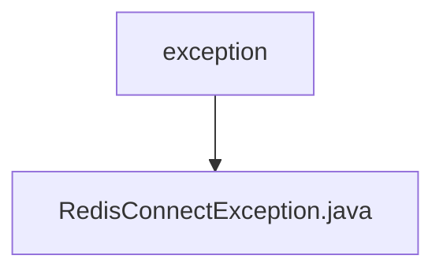

# 基础信息

|      |      |
|------|------|
| 名称 | exception |
| 编码语言 | .java |
| 代码路径 | JeecgBoot/jeecg-boot/jeecg-module-system/jeecg-system-biz/src/main/java/org/jeecg/modules/monitor/exception |
| 包名 | JeecgBoot.jeecg-boot.jeecg-module-system.jeecg-system-biz.src.main.java.org.jeecg.modules.monitor.exception |
| 概述说明 | RedisConnectException是处理Redis连接异常的自定义异常类。 |

# 说明

RedisConnectException是一个自定义的异常类，它继承自Exception类，专门用于处理与Redis连接相关的异常情况。通过定义这个异常类，开发者可以在Redis连接出现问题时，捕获并处理这些异常，从而提高程序的健壮性和可维护性。

### 包内部结构视图

该流程图展示了路径层级关系，`exception` 是父节点，`RedisConnectException.java` 是其子节点。路径结构简单明了，仅包含一个文件夹和一个文件，层级关系清晰，便于理解文件在项目中的位置。

# 文件列表 File List

| 名称   | 类型  | 说明 |
|-------|------|-------------|
| [RedisConnectException.java](RedisConnectException.md) | file | RedisConnectException是处理Redis连接异常的自定义异常类。 |

