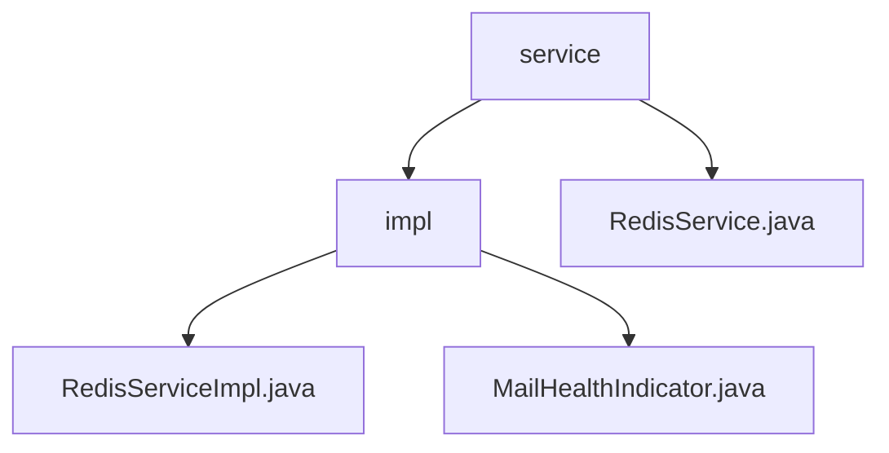

# 基础信息

|      |      |
|------|------|
| 名称 | service |
| 编码语言 | .java |
| 代码路径 | JeecgBoot/jeecg-boot/jeecg-module-system/jeecg-system-biz/src/main/java/org/jeecg/modules/monitor/service |
| 包名 | JeecgBoot.jeecg-boot.jeecg-module-system.jeecg-system-biz.src.main.java.org.jeecg.modules.monitor.service |
| 概述说明 | 该模块实现系统监控与健康检查，包含Redis服务监控和系统健康评估功能。 |

# 说明

## 概述
该代码模块主要聚焦于系统监控和健康检查功能，旨在提升系统的可管理性和稳定性。模块中包含两个核心类：`RedisServiceImpl` 和 `MailHealthIndicator`。`RedisServiceImpl` 负责 Redis 服务的信息查询、内存监控和历史性能记录，而 `MailHealthIndicator` 则通过检查错误码来评估系统的健康状态。这些功能共同为系统的实时监控、故障排查和性能优化提供了有力支持。

## 主要业务场景
1. **Redis 服务监控与优化**：
   - **信息查询**：实时获取 Redis 服务的状态和配置信息，便于管理员进行实时监控和调整。
   - **内存监控**：跟踪和分析 Redis 实例的内存使用情况，帮助识别潜在的内存问题，防止内存溢出或资源浪费。
   - **历史性能记录**：记录 Redis 的性能指标，提供历史数据分析支持，以便优化系统性能和资源分配。

2. **系统健康检查**：
   - **错误码分析**：通过检查错误码来判断系统是否存在异常或故障，确保系统运行状况的实时监控。
   - **健康状态评估**：根据错误码的检查结果返回系统的健康状态，帮助管理员及时发现并处理潜在问题，保障系统的稳定运行。

### 包内部结构视图

该流程图展示了`service`文件夹与其子文件夹`impl`以及相关文件之间的层级关系。`service`文件夹包含`RedisService.java`文件，而`impl`文件夹则包含`RedisServiceImpl.java`和`MailHealthIndicator.java`两个文件。

# 文件列表 File List

| 名称   | 类型  | 说明 |
|-------|------|-------------|
| [RedisService.java](RedisService.md) | file | 信息为空，无法生成概要描述。 |
| [impl](impl/_module.md) | package | Redis服务类实现信息查询、内存监控和历史性能记录，提升可管理性和稳定性。MailHealthIndicator类检查错误码，监控系统健康状态。 |

