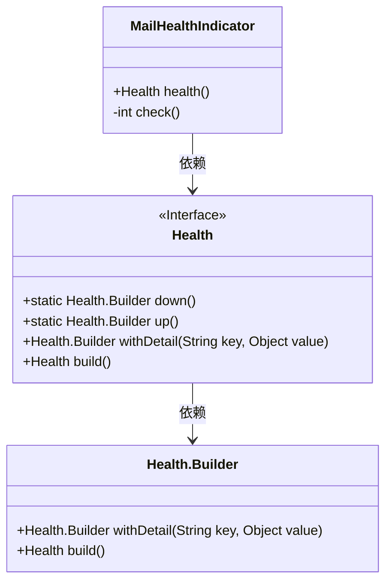
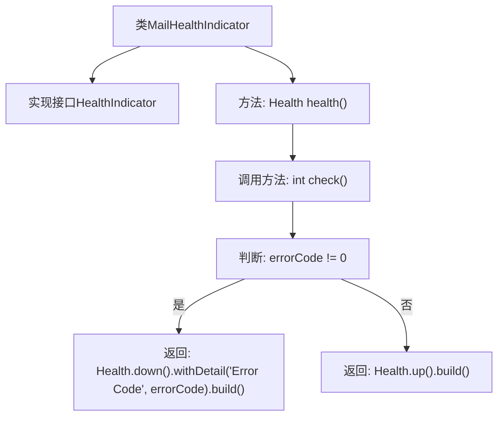

# 基础信息

|      |      |
|------|------|
| 名称 | MailHealthIndicator |
| 编码语言 | .java |
| 代码路径 | JeecgBoot/jeecg-boot/jeecg-module-system/jeecg-system-biz/src/main/java/org/jeecg/modules/monitor/service/impl/MailHealthIndicator.java |
| 包名 | org.jeecg.modules.monitor.service.impl |
| 依赖项 | ['org.springframework.boot.actuate.health.Health', 'org.springframework.boot.actuate.health.HealthIndicator', 'org.springframework.stereotype.Component'] |
| 概述说明 | MailHealthIndicator类通过检查错误码实现健康状态监控。 |

# 说明

MailHealthIndicator类实现了HealthIndicator接口，其主要功能是检查错误码并根据检查结果返回系统的健康状态。该类通过分析错误码来判断系统是否存在异常或故障，从而提供准确的健康信息。这一实现有助于监控系统的运行状况，确保及时发现并处理潜在问题。

# 类列表 Class Summary

| 名称   | 类型  | 说明 |
|-------|------|-------------|
| MailHealthIndicator | class | MailHealthIndicator类实现HealthIndicator接口，检查错误码并返回健康状态。 |

## 类 MailHealthIndicator

|      |      |
|------|------|
| 访问范围 | @Component;public |
| 类型 | class |
| 名称 | MailHealthIndicator |
| 说明 | MailHealthIndicator类实现HealthIndicator接口，检查错误码并返回健康状态。 |

### UML类图

### 描述
`MailHealthIndicator` 类实现了 `HealthIndicator` 接口，用于检查邮件服务的健康状态。它包含一个 `health()` 方法，该方法调用 `check()` 方法来获取错误码，并根据错误码返回健康状态。`Health` 接口提供了 `down()` 和 `up()` 方法来构建健康状态，`Health.Builder` 类用于添加详细信息和构建最终的 `Health` 对象。`MailHealthIndicator` 类依赖于 `Health` 接口和 `Health.Builder` 类来实现其功能。

### 内部方法调用关系图

这段代码定义了一个名为 `MailHealthIndicator` 的类，实现了 `HealthIndicator` 接口。`health()` 方法调用 `check()` 方法来获取错误码，如果错误码不为 0，则返回 `Health.down()` 状态，并包含错误码的详细信息；否则返回 `Health.up()` 状态。`check()` 方法可以自定义数据库检测逻辑，默认返回 0。

### 字段列表 Field List

| 名称  | 类型  | 说明 |
|-------|-------|------|

### 方法列表 Method List

| 名称  | 类型  | 说明 |
|-------|-------|------|
| health | Health | 检查错误码，返回健康状态及错误详情。 |
| check | int | 自定义数据库检测逻辑函数，返回值为0。 |

