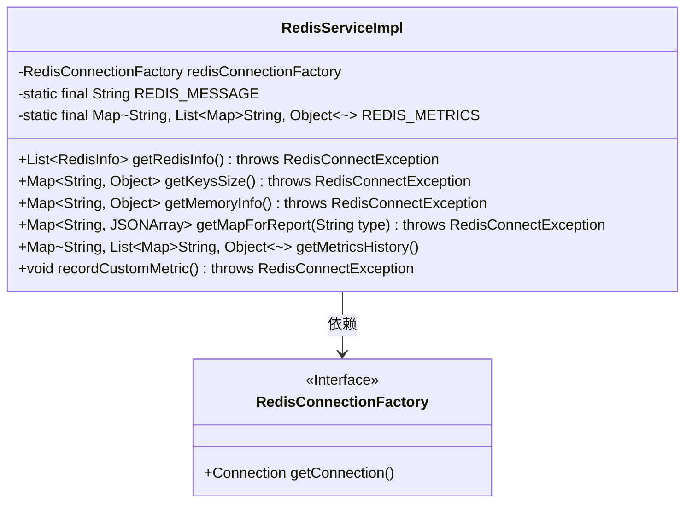

# 基础信息

|      |      |
|------|------|
| 名称 | RedisServiceImpl |
| 编码语言 | .java |
| 代码路径 | JeecgBoot/jeecg-boot/jeecg-module-system/jeecg-system-biz/src/main/java/org/jeecg/modules/monitor/service/impl/RedisServiceImpl.java |
| 包名 | org.jeecg.modules.monitor.service.impl |
| 依赖项 | ['java.util', 'javax.annotation.Resource', 'cn.hutool.core.date.DateUtil', 'com.alibaba.fastjson.JSONArray', 'com.alibaba.fastjson.JSONObject', 'com.google.common.collect.Maps', 'org.jeecg.common.util.oConvertUtils', 'org.jeecg.modules.monitor.domain.RedisInfo', 'org.jeecg.modules.monitor.exception.RedisConnectException', 'org.jeecg.modules.monitor.service.RedisService', 'org.springframework.cglib.beans.BeanMap', 'org.springframework.data.redis.connection.RedisConnectionFactory', 'org.springframework.scheduling.annotation.Scheduled', 'org.springframework.stereotype.Service', 'lombok.extern.slf4j.Slf4j'] |
| 概述说明 | Redis服务类实现信息查询、内存监控及历史性能记录。 |

# 说明

Redis服务类实现了信息查询、内存监控及历史性能记录功能。信息查询功能允许用户获取Redis服务的当前状态和配置信息，便于实时监控和调整。内存监控功能用于跟踪和分析Redis实例的内存使用情况，帮助识别潜在的内存问题。历史性能记录功能则通过记录Redis的性能指标，提供历史数据分析支持，以便优化系统性能和资源分配。这些功能共同提升了Redis服务的可管理性和稳定性。

# 类列表 Class Summary

| 名称   | 类型  | 说明 |
|-------|------|-------------|
| RedisServiceImpl | class | Redis服务类实现信息查询、内存监控及历史性能记录功能。 |

## 类 RedisServiceImpl

|      |      |
|------|------|
| 访问范围 | @Service("redisService");@Slf4j;public |
| 类型 | class |
| 名称 | RedisServiceImpl |
| 说明 | Redis服务类实现信息查询、内存监控及历史性能记录功能。 |

### UML类图

**描述：**
`RedisServiceImpl` 类实现了 `RedisService` 接口，主要用于与 Redis 数据库进行交互。它通过 `RedisConnectionFactory` 获取 Redis 连接，并提供了一系列方法用于获取 Redis 信息、键数量、内存使用情况等。此外，它还包含一个定时任务 `recordCustomMetric`，用于记录近一小时的 Redis 监控数据。类中使用了静态常量 `REDIS_MESSAGE` 和 `REDIS_METRICS` 来存储 Redis 信息和性能指标。

### 内部方法调用关系图

```mermaid
graph TD
    A["类RedisServiceImpl"]
    B["属性: RedisConnectionFactory redisConnectionFactory"]
    C["常量: String REDIS_MESSAGE"]
    D["常量: Map<String, List<Map<String, Object>>> REDIS_METRICS"]
    E["方法: List<RedisInfo> getRedisInfo()"]
    F["方法: Map<String, Object> getKeysSize()"]
    G["方法: Map<String, Object> getMemoryInfo()"]
    H["方法: Map<String, JSONArray> getMapForReport(String type)"]
    I["方法: Map<String, List<Map<String, Object>>> getMetricsHistory()"]
    J["方法: void recordCustomMetric()"]
    K["调用: redisConnectionFactory.getConnection().info()"]
    L["调用: redisConnectionFactory.getConnection().dbSize()"]
    M["调用: oConvertUtils.getString(Object)"]
    N["调用: BeanMap.create(Object)"]
    O["调用: DateUtil.formatTime(Date)"]
    P["调用: DateUtil.date(Long)"]
    Q["调用: log.debug(String)"]
    R["调用: REDIS_METRICS.containsKey(String)"]
    S["调用: REDIS_METRICS.get(String)"]
    T["调用: REDIS_METRICS.put(String, List<Map<String, Object>>)"]
    U["调用: list.remove(int)"]
    V["调用: list.add(Map<String, Object>)"]

    A --> B
    A --> C
    A --> D
    A --> E
    A --> F
    A --> G
    A --> H
    A --> I
    A --> J
    E --> K
    E --> M
    F --> L
    F --> Q
    G --> K
    G --> M
    G --> Q
    H --> E
    H --> F
    H --> G
    H --> N
    H --> O
    H --> P
    J --> F
    J --> G
    J --> R
    J --> S
    J --> T
    J --> U
    J --> V
```

这段代码定义了一个名为`RedisServiceImpl`的类，它实现了`RedisService`接口，主要用于管理和监控Redis数据库的相关信息。类中包含多个方法，如获取Redis信息、获取键的数量、获取内存使用情况、生成报表数据、获取历史性能指标以及定期记录Redis监控数据等。代码通过`RedisConnectionFactory`与Redis进行交互，并使用`oConvertUtils`、`BeanMap`、`DateUtil`等工具类进行数据处理和格式化。`recordCustomMetric`方法通过定时任务每60秒记录一次Redis的键数量和内存使用情况，并存储在`REDIS_METRICS`中，最多保留60条记录。

### 字段列表 Field List

| 名称  | 类型  | 说明 |
|-------|-------|------|
| REDIS_MESSAGE = "3" | String | 定义常量REDIS_MESSAGE，值为"3"。 |
| redisConnectionFactory | RedisConnectionFactory | 声明了一个私有Redis连接工厂变量。 |
| REDIS_METRICS = new HashMap<>(2) | Map<String,List<Map<String, Object>>> | 定义了一个静态不可变的Redis指标映射，初始容量为2。 |

### 方法列表 Method List

| 名称  | 类型  | 说明 |
|-------|-------|------|
| recordCustomMetric | void | 定时记录Redis数据库大小和内存信息，最多保存60条数据。 |
| getMemoryInfo | Map<String, Object> | 方法获取Redis内存信息并返回包含使用内存和创建时间的Map。 |
| getMapForReport | Map<String, JSONArray> | 根据类型生成Redis报告数据，包括内存使用和键大小信息。 |
| getMetricsHistory | Map<String, List<Map<String, Object>>> | 重写方法getMetricsHistory，返回REDIS_METRICS数据。 |
| getKeysSize | Map<String, Object> | 重写方法获取Redis数据库大小，返回包含创建时间和大小的映射。 |
| getRedisInfo | List<RedisInfo> | 方法获取Redis信息并转换为列表返回。 |

