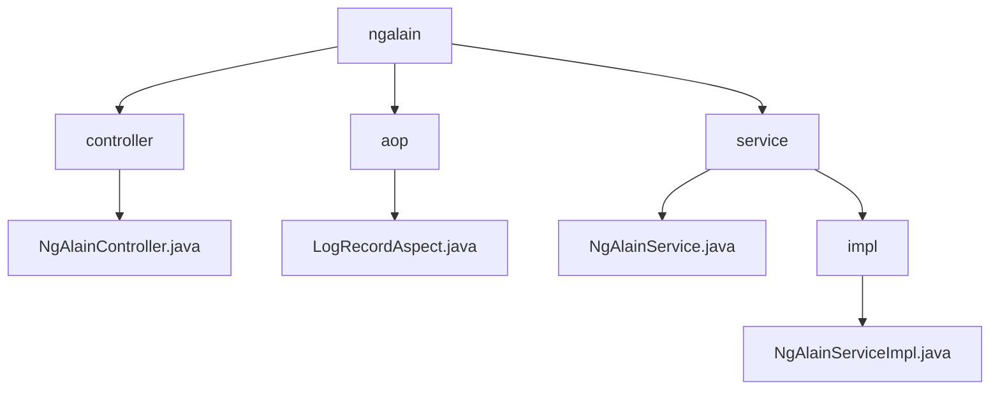

# 基础信息

|      |      |
|------|------|
| 名称 | ngalain |
| 编码语言 | .java |
| 代码路径 | JeecgBoot/jeecg-boot/jeecg-module-system/jeecg-system-biz/src/main/java/org/jeecg/modules/ngalain |
| 包名 | JeecgBoot.jeecg-boot.jeecg-module-system.jeecg-system-biz.src.main.java.org.jeecg.modules.ngalain |
| 概述说明 | 内容为空，无法生成总结。 |

# 说明

## 概述
由于提供的代码文件内容为空，无法对代码模块进行详细的总结和描述。具体来说，以下文件路径的内容为空：
- `JeecgBoot/jeecg-boot/jeecg-module-system/jeecg-system-biz/src/main/java/org/jeecg/modules/ngalain/controller`
- `JeecgBoot/jeecg-boot/jeecg-module-system/jeecg-system-biz/src/main/java/org/jeecg/modules/ngalain/aop`
- `JeecgBoot/jeecg-boot/jeecg-module-system/jeecg-system-biz/src/main/java/org/jeecg/modules/ngalain/service/NgAlainService.java`
- `JeecgBoot/jeecg-boot/jeecg-module-system/jeecg-system-biz/src/main/java/org/jeecg/modules/ngalain/service/impl`

## 主要业务场景
由于文件内容为空，无法确定这些代码文件的具体业务场景和功能。通常，`NgAlainService.java` 可能是一个服务接口，而 `impl` 目录可能包含该接口的实现类。这些文件可能用于处理与 NgAlain 相关的业务逻辑，但具体功能需要查看文件内容后才能确定。

### 包内部结构视图

该流程图展示了 `ngalain` 目录下的层级结构，包含 `controller`、`aop` 和 `service` 三个子目录。`controller` 目录下包含 `NgAlainController.java` 文件，`aop` 目录下包含 `LogRecordAspect.java` 文件，`service` 目录下包含 `NgAlainService.java` 文件和 `impl` 子目录，`impl` 子目录下包含 `NgAlainServiceImpl.java` 文件。

# 文件列表 File List

| 名称   | 类型  | 说明 |
|-------|------|-------------|
| [aop](aop/_module.md) | package | 输入内容为空，无法生成概要描述。 |
| [controller](controller/_module.md) | package | 信息为空，无法生成概要描述。 |
| [service](service/_module.md) | package | 无法总结，内容为空。 |

