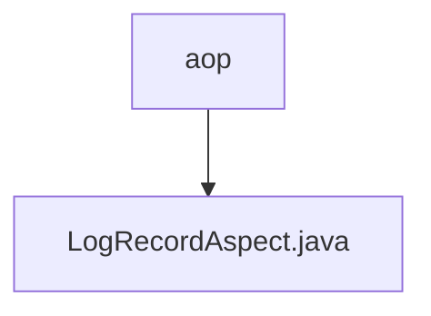

# 基础信息

|      |      |
|------|------|
| 名称 | aop |
| 编码语言 | .java |
| 代码路径 | JeecgBoot/jeecg-boot/jeecg-module-system/jeecg-system-biz/src/main/java/org/jeecg/modules/ngalain/aop |
| 包名 | JeecgBoot.jeecg-boot.jeecg-module-system.jeecg-system-biz.src.main.java.org.jeecg.modules.ngalain.aop |
| 概述说明 | 输入内容为空，无法生成概要描述。 |

# 说明

该内容为空，未提供任何具体信息或细节。因此，无法生成总结描述。请提供具体内容以便进行详细总结。

### 包内部结构视图

流程图描述：该流程图展示了路径层级关系，`aop` 是根节点，`LogRecordAspect.java` 是其子节点。`aop` 表示一个目录，`LogRecordAspect.java` 是该目录下的一个文件。这种层级关系清晰展示了文件在目录结构中的位置。

# 文件列表 File List

| 名称   | 类型  | 说明 |
|-------|------|-------------|
| [LogRecordAspect.java](LogRecordAspect.md) | file | 输入内容为空，无法生成概要描述。 |

