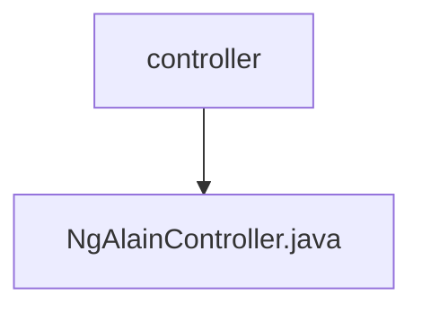

# 基础信息

|      |      |
|------|------|
| 名称 | controller |
| 编码语言 | .java |
| 代码路径 | JeecgBoot/jeecg-boot/jeecg-module-system/jeecg-system-biz/src/main/java/org/jeecg/modules/ngalain/controller |
| 包名 | JeecgBoot.jeecg-boot.jeecg-module-system.jeecg-system-biz.src.main.java.org.jeecg.modules.ngalain.controller |
| 概述说明 | 信息为空，无法生成概要描述。 |

# 说明

该内容为空，未提供任何具体信息或细节，因此无法进行总结描述。

### 包内部结构视图

该流程图展示了JeecgBoot项目中`ngalain`模块的控制器结构。`controller`文件夹包含一个名为`NgAlainController.java`的文件，表示这是该控制器的主要实现文件。通过这种层级关系，可以清晰地看到控制器的组织方式及其核心文件的定位。

# 文件列表 File List

| 名称   | 类型  | 说明 |
|-------|------|-------------|
| [NgAlainController.java](NgAlainController.md) | file | 信息为空，无法生成概要描述。 |

