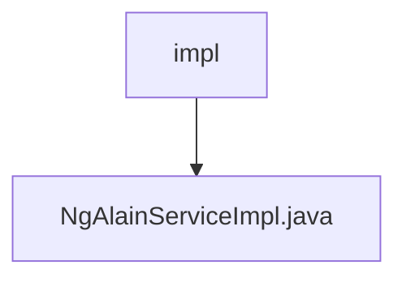

# 基础信息

|      |      |
|------|------|
| 名称 | impl |
| 编码语言 | .java |
| 代码路径 | JeecgBoot/jeecg-boot/jeecg-module-system/jeecg-system-biz/src/main/java/org/jeecg/modules/ngalain/service/impl |
| 包名 | JeecgBoot.jeecg-boot.jeecg-module-system.jeecg-system-biz.src.main.java.org.jeecg.modules.ngalain.service.impl |
| 概述说明 | 无内容，无法生成概要描述。 |

# 说明

内容为空，无法进行总结描述。请提供具体内容以便生成详细的总结。

### 包内部结构视图

该流程图展示了`impl`文件夹与`NgAlainServiceImpl.java`文件之间的层级关系。`impl`文件夹作为父节点，包含了一个子节点`NgAlainServiceImpl.java`，表示该文件位于`impl`文件夹内。

# 文件列表 File List

| 名称   | 类型  | 说明 |
|-------|------|-------------|
| [NgAlainServiceImpl.java](NgAlainServiceImpl.md) | file | 无内容，无法生成概要描述。 |

