# 基础信息

|      |      |
|------|------|
| 名称 | openapi |
| 编码语言 | .java |
| 代码路径 | JeecgBoot/jeecg-boot/jeecg-module-system/jeecg-system-biz/src/main/java/org/jeecg/modules/openapi |
| 包名 | JeecgBoot.jeecg-boot.jeecg-module-system.jeecg-system-biz.src.main.java.org.jeecg.modules.openapi |
| 概述说明 | 代码模块实现API安全认证，包含加密处理和权限检查，确保数据传输和用户身份合法。 |

# 说明

## 概述

该代码模块是一个基于JeecgBoot框架的系统模块，专注于OpenAPI的管理、安全性和认证机制。模块涵盖了从API的创建、管理、调用到安全性验证的全流程，提供了多层次的安全保障和灵活的API管理功能。核心功能包括API的加密处理、认证与权限检查、参数管理、调用记录管理以及Swagger文档的自动生成。模块通过多个过滤器、控制器、服务类和实体类协同工作，确保API的安全性、完整性和可管理性。

## 主要业务场景

1. **API安全与认证**：
   - 通过`ApiFilterConfig`和`ApiAuthFilter`过滤器，模块对指定路径的API调用进行加密处理、身份验证、签名验证和权限检查，确保API通信的安全性和用户身份的合法性。

2. **API管理与操作**：
   - 通过`OpenApiController`、`OpenApiAuthController`等控制器，模块支持API的创建、编辑、删除、调用以及权限管理，确保API的可访问性和安全性。
   - `OpenApi`、`OpenApiAuth`、`OpenApiParam`等实体类用于定义和管理API的基本信息、认证信息、参数信息等，确保API的完整性和可配置性。

3. **API调用记录与审计**：
   - `OpenApiRecord`类用于记录API的调用过程，包括调用时间、耗时、响应时间等，便于后续的审计和性能优化。

4. **Swagger文档生成与管理**：
   - 通过`SwaggerOperation`、`SwaggerModel`等类，模块支持API文档的自动生成和管理，确保API文档的规范性和可读性。

5. **随机字符串生成**：
   - `PathGenerator`和`AKSKGenerator`类分别用于生成随机的路径标识和AKSK对，适用于URL短链、文件路径标识以及API访问控制等场景。

6. **数据映射与持久化**：
   - `OpenApiMapper`、`OpenApiAuthMapper`等映射器类负责与数据库的交互，确保API相关数据的持久化和高效管理。

该模块通过上述功能，全面支持了OpenAPI的管理、安全性验证和调用记录，适用于需要高效管理API请求和权限的系统场景。

### 包内部结构视图

```mermaid
graph TD
    openapi --> filter
    openapi --> entity
    openapi --> controller
    openapi --> service
    openapi --> swagger
    openapi --> generator
    openapi --> mapper
    filter --> ApiFilterConfig.java
    filter --> ApiAuthFilter.java
    entity --> OpenApiHeader.java
    entity --> OpenApi.java
    entity --> OpenApiAuth.java
    entity --> OpenApiParam.java
    entity --> OpenApiRecord.java
    entity --> OpenApiPermission.java
    controller --> OpenApiIndexController.java
    controller --> OpenApiAuthController.java
    controller --> OpenApiController.java
    controller --> OpenApiPermissionController.java
    controller --> OpenApiRecordController.java
    service --> OpenApiRecordService.java
    service --> OpenApiAuthService.java
    service --> OpenApiPermissionService.java
    service --> OpenApiParamService.java
    service --> OpenApiService.java
    service --> OpenApiHeaderService.java
    service --> impl
    impl --> OpenApiParamServiceImpl.java
    impl --> OpenApiAuthServiceImpl.java
    impl --> OpenApiHeaderServiceImpl.java
    impl --> OpenApiPermissionServiceImpl.java
    impl --> OpenApiServiceImpl.java
    impl --> OpenApiRecordServiceImpl.java
    swagger --> SwaggerOperationParameter.java
    swagger --> SwaggerModel.java
    swagger --> SwaggerInfoContact.java
    swagger --> SwaggerInfoLicense.java
    swagger --> SwaggerOperation.java
    swagger --> SwaggerOperationResponse.java
    swagger --> SwaggerDefinitionProperties.java
    swagger --> SwaggerSchema.java
    swagger --> SwaggerTag.java
    swagger --> SwaggerDefinition.java
    swagger --> SwaggerInfo.java
    generator --> PathGenerator.java
    generator --> AKSKGenerator.java
    mapper --> OpenApiMapper.java
    mapper --> OpenApiHeaderMapper.java
    mapper --> OpenApiPermissionMapper.java
    mapper --> OpenApiParamMapper.java
    mapper --> OpenApiAuthMapper.java
    mapper --> OpenApiRecordMapper.java
```

该流程图展示了`openapi`模块的层级结构，包含`filter`、`entity`、`controller`、`service`、`swagger`、`generator`和`mapper`等子模块。每个子模块下进一步细分为具体的文件，如`ApiFilterConfig.java`、`OpenApi.java`、`OpenApiIndexController.java`等。这些文件共同构成了`openapi`模块的功能实现，涵盖了从请求过滤、实体定义、控制器逻辑、服务处理、Swagger文档生成到数据映射等多个方面。

# 文件列表 File List

| 名称   | 类型  | 说明 |
|-------|------|-------------|
| [mapper](mapper/_module.md) | package | 输入内容为空，无法生成总结描述。 |
| [generator](generator/_module.md) | package | PathGenerator生成8位Base62随机路径，AKSKGenerator生成16位AK和32位SK随机密钥对。 |
| [swagger](swagger/_module.md) | package | Swagger类库包含多个类，用于定义API操作、参数、响应、模型、标签、许可证等信息，确保API描述准确和完整。 |
| [filter](filter/_module.md) | package | 注册API加密过滤器保护/openapi/call/*路径数据，ApiAuthFilter实现认证、签名验证、权限检查及调用记录。 |
| [service](service/_module.md) | package | 该模块实现OpenApi功能，涵盖参数、认证、权限、记录等管理，确保API高效安全。 |
| [controller](controller/_module.md) | package | OpenApi控制器类实现增删改查、权限管理、记录操作及AKSK生成等功能。 |
| [entity](entity/_module.md) | package | OpenApi类定义了接口结构，包含ID、名称、请求方式等字段，用于管理API接口。OpenApiHeader类描述头信息，包含ID、键、必填标志等。OpenApiAuth类管理认证信息，包含ID、名称、密钥等。OpenApiParam类定义API参数，包含ID、apiId、paramKey等。OpenApiRecord类记录接口调用，包含接口ID、调用ID、调用时间等。OpenApiPermission类管理权限，包含ID、接口ID、认证ID等。 |

