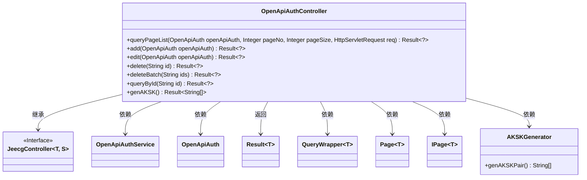

# 基础信息

|      |      |
|------|------|
| 名称 | OpenApiAuthController |
| 编码语言 | .java |
| 代码路径 | JeecgBoot/jeecg-boot/jeecg-module-system/jeecg-system-biz/src/main/java/org/jeecg/modules/openapi/controller/OpenApiAuthController.java |
| 包名 | org.jeecg.modules.openapi.controller |
| 依赖项 | ['com.baomidou.mybatisplus.core.conditions.query.QueryWrapper', 'com.baomidou.mybatisplus.core.metadata.IPage', 'com.baomidou.mybatisplus.extension.plugins.pagination.Page', 'org.jeecg.common.api.vo.Result', 'org.jeecg.common.system.base.controller.JeecgController', 'org.jeecg.common.system.query.QueryGenerator', 'org.jeecg.modules.openapi.entity.OpenApiAuth', 'org.jeecg.modules.openapi.generator.AKSKGenerator', 'org.jeecg.modules.openapi.service.OpenApiAuthService', 'org.springframework.web.bind.annotation', 'javax.servlet.http.HttpServletRequest', 'java.util.Arrays'] |
| 概述说明 | OpenApiAuthController实现分页查询、增删改查、批量删除及生成AKSK功能。 |

# 说明

OpenApiAuthController实现了多项核心功能，包括分页查询、添加、编辑、删除、批量删除、ID查询以及生成AKSK。这些功能覆盖了基本的增删改查操作，同时支持批量处理和特定ID的查询，还提供了生成AKSK的能力，确保了系统的完整性和灵活性。

# 类列表 Class Summary

| 名称   | 类型  | 说明 |
|-------|------|-------------|
| OpenApiAuthController | class | OpenApiAuthController实现分页查询、添加、编辑、删除、批量删除、ID查询及生成AKSK功能。 |

## 类 OpenApiAuthController

|      |      |
|------|------|
| 访问范围 | @RestController;@RequestMapping("/openapi/auth");public |
| 类型 | class |
| 名称 | OpenApiAuthController |
| 说明 | OpenApiAuthController实现分页查询、添加、编辑、删除、批量删除、ID查询及生成AKSK功能。 |

### UML类图

### 描述
`OpenApiAuthController` 是一个基于 Spring 的 REST 控制器，负责处理与 `OpenApiAuth` 相关的 CRUD 操作。它继承了 `JeecgController`，并依赖 `OpenApiAuthService` 来执行具体的业务逻辑。控制器提供了分页查询、添加、编辑、删除、批量删除、按 ID 查询以及生成 AK/SK 对的功能。每个方法都返回 `Result` 对象，用于封装操作结果。

### 内部方法调用关系图

```mermaid
graph TD
    A["类OpenApiAuthController"]
    B["方法: queryPageList(OpenApiAuth, Integer, Integer, HttpServletRequest)"]
    C["方法: add(OpenApiAuth)"]
    D["方法: edit(OpenApiAuth)"]
    E["方法: delete(String)"]
    F["方法: deleteBatch(String)"]
    G["方法: queryById(String)"]
    H["方法: genAKSK()"]
    I["调用: QueryGenerator.initQueryWrapper(OpenApiAuth, Map)"]
    J["调用: service.page(Page, QueryWrapper)"]
    K["调用: service.save(OpenApiAuth)"]
    L["调用: service.updateById(OpenApiAuth)"]
    M["调用: service.removeById(String)"]
    N["调用: service.removeByIds(List)"]
    O["调用: service.getById(String)"]
    P["调用: AKSKGenerator.genAKSKPair()"]
    Q["返回: Result.ok(IPage)"]
    R["返回: Result.ok(String)"]
    S["返回: Result.ok(OpenApiAuth)"]
    T["返回: Result.ok(String[])"]

    A --> B
    A --> C
    A --> D
    A --> E
    A --> F
    A --> G
    A --> H
    B --> I
    B --> J
    B --> Q
    C --> K
    C --> R
    D --> L
    D --> R
    E --> M
    E --> R
    F --> N
    F --> R
    G --> O
    G --> S
    H --> P
    H --> T
```

这段代码定义了一个名为`OpenApiAuthController`的REST控制器，提供了多个API接口用于处理与`OpenApiAuth`实体相关的操作。这些操作包括分页查询、添加、编辑、删除、批量删除、通过ID查询以及生成AKSK对。每个方法都通过调用`service`层的方法来完成具体的业务逻辑，并返回相应的`Result`对象。流程图清晰地展示了各个方法的调用关系和返回结果。

### 字段列表 Field List

| 名称  | 类型  | 说明 |
|-------|-------|------|

### 方法列表 Method List

| 名称  | 类型  | 说明 |
|-------|-------|------|
| add | Result<?> | 使用PostMapping添加OpenApiAuth，成功后返回添加成功信息。 |
| queryPageList | Result<?> | GET请求分页查询OpenApiAuth列表，默认页数1，每页10条。 |
| genAKSK | Result<String[]> | 该方法生成并返回AKSK密钥对。 |
| queryById | Result<?> | 通过ID查询OpenApiAuth信息并返回结果。 |
| edit | Result<?> | PUT请求路径为/edit，更新OpenApiAuth并返回成功信息。 |
| delete | Result<?> | 删除接口，接收ID参数，调用服务删除数据，返回成功信息。 |
| deleteBatch | Result<?> | 批量删除接口，接收ID列表并调用服务进行删除，返回成功信息。 |

