# 基础信息

|      |      |
|------|------|
| 名称 | OpenApiController |
| 编码语言 | .java |
| 代码路径 | JeecgBoot/jeecg-boot/jeecg-module-system/jeecg-system-biz/src/main/java/org/jeecg/modules/openapi/controller/OpenApiController.java |
| 包名 | org.jeecg.modules.openapi.controller |
| 依赖项 | ['com.alibaba.fastjson.JSONObject', 'com.baomidou.mybatisplus.core.conditions.query.QueryWrapper', 'com.baomidou.mybatisplus.core.metadata.IPage', 'com.baomidou.mybatisplus.extension.plugins.pagination.Page', 'com.google.common.collect.Lists', 'org.jeecg.common.api.vo.Result', 'org.jeecg.common.constant.CommonConstant', 'org.jeecg.common.system.base.controller.JeecgController', 'org.jeecg.common.system.query.QueryGenerator', 'org.jeecg.common.system.util.JwtUtil', 'org.jeecg.modules.openapi.entity.OpenApi', 'org.jeecg.modules.openapi.entity.OpenApiAuth', 'org.jeecg.modules.openapi.entity.OpenApiHeader', 'org.jeecg.modules.openapi.entity.OpenApiParam', 'org.jeecg.modules.openapi.generator.PathGenerator', 'org.jeecg.modules.openapi.service.OpenApiAuthService', 'org.jeecg.modules.openapi.service.OpenApiHeaderService', 'org.jeecg.modules.openapi.service.OpenApiParamService', 'org.jeecg.modules.openapi.service.OpenApiService', 'org.jeecg.modules.openapi.swagger', 'org.jeecg.modules.system.entity.SysUser', 'org.jeecg.modules.system.service.ISysUserService', 'org.springframework.beans.factory.annotation.Autowired', 'org.springframework.http.HttpEntity', 'org.springframework.http.HttpHeaders', 'org.springframework.http.HttpMethod', 'org.springframework.util.CollectionUtils', 'org.springframework.util.StringUtils', 'org.springframework.web.bind.annotation', 'org.springframework.web.client.RestTemplate', 'javax.servlet.http.HttpServletRequest', 'java.util'] |
| 概述说明 | OpenApiController支持分页查询、增删改及接口调用，具备批量操作和Swagger模型生成功能。 |

# 说明

OpenApiController具备分页查询、添加、编辑、删除及接口调用功能，支持批量操作和Swagger模型生成。该控制器能够处理多种数据操作需求，包括单条记录和批量记录的增删改查，同时集成了Swagger模型生成功能，便于API文档的自动生成和管理。

# 类列表 Class Summary

| 名称   | 类型  | 说明 |
|-------|------|-------------|
| OpenApiController | class | OpenApiController提供分页查询、添加、编辑、删除及接口调用功能，支持批量操作和Swagger模型生成。 |

## 类 OpenApiController

|      |      |
|------|------|
| 访问范围 | @RestController;@RequestMapping("/openapi");public |
| 类型 | class |
| 名称 | OpenApiController |
| 说明 | OpenApiController提供分页查询、添加、编辑、删除及接口调用功能，支持批量操作和Swagger模型生成。 |

### UML类图

```mermaid
classDiagram
    class OpenApiController {
        -RestTemplate restTemplate
        -OpenApiParamService openApiParamService
        -OpenApiHeaderService openApiHeaderService
        -ISysUserService sysUserService
        -OpenApiAuthService openApiAuthService
        +Result~?~ queryPageList(OpenApi openApi, Integer pageNo, Integer pageSize, HttpServletRequest req)
        +Result~?~ add(OpenApi openApi)
        +Result~?~ edit(OpenApi openApi)
        +Result~?~ delete(String id)
        +Result~?~ deleteBatch(String ids)
        +Result~?~ queryById(String id)
        +Result~?~ call(String path, String json, HttpServletRequest request)
        +SwaggerModel swaggerModel()
        +Result~String~ genPath()
    }

    class OpenApi {
        +String id
        +String name
        +String originUrl
        +String requestMethod
        +String body
        +String requestUrl
        +List~OpenApiParam~ params
        +List~OpenApiHeader~ headers
    }

    class OpenApiParam {
        +String paramKey
        +String note
        +int required
    }

    class OpenApiHeader {
        +String headerKey
        +String note
        +int required
    }

    class OpenApiParamService {
        +List~OpenApiParam~ findByApiId(String apiId)
        +void saveBatch(List~OpenApiParam~ params)
        +void deleteByApiId(String apiId)
    }

    class OpenApiHeaderService {
        +List~OpenApiHeader~ findByApiId(String apiId)
        +void saveBatch(List~OpenApiHeader~ headers)
        +void deleteByApiId(String apiId)
    }

    class ISysUserService {
        +SysUser getById(String id)
    }

    class OpenApiAuthService {
        +OpenApiAuth getByAppkey(String appkey)
    }

    class SwaggerModel {
        +String swagger
        +SwaggerInfo info
        +String host
        +String basePath
        +List~String~ schemes
        +List~SwaggerTag~ tags
        +Map~String, Map~String, SwaggerOperation~~ paths
        +Map~String, SwaggerDefinition~ definitions
    }

    class SwaggerInfo {
        +String description
        +String version
        +String title
        +String termsOfService
        +SwaggerInfoContact contact
        +SwaggerInfoLicense license
    }

    class SwaggerInfoContact {
        +String name
    }

    class SwaggerInfoLicense {
        +String name
        +String url
    }

    class SwaggerTag {
        +String name
    }

    class SwaggerOperation {
        +List~String~ tags
        +String summary
        +String description
        +String operationId
        +List~String~ produces
        +List~SwaggerOperationParameter~ parameters
        +Map~String, SwaggerOperationResponse~ responses
    }

    class SwaggerOperationParameter {
        +String in
        +String name
        +boolean required
        +String description
        +Map~String, String~ schema
    }

    class SwaggerOperationResponse {
        +String description
        +Map~String, String~ schema
    }

    class SwaggerDefinition {
        +String type
        +Map~String, SwaggerDefinitionProperties~ properties
    }

    class SwaggerDefinitionProperties {
        +String type
        +String description
    }

    OpenApiController --> OpenApiParamService : 依赖
    OpenApiController --> OpenApiHeaderService : 依赖
    OpenApiController --> ISysUserService : 依赖
    OpenApiController --> OpenApiAuthService : 依赖
    OpenApiController --> RestTemplate : 依赖
    OpenApiController --> OpenApi : 依赖
    OpenApi --> OpenApiParam : 包含
    OpenApi --> OpenApiHeader : 包含
    OpenApiParamService --> OpenApiParam : 操作
    OpenApiHeaderService --> OpenApiHeader : 操作
    ISysUserService --> SysUser : 操作
    OpenApiAuthService --> OpenApiAuth : 操作
    SwaggerModel --> SwaggerInfo : 包含
    SwaggerModel --> SwaggerTag : 包含
    SwaggerModel --> SwaggerOperation : 包含
    SwaggerModel --> SwaggerDefinition : 包含
    SwaggerInfo --> SwaggerInfoContact : 包含
    SwaggerInfo --> SwaggerInfoLicense : 包含
    SwaggerOperation --> SwaggerOperationParameter : 包含
    SwaggerOperation --> SwaggerOperationResponse : 包含
    SwaggerDefinition --> SwaggerDefinitionProperties : 包含
```

### 描述
该代码是一个基于Spring Boot的OpenAPI控制器类，主要负责处理与OpenAPI相关的请求。它通过依赖注入的方式使用了多个服务类，如`OpenApiParamService`、`OpenApiHeaderService`等，来执行具体的业务逻辑。控制器提供了分页查询、添加、编辑、删除、批量删除、查询详情、接口调用、生成Swagger文档等功能。代码中涉及多个实体类和服务类，它们之间的关系通过依赖注入和操作来体现。

### 内部方法调用关系图

```mermaid
graph TD
    A["类OpenApiController"]
    B["属性: RestTemplate restTemplate"]
    C["属性: OpenApiParamService openApiParamService"]
    D["属性: OpenApiHeaderService openApiHeaderService"]
    E["属性: ISysUserService sysUserService"]
    F["属性: OpenApiAuthService openApiAuthService"]
    G["方法: Result<?> queryPageList(OpenApi openApi, Integer pageNo, Integer pageSize, HttpServletRequest req)"]
    H["方法: Result<?> add(@RequestBody OpenApi openApi)"]
    I["方法: Result<?> edit(@RequestBody OpenApi openApi)"]
    J["方法: Result<?> delete(@RequestParam String id)"]
    K["方法: Result<?> deleteBatch(@RequestParam String ids)"]
    L["方法: Result<?> queryById(@RequestParam String id)"]
    M["方法: Result<?> call(@PathVariable String path, @RequestBody String json, HttpServletRequest request)"]
    N["方法: SwaggerModel swaggerModel()"]
    O["方法: Result<String> genPath()"]
    P["私有方法: void pathsAndDefinitions(SwaggerModel swaggerModel)"]
    Q["私有方法: void parameters(SwaggerOperation operation, OpenApi openApi)"]
    R["私有方法: SwaggerInfo swaggerInfo()"]

    A --> B
    A --> C
    A --> D
    A --> E
    A --> F
    A --> G
    A --> H
    A --> I
    A --> J
    A --> K
    A --> L
    A --> M
    A --> N
    A --> O
    A --> P
    A --> Q
    A --> R
```

这段代码是一个Spring Boot的控制器类`OpenApiController`，负责处理与OpenAPI相关的HTTP请求。它提供了分页查询、添加、编辑、删除、批量删除、查询单个记录、接口调用、生成Swagger文档等功能。类中注入了多个服务类，如`RestTemplate`、`OpenApiParamService`、`OpenApiHeaderService`等，用于处理业务逻辑。私有方法`pathsAndDefinitions`、`parameters`和`swaggerInfo`用于生成Swagger文档的路径、参数和信息。整个类结构清晰，功能模块化，便于维护和扩展。

### 字段列表 Field List

| 名称  | 类型  | 说明 |
|-------|-------|------|
| restTemplate | RestTemplate | 使用@Autowired注解自动注入RestTemplate实例。 |
| openApiAuthService | OpenApiAuthService | 自动注入OpenApiAuthService服务实例。 |
| openApiParamService | OpenApiParamService | 自动注入OpenApiParamService服务实例。 |
| sysUserService | ISysUserService | 自动注入系统用户服务实例。 |
| openApiHeaderService | OpenApiHeaderService | 自动注入OpenApiHeaderService服务实例。 |

### 方法列表 Method List

| 名称  | 类型  | 说明 |
|-------|-------|------|
| edit | Result<?> | 处理OpenApi编辑请求，更新数据并返回成功结果。 |
| parameters | void | 方法parameters根据openApi生成SwaggerOperation参数列表，包含路径和头信息。 |
| deleteBatch | Result<?> | 删除批量数据接口，接收ID列表并执行批量删除操作。 |
| pathsAndDefinitions | void | 生成Swagger模型，包含路径、操作、参数和响应定义。 |
| add | Result<?> | 通过POST请求添加OpenApi，保存成功后处理其头部和参数，返回添加成功信息。 |
| queryById | Result<?> | 通过ID查询OpenApi信息并返回结果。 |
| call | Result<?> | 处理请求，验证路径和权限，构建请求头，执行API调用并返回结果。 |
| delete | Result<?> | 删除接口，通过ID删除数据，返回成功信息。 |
| swaggerInfo | SwaggerInfo | OpenAPI接口列表，版本3.7.1，Apache 2.0许可，联系jeecg@qq.com。 |
| swaggerModel | SwaggerModel | GET请求返回Swagger模型，包含版本、信息、主机、路径、协议和标签。 |
| queryPageList | Result<?> | GET请求分页查询OpenApi列表，设置参数并返回结果。 |
| genPath | Result<String> | 通过Get请求生成路径并返回成功结果。 |

