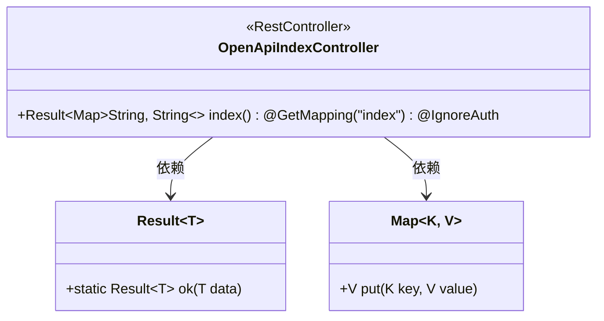
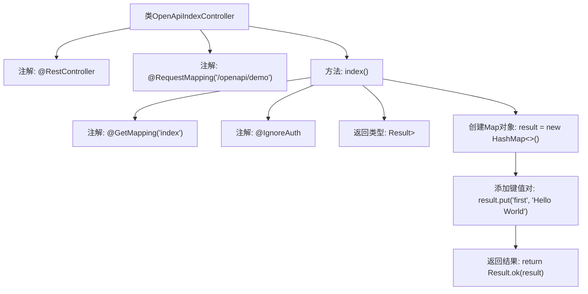

# 基础信息

|      |      |
|------|------|
| 名称 | OpenApiIndexController |
| 编码语言 | .java |
| 代码路径 | JeecgBoot/jeecg-boot/jeecg-module-system/jeecg-system-biz/src/main/java/org/jeecg/modules/openapi/controller/OpenApiIndexController.java |
| 包名 | org.jeecg.modules.openapi.controller |
| 依赖项 | ['org.jeecg.common.api.vo.Result', 'org.jeecg.config.shiro.IgnoreAuth', 'org.springframework.web.bind.annotation.GetMapping', 'org.springframework.web.bind.annotation.RequestMapping', 'org.springframework.web.bind.annotation.RestController', 'java.util.HashMap', 'java.util.Map'] |
| 概述说明 | OpenApiIndexController提供/index接口，返回Hello World。 |

# 说明

OpenApiIndexController是一个控制器类，提供了一个名为/index的接口。当访问该接口时，会返回一个简单的字符串“Hello World”。这个接口主要用于展示基本的API功能，通常用于测试或演示目的。

# 类列表 Class Summary

| 名称   | 类型  | 说明 |
|-------|------|-------------|
| OpenApiIndexController | class | OpenApiIndexController提供/index接口，返回Hello World。 |

## 类 OpenApiIndexController

|      |      |
|------|------|
| 访问范围 | @RestController;@RequestMapping("/openapi/demo");public |
| 类型 | class |
| 名称 | OpenApiIndexController |
| 说明 | OpenApiIndexController提供/index接口，返回Hello World。 |

### UML类图

**描述：**
`OpenApiIndexController` 是一个 REST 控制器，负责处理 `/openapi/demo/index` 路径的 GET 请求。它使用 `@IgnoreAuth` 注解忽略身份验证，并返回一个包含 `"Hello World"` 的 `Result` 对象。`Result` 是一个泛型类，用于封装返回数据，`Map` 用于存储键值对。控制器依赖于 `Result` 和 `Map` 类来实现其功能。

### 内部方法调用关系图

这段代码定义了一个名为 `OpenApiIndexController` 的控制器类，用于处理 `/openapi/demo/index` 路径的 GET 请求。该方法 `index()` 被 `@IgnoreAuth` 注解标记，表示无需身份验证即可访问。方法内部创建了一个 `Map` 对象，并添加了一个键值对 `"first": "Hello World"`，最后通过 `Result.ok(result)` 返回该结果。流程图展示了类的结构、方法调用顺序以及返回结果的流程。

### 字段列表 Field List

| 名称  | 类型  | 说明 |
|-------|-------|------|

### 方法列表 Method List

| 名称  | 类型  | 说明 |
|-------|-------|------|
| index | Result<Map<String, String>> | GetMapping方法忽略鉴权，返回包含"Hello World"的Map结果。 |

