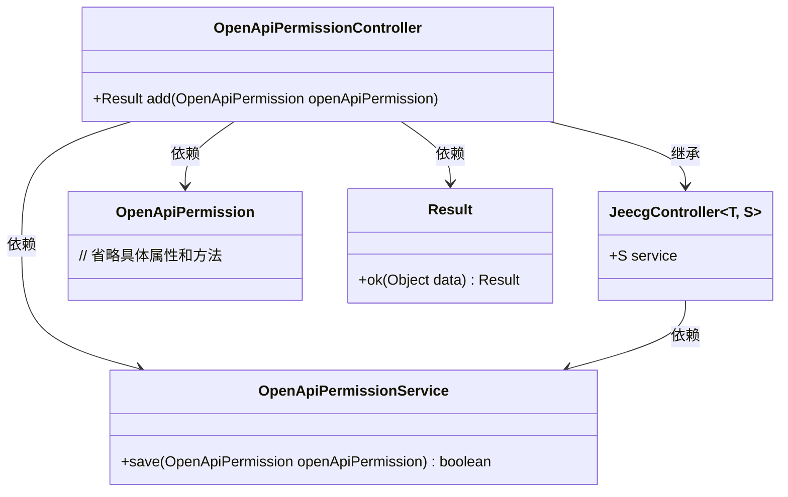
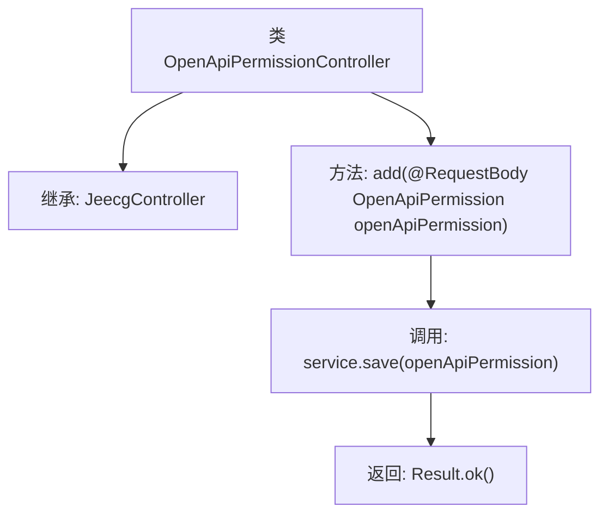

# 基础信息

|      |      |
|------|------|
| 名称 | OpenApiPermissionController |
| 编码语言 | .java |
| 代码路径 | JeecgBoot/jeecg-boot/jeecg-module-system/jeecg-system-biz/src/main/java/org/jeecg/modules/openapi/controller/OpenApiPermissionController.java |
| 包名 | org.jeecg.modules.openapi.controller |
| 依赖项 | ['org.jeecg.common.api.vo.Result', 'org.jeecg.common.system.base.controller.JeecgController', 'org.jeecg.modules.openapi.entity.OpenApiPermission', 'org.jeecg.modules.openapi.service.OpenApiPermissionService', 'org.springframework.web.bind.annotation.PostMapping', 'org.springframework.web.bind.annotation.RequestBody', 'org.springframework.web.bind.annotation.RequestMapping', 'org.springframework.web.bind.annotation.RestController'] |
| 概述说明 | OpenApiPermissionController类处理权限添加请求并保存数据。 |

# 说明

OpenApiPermissionController类负责处理权限添加请求，通过调用相关服务将数据保存至系统中，并最终返回处理结果。该控制器在权限管理流程中起到关键作用，确保权限数据的准确存储和及时反馈。

# 类列表 Class Summary

| 名称   | 类型  | 说明 |
|-------|------|-------------|
| OpenApiPermissionController | class | OpenApiPermissionController类处理权限添加请求，调用服务保存数据并返回结果。 |

## 类 OpenApiPermissionController

|      |      |
|------|------|
| 访问范围 | @RestController;@RequestMapping("/openapi/permission");public |
| 类型 | class |
| 名称 | OpenApiPermissionController |
| 说明 | OpenApiPermissionController类处理权限添加请求，调用服务保存数据并返回结果。 |

### UML类图

这段代码定义了一个名为 `OpenApiPermissionController` 的 REST 控制器，继承自 `JeecgController` 泛型类。控制器通过 `@PostMapping` 注解处理 POST 请求，调用 `OpenApiPermissionService` 的 `save` 方法保存 `OpenApiPermission` 对象，并返回 `Result` 对象。类图展示了控制器与其依赖的服务、实体类和结果类之间的关系。

### 内部方法调用关系图

该流程图描述了`OpenApiPermissionController`类的结构及其方法调用关系。该类继承自`JeecgController`，并包含一个`add`方法，该方法接收一个`OpenApiPermission`对象作为请求体，调用`service.save`方法保存该对象，并返回一个`Result.ok`的结果。整个流程展示了从请求接收到结果返回的完整过程。

### 字段列表 Field List

| 名称  | 类型  | 说明 |
|-------|-------|------|

### 方法列表 Method List

| 名称  | 类型  | 说明 |
|-------|-------|------|
| add | Result | 使用PostMapping添加OpenApiPermission并返回结果。 |

