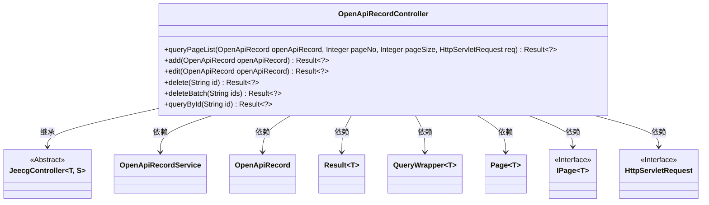
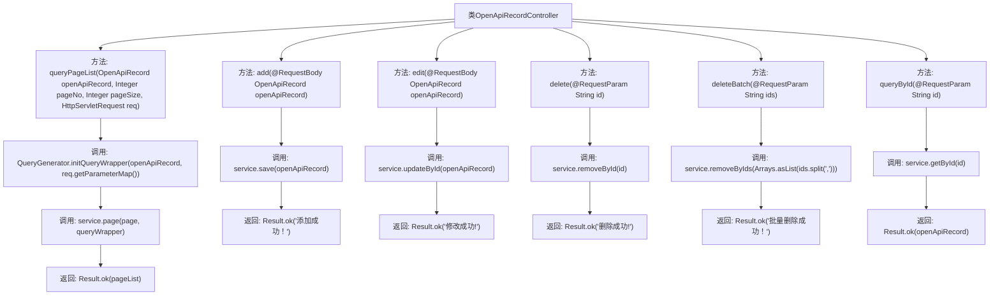

# 基础信息

|      |      |
|------|------|
| 名称 | OpenApiRecordController |
| 编码语言 | .java |
| 代码路径 | JeecgBoot/jeecg-boot/jeecg-module-system/jeecg-system-biz/src/main/java/org/jeecg/modules/openapi/controller/OpenApiRecordController.java |
| 包名 | org.jeecg.modules.openapi.controller |
| 依赖项 | ['com.baomidou.mybatisplus.core.conditions.query.QueryWrapper', 'com.baomidou.mybatisplus.core.metadata.IPage', 'com.baomidou.mybatisplus.extension.plugins.pagination.Page', 'org.jeecg.common.api.vo.Result', 'org.jeecg.common.system.base.controller.JeecgController', 'org.jeecg.common.system.query.QueryGenerator', 'org.jeecg.modules.openapi.entity.OpenApiRecord', 'org.jeecg.modules.openapi.service.OpenApiRecordService', 'org.springframework.web.bind.annotation', 'javax.servlet.http.HttpServletRequest', 'java.util.Arrays'] |
| 概述说明 | OpenApiRecordController支持分页查询、增删改及批量删除操作。 |

# 说明

OpenApiRecordController提供了全面的记录管理功能，包括分页查询、添加、编辑、删除以及批量删除操作。这些功能使得用户能够高效地管理和操作记录数据，满足多样化的业务需求。

# 类列表 Class Summary

| 名称   | 类型  | 说明 |
|-------|------|-------------|
| OpenApiRecordController | class | OpenApiRecordController提供分页查询、添加、编辑、删除及批量删除功能。 |

## 类 OpenApiRecordController

|      |      |
|------|------|
| 访问范围 | @RestController;@RequestMapping("/openapi/record");public |
| 类型 | class |
| 名称 | OpenApiRecordController |
| 说明 | OpenApiRecordController提供分页查询、添加、编辑、删除及批量删除功能。 |

### UML类图

### 描述
`OpenApiRecordController` 是一个基于 Spring Boot 的 REST 控制器，继承自 `JeecgController`，用于处理与 `OpenApiRecord` 相关的 CRUD 操作。它提供了分页查询、添加、编辑、删除、批量删除和通过 ID 查询的功能。控制器依赖于 `OpenApiRecordService` 来执行具体的业务逻辑，并使用 `Result` 类来包装返回结果。此外，它还使用了 `QueryWrapper`、`Page` 和 `IPage` 等类来处理分页查询和条件过滤。

### 内部方法调用关系图

这段代码定义了一个名为 `OpenApiRecordController` 的 REST 控制器，提供了分页查询、添加、编辑、删除、批量删除和通过 ID 查询的功能。每个方法通过调用不同的服务层方法来完成相应的操作，并返回包含操作结果的 `Result` 对象。流程图中清晰地展示了每个方法的调用链和返回结果，帮助理解代码的执行流程。

### 字段列表 Field List

| 名称  | 类型  | 说明 |
|-------|-------|------|

### 方法列表 Method List

| 名称  | 类型  | 说明 |
|-------|-------|------|
| queryById | Result<?> | 通过ID查询OpenApi记录并返回结果。 |
| queryPageList | Result<?> | GET请求查询分页列表，默认页码1，每页10条，返回分页结果。 |
| delete | Result<?> | 删除接口，根据ID删除数据并返回成功信息。 |
| edit | Result<?> | 编辑接口，更新OpenApiRecord并返回成功信息。 |
| add | Result<?> | 通过POST请求添加OpenApi记录并返回成功结果。 |
| deleteBatch | Result<?> | 批量删除接口，接收ID列表并删除对应数据，返回成功信息。 |

