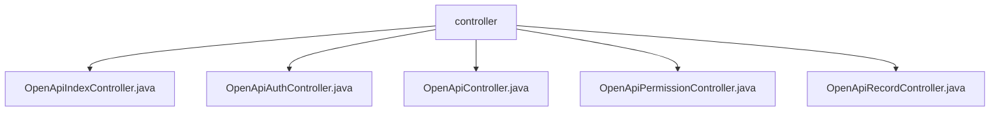

# 基础信息

|      |      |
|------|------|
| 名称 | controller |
| 编码语言 | .java |
| 代码路径 | JeecgBoot/jeecg-boot/jeecg-module-system/jeecg-system-biz/src/main/java/org/jeecg/modules/openapi/controller |
| 包名 | JeecgBoot.jeecg-boot.jeecg-module-system.jeecg-system-biz.src.main.java.org.jeecg.modules.openapi.controller |
| 概述说明 | OpenApi控制器类实现增删改查、权限管理、记录操作及AKSK生成等功能。 |

# 说明

## 概述

该代码模块是一个基于JeecgBoot框架的系统模块，主要负责处理与OpenAPI相关的业务逻辑。模块中包含多个控制器类，分别负责不同的功能，如基本API展示、权限管理、记录管理、接口调用等。这些控制器通过提供RESTful接口，实现了数据的增删改查、批量操作、权限管理、AKSK生成等功能，确保了系统的灵活性和可扩展性。同时，模块还集成了Swagger模型生成功能，便于API文档的自动生成和管理。

## 主要业务场景

1. **API展示与测试**：通过`OpenApiIndexController`提供的基本接口，展示“Hello World”字符串，通常用于API的测试或演示目的。
2. **权限管理**：`OpenApiAuthController`和`OpenApiPermissionController`负责权限的添加、查询、编辑、删除等操作，确保系统中的权限数据能够准确存储和及时反馈。
3. **记录管理**：`OpenApiRecordController`提供了记录的分页查询、添加、编辑、删除及批量删除功能，满足用户对记录数据的高效管理需求。
4. **接口调用与数据操作**：`OpenApiController`支持接口调用、数据的分页查询、添加、编辑、删除等操作，同时集成了Swagger模型生成功能，便于API文档的自动生成和管理。
5. **AKSK生成**：`OpenApiAuthController`还提供了生成AKSK的能力，确保系统的安全性和灵活性。

通过这些业务场景，该模块能够满足多样化的业务需求，提供高效、灵活的系统功能支持。

### 包内部结构视图

该流程图展示了在`controller`文件夹下的五个Java文件：`OpenApiIndexController.java`、`OpenApiAuthController.java`、`OpenApiController.java`、`OpenApiPermissionController.java`和`OpenApiRecordController.java`。这些文件都位于同一个目录下，且没有进一步的子目录层级，所有文件直接隶属于`controller`文件夹。

# 文件列表 File List

| 名称   | 类型  | 说明 |
|-------|------|-------------|
| [OpenApiAuthController.java](OpenApiAuthController.md) | file | OpenApiAuthController实现分页查询、增删改查、批量删除及生成AKSK功能。 |
| [OpenApiRecordController.java](OpenApiRecordController.md) | file | OpenApiRecordController支持分页查询、增删改及批量删除操作。 |
| [OpenApiPermissionController.java](OpenApiPermissionController.md) | file | OpenApiPermissionController类处理权限添加请求并保存数据。 |
| [OpenApiController.java](OpenApiController.md) | file | OpenApiController支持分页查询、增删改及接口调用，具备批量操作和Swagger模型生成功能。 |
| [OpenApiIndexController.java](OpenApiIndexController.md) | file | OpenApiIndexController提供/index接口，返回Hello World。 |

