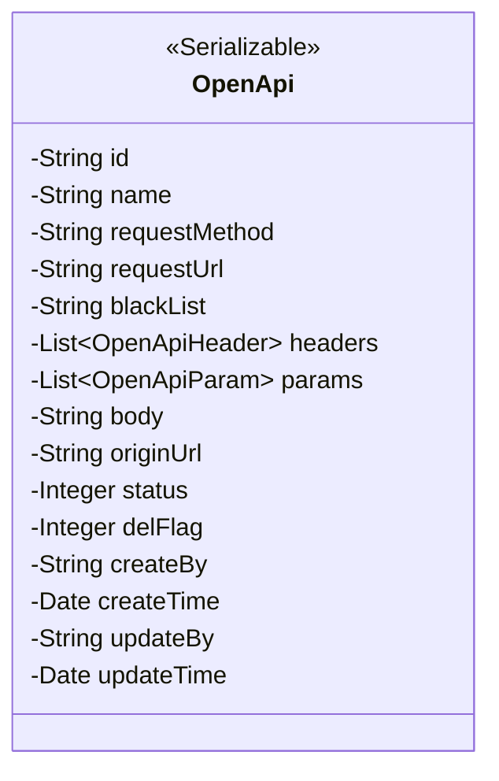

# 基础信息

|      |      |
|------|------|
| 名称 | OpenApi |
| 编码语言 | .java |
| 代码路径 | JeecgBoot/jeecg-boot/jeecg-module-system/jeecg-system-biz/src/main/java/org/jeecg/modules/openapi/entity/OpenApi.java |
| 包名 | org.jeecg.modules.openapi.entity |
| 依赖项 | ['com.baomidou.mybatisplus.annotation.IdType', 'com.baomidou.mybatisplus.annotation.TableField', 'com.baomidou.mybatisplus.annotation.TableId', 'com.baomidou.mybatisplus.annotation.TableLogic', 'lombok.Data', 'lombok.EqualsAndHashCode', 'lombok.experimental.Accessors', 'java.io.Serializable', 'java.util.Date', 'java.util.List'] |
| 概述说明 | OpenApi类实现序列化，包含ID、名称、请求方式、路径、黑名单、请求头、参数和状态字段。 |

# 说明

OpenApi类实现了序列化功能，包含多个关键字段：接口ID用于唯一标识，名称描述接口用途，请求方式指定HTTP方法，路径定义访问地址，黑名单用于限制访问，请求头包含HTTP头信息，参数存储请求数据，状态记录接口当前状态。这些字段共同确保接口的完整性和可管理性。

# 类列表 Class Summary

| 名称   | 类型  | 说明 |
|-------|------|-------------|
| OpenApi | class | OpenApi类实现序列化，包含接口ID、名称、请求方式、路径、黑名单、请求头、参数、状态等字段。 |

## 类 OpenApi

|      |      |
|------|------|
| 访问范围 | @Data;@EqualsAndHashCode(callSuper = false);@Accessors(chain = true);public |
| 类型 | class |
| 名称 | OpenApi |
| 说明 | OpenApi类实现序列化，包含接口ID、名称、请求方式、路径、黑名单、请求头、参数、状态等字段。 |

### UML类图

**描述**：`OpenApi`类实现了`Serializable`接口，用于表示开放的API接口信息。类中包含多个私有字段，如接口ID、名称、请求方式、请求路径、IP黑名单、请求头列表、请求参数列表、请求体、原始路径、状态、删除标志、创建人、创建时间、更新人和更新时间。这些字段用于描述API接口的详细信息和状态，支持序列化操作。

### 内部方法调用关系图

```mermaid
graph TD
    A["类OpenApi"]
    B["属性: String id"]
    C["属性: String name"]
    D["属性: String requestMethod"]
    E["属性: String requestUrl"]
    F["属性: String blackList"]
    G["属性: List<OpenApiHeader> headers"]
    H["属性: List<OpenApiParam> params"]
    I["属性: String body"]
    J["属性: String originUrl"]
    K["属性: Integer status"]
    L["属性: Integer delFlag"]
    M["属性: String createBy"]
    N["属性: Date createTime"]
    O["属性: String updateBy"]
    P["属性: Date updateTime"]

    A --> B
    A --> C
    A --> D
    A --> E
    A --> F
    A --> G
    A --> H
    A --> I
    A --> J
    A --> K
    A --> L
    A --> M
    A --> N
    A --> O
    A --> P
```

这段代码定义了一个名为 `OpenApi` 的类，该类实现了 `Serializable` 接口，用于表示开放的API接口信息。类中包含多个属性，如接口的唯一标识 `id`、接口名称 `name`、请求方式 `requestMethod`、请求路径 `requestUrl` 等。此外，还包括了一些与接口状态、创建和更新相关的属性，如 `status`、`delFlag`、`createBy`、`createTime` 等。这些属性共同描述了API接口的详细信息及其生命周期状态。

### 字段列表 Field List

| 名称  | 类型  | 说明 |
|-------|-------|------|
| serialVersionUID = 1L | long | 声明序列化版本UID为1L。 |
| blackList | String | 私有字符串变量blackList。 |
| requestUrl | String | 定义了一个私有字符串变量requestUrl。 |
| name | String | 定义了一个私有的字符串类型变量name。 |
| originUrl | String | 定义私有字符串变量originUrl。 |
| body | String | 定义了一个私有字符串变量body。 |
| updateTime | Date | 私有日期类型变量updateTime。 |
| updateBy | String | 私有字符串变量updateBy用于记录更新者信息。 |
| status | Integer | 私有整型变量status用于存储状态信息。 |
| createTime | Date | 创建时间字段为私有日期类型。 |
| params | List<OpenApiParam> | 实体类中忽略数据库映射的OpenApiParam列表字段。 |
| createBy | String | 定义私有字符串变量createBy。 |
| id | String | 表主键采用ASSIGN_ID类型，类型为String。 |
| requestMethod | String | 定义了一个私有字符串变量requestMethod。 |
| delFlag | Integer | 使用@TableLogic注解标记delFlag字段为逻辑删除标识。 |
| headers | List<OpenApiHeader> | 未持久化的OpenApiHeader列表字段。 |

### 方法列表 Method List

| 名称  | 类型  | 说明 |
|-------|-------|------|

