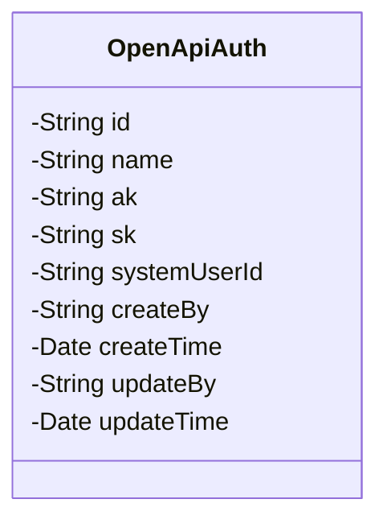
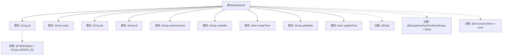

# 基础信息

|      |      |
|------|------|
| 名称 | OpenApiAuth |
| 编码语言 | .java |
| 代码路径 | JeecgBoot/jeecg-boot/jeecg-module-system/jeecg-system-biz/src/main/java/org/jeecg/modules/openapi/entity/OpenApiAuth.java |
| 包名 | org.jeecg.modules.openapi.entity |
| 依赖项 | ['com.baomidou.mybatisplus.annotation.IdType', 'com.baomidou.mybatisplus.annotation.TableId', 'lombok.Data', 'lombok.EqualsAndHashCode', 'lombok.experimental.Accessors', 'java.io.Serializable', 'java.util.Date'] |
| 概述说明 | OpenApiAuth类含ID、名称、密钥、用户ID及时间戳字段。 |

# 说明

OpenApiAuth类是一个包含多个关键字段的数据结构，用于管理和存储与API认证相关的信息。该类的主要字段包括ID，用于唯一标识每个认证实例；名称，用于描述或标识该认证的具体用途或来源；密钥，用于安全验证和授权；用户ID，用于关联特定用户或系统；以及时间戳，用于记录认证信息的创建或更新时间。这些字段共同构成了OpenApiAuth类的基础，确保API认证过程的安全性和可追溯性。

# 类列表 Class Summary

| 名称   | 类型  | 说明 |
|-------|------|-------------|
| OpenApiAuth | class | OpenApiAuth类包含ID、名称、密钥、用户ID及时间戳等字段。 |

## 类 OpenApiAuth

|      |      |
|------|------|
| 访问范围 | @Data;@EqualsAndHashCode(callSuper = false);@Accessors(chain = true);public |
| 类型 | class |
| 名称 | OpenApiAuth |
| 说明 | OpenApiAuth类包含ID、名称、密钥、用户ID及时间戳等字段。 |

### UML类图

**描述：**  
`OpenApiAuth` 类是一个用于表示开放API授权信息的实体类，实现了 `Serializable` 接口以确保对象可序列化。该类包含多个私有字段，如 `id`、`name`、`ak`、`sk` 等，分别用于存储授权ID、授权名称、访问密钥、秘密密钥等信息。此外，还包含创建和更新的时间及操作人信息，用于记录授权信息的创建和更新历史。

### 内部方法调用关系图

这段代码定义了一个名为`OpenApiAuth`的类，该类实现了`Serializable`接口，用于序列化对象。类中包含多个属性，如`id`、`name`、`ak`、`sk`等，分别用于存储不同的授权信息。类上使用了`@Data`、`@EqualsAndHashCode`和`@Accessors`注解，分别用于自动生成getter、setter、equals、hashCode方法以及支持链式调用。`id`属性上使用了`@TableId`注解，指定了该字段为主键，并采用`IdType.ASSIGN_ID`策略生成ID。

### 字段列表 Field List

| 名称  | 类型  | 说明 |
|-------|-------|------|
| id | String | 表主键使用自定义ID生成策略。 |
| systemUserId | String | 系统用户ID的私有字符串变量。 |
| updateTime | Date | 私有日期类型变量updateTime。 |
| createTime | Date | 私有日期类型变量createTime。 |
| createBy | String | 私有字符串变量createBy的声明。 |
| serialVersionUID = -5933153354153738498L | long | 定义了一个私有的静态常量serialVersionUID。 |
| updateBy | String | 私有字符串变量updateBy用于记录更新者信息。 |
| sk | String | 定义了一个私有字符串变量sk。 |
| ak | String | 声明一个私有字符串变量ak。 |
| name | String | 定义了一个私有字符串变量name。 |

### 方法列表 Method List

| 名称  | 类型  | 说明 |
|-------|-------|------|

