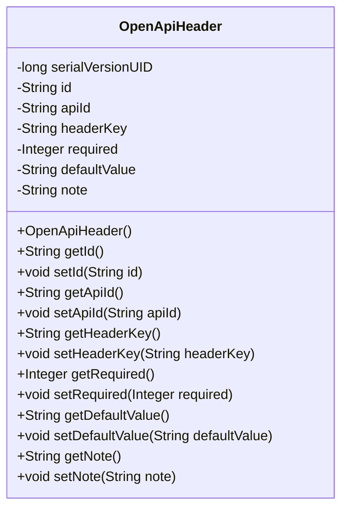
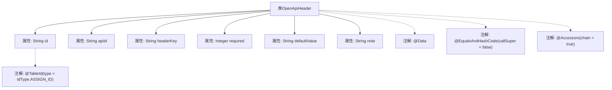

# 基础信息

|      |      |
|------|------|
| 名称 | OpenApiHeader |
| 编码语言 | .java |
| 代码路径 | JeecgBoot/jeecg-boot/jeecg-module-system/jeecg-system-biz/src/main/java/org/jeecg/modules/openapi/entity/OpenApiHeader.java |
| 包名 | org.jeecg.modules.openapi.entity |
| 依赖项 | ['com.baomidou.mybatisplus.annotation.IdType', 'com.baomidou.mybatisplus.annotation.TableId', 'lombok.Data', 'lombok.EqualsAndHashCode', 'lombok.experimental.Accessors', 'java.io.Serializable'] |
| 概述说明 | OpenApiHeader类包含ID、接口ID、键、必填标志、默认值和说明字段。 |

# 说明

OpenApiHeader类定义了六个主要字段，分别是ID、接口ID、键、必填标志、默认值和说明。ID用于唯一标识该头信息，接口ID关联到特定的接口，键表示头信息的名称，必填标志指示该头信息是否为必填项，默认值提供头信息的默认内容，说明字段则用于描述该头信息的具体用途或含义。这些字段共同构成了OpenApiHeader类的完整结构，用于管理和描述API请求或响应中的头信息。

# 类列表 Class Summary

| 名称   | 类型  | 说明 |
|-------|------|-------------|
| OpenApiHeader | class | OpenApiHeader类包含ID、接口ID、键、必填标志、默认值和说明字段。 |

## 类 OpenApiHeader

|      |      |
|------|------|
| 访问范围 | @Data;@EqualsAndHashCode(callSuper = false);@Accessors(chain = true);public |
| 类型 | class |
| 名称 | OpenApiHeader |
| 说明 | OpenApiHeader类包含ID、接口ID、键、必填标志、默认值和说明字段。 |

### UML类图

**描述：**
`OpenApiHeader` 类是一个实现了 `Serializable` 接口的 Java 类，用于表示开放 API 的头部信息。该类包含多个私有字段，如 `id`、`apiId`、`headerKey`、`required`、`defaultValue` 和 `note`，分别用于存储头部信息的唯一标识、接口 ID、键、是否必填、默认值和说明。类中提供了这些字段的 getter 和 setter 方法，以便外部代码可以访问和修改这些字段的值。

### 内部方法调用关系图

该流程图展示了`OpenApiHeader`类的结构，包括其属性和使用的注解。类包含多个属性，如`id`、`apiId`、`headerKey`等，并且使用了多个注解，如`@Data`、`@EqualsAndHashCode`和`@Accessors`，用于自动生成getter、setter、equals、hashCode等方法。`id`属性还特别使用了`@TableId`注解，指定了其生成策略。这些注解和属性共同构成了一个用于处理OpenAPI头信息的类。

### 字段列表 Field List

| 名称  | 类型  | 说明 |
|-------|-------|------|
| headerKey | String | 私有字符串变量headerKey声明。 |
| note | String | 私有字符串类型变量note。 |
| serialVersionUID = 5032708503120184683L | long | 定义静态常量serialVersionUID，值为5032708503120184683L。 |
| required | Integer | 私有整型变量，必填项。 |
| id | String | 表ID字段使用ASSIGN_ID类型生成。 |
| apiId | String | 定义了一个私有字符串变量apiId。 |
| defaultValue | String | 定义私有字符串变量defaultValue。 |

### 方法列表 Method List

| 名称  | 类型  | 说明 |
|-------|-------|------|

