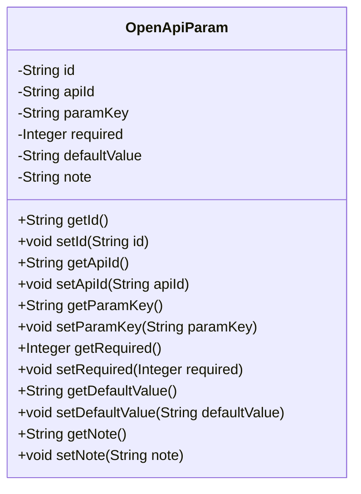
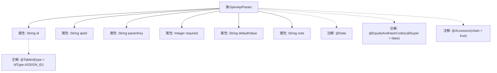

# 基础信息

|      |      |
|------|------|
| 名称 | OpenApiParam |
| 编码语言 | .java |
| 代码路径 | JeecgBoot/jeecg-boot/jeecg-module-system/jeecg-system-biz/src/main/java/org/jeecg/modules/openapi/entity/OpenApiParam.java |
| 包名 | org.jeecg.modules.openapi.entity |
| 依赖项 | ['com.baomidou.mybatisplus.annotation.IdType', 'com.baomidou.mybatisplus.annotation.TableId', 'lombok.Data', 'lombok.EqualsAndHashCode', 'lombok.experimental.Accessors', 'java.io.Serializable'] |
| 概述说明 | OpenApiParam类包含id、apiId、paramKey、required、defaultValue和note字段。 |

# 说明

OpenApiParam类是一个用于定义API参数的类，包含多个关键字段。这些字段包括id，用于唯一标识参数；apiId，表示该参数所属的API；paramKey，指定参数的键名；required，指示该参数是否为必填项；defaultValue，提供参数的默认值；note，用于记录与参数相关的备注或说明信息。通过这些字段，OpenApiParam类能够全面描述API参数的各种属性和配置。

# 类列表 Class Summary

| 名称   | 类型  | 说明 |
|-------|------|-------------|
| OpenApiParam | class | OpenApiParam类包含id、apiId、paramKey、required、defaultValue和note字段。 |

## 类 OpenApiParam

|      |      |
|------|------|
| 访问范围 | @Data;@EqualsAndHashCode(callSuper = false);@Accessors(chain = true);public |
| 类型 | class |
| 名称 | OpenApiParam |
| 说明 | OpenApiParam类包含id、apiId、paramKey、required、defaultValue和note字段。 |

### UML类图

**描述：**  
`OpenApiParam` 类是一个用于表示开放API参数的实体类，实现了 `Serializable` 接口以确保其对象可以被序列化。类中包含多个私有字段，如 `id`、`apiId`、`paramKey`、`required`、`defaultValue` 和 `note`，分别用于存储参数的唯一标识、接口ID、参数键、是否必填、默认值和说明信息。每个字段都有对应的 `getter` 和 `setter` 方法，以便外部代码可以访问和修改这些字段的值。该类通过注解 `@Data` 自动生成了一些常用方法，如 `toString`、`equals` 和 `hashCode`，简化了代码的编写。

### 内部方法调用关系图

这段代码定义了一个名为`OpenApiParam`的Java类，该类实现了`Serializable`接口，用于序列化对象。类中包含多个属性，如`id`、`apiId`、`paramKey`等，分别用于存储接口参数的相关信息。类上使用了多个注解，如`@Data`、`@EqualsAndHashCode`和`@Accessors`，这些注解来自Lombok库，用于自动生成getter、setter、equals、hashCode等方法，并支持链式调用。`id`属性上使用了`@TableId`注解，指定了主键生成策略。

### 字段列表 Field List

| 名称  | 类型  | 说明 |
|-------|-------|------|
| serialVersionUID = -6174831468578022357L | long | 定义了一个私有的静态长整型常量serialVersionUID。 |
| note | String | 定义了一个私有字符串变量note。 |
| required | Integer | 定义了一个私有的整型变量required。 |
| id | String | 使用ASSIGN_ID类型定义表主键ID字段。 |
| apiId | String | 定义私有字符串变量apiId。 |
| defaultValue | String | 定义了一个私有字符串变量defaultValue。 |
| paramKey | String | 定义了一个私有字符串变量paramKey。 |

### 方法列表 Method List

| 名称  | 类型  | 说明 |
|-------|-------|------|

