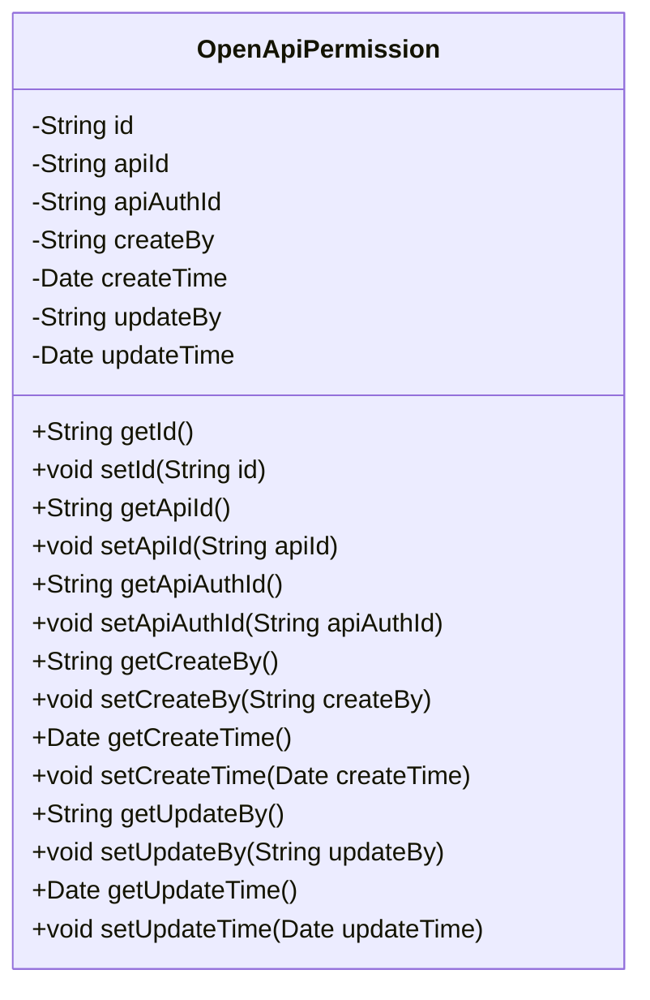
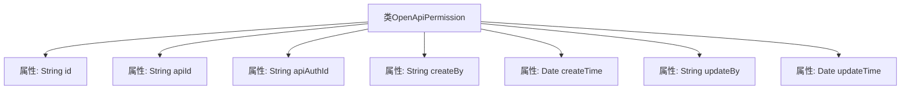

# 基础信息

|      |      |
|------|------|
| 名称 | OpenApiPermission |
| 编码语言 | .java |
| 代码路径 | JeecgBoot/jeecg-boot/jeecg-module-system/jeecg-system-biz/src/main/java/org/jeecg/modules/openapi/entity/OpenApiPermission.java |
| 包名 | org.jeecg.modules.openapi.entity |
| 依赖项 | ['com.baomidou.mybatisplus.annotation.IdType', 'com.baomidou.mybatisplus.annotation.TableId', 'lombok.Data', 'lombok.EqualsAndHashCode', 'lombok.experimental.Accessors', 'java.io.Serializable', 'java.util.Date'] |
| 概述说明 | OpenApiPermission类含ID、接口ID、认证ID等字段及创建、更新时间信息。 |

# 说明

OpenApiPermission类包含七个关键字段：ID用于唯一标识权限，接口ID关联特定接口，认证ID用于认证相关操作，创建人记录权限的创建者，创建时间记录权限的创建时间，更新人记录最后一次修改权限的用户，更新时间记录权限的最后修改时间。这些字段共同构成了权限管理的基础信息。

# 类列表 Class Summary

| 名称   | 类型  | 说明 |
|-------|------|-------------|
| OpenApiPermission | class | OpenApiPermission类包含ID、接口ID、认证ID、创建人、创建时间、更新人和更新时间字段。 |

## 类 OpenApiPermission

|      |      |
|------|------|
| 访问范围 | @Data;@EqualsAndHashCode(callSuper = false);@Accessors(chain = true);public |
| 类型 | class |
| 名称 | OpenApiPermission |
| 说明 | OpenApiPermission类包含ID、接口ID、认证ID、创建人、创建时间、更新人和更新时间字段。 |

### UML类图

**描述：**
`OpenApiPermission` 类是一个用于表示开放API权限的实体类，包含多个私有字段，如 `id`、`apiId`、`apiAuthId` 等，分别用于存储权限的唯一标识、接口ID、认证ID等信息。类中还提供了对应的公有getter和setter方法，用于访问和修改这些字段的值。该类实现了 `Serializable` 接口，表明其实例可以被序列化。

### 内部方法调用关系图

该流程图展示了`OpenApiPermission`类的结构，包括其所有属性。`OpenApiPermission`类是一个实现了`Serializable`接口的实体类，主要用于存储API权限的相关信息。类中包含多个属性，如`id`、`apiId`、`apiAuthId`等，分别用于标识不同的权限信息。该图清晰地展示了类与属性之间的关系，便于理解类的内部结构。

### 字段列表 Field List

| 名称  | 类型  | 说明 |
|-------|-------|------|
| id | String | 表ID字段使用指定ID类型生成。 |
| apiId | String | 定义私有字符串变量apiId。 |
| createTime | Date | 定义私有日期类型变量createTime。 |
| updateTime | Date | 私有日期类型变量updateTime。 |
| updateBy | String | 私有字符串变量updateBy用于记录更新者信息。 |
| createBy | String | 私有字符串变量createBy。 |
| apiAuthId | String | 定义私有字符串变量apiAuthId。 |

### 方法列表 Method List

| 名称  | 类型  | 说明 |
|-------|-------|------|

