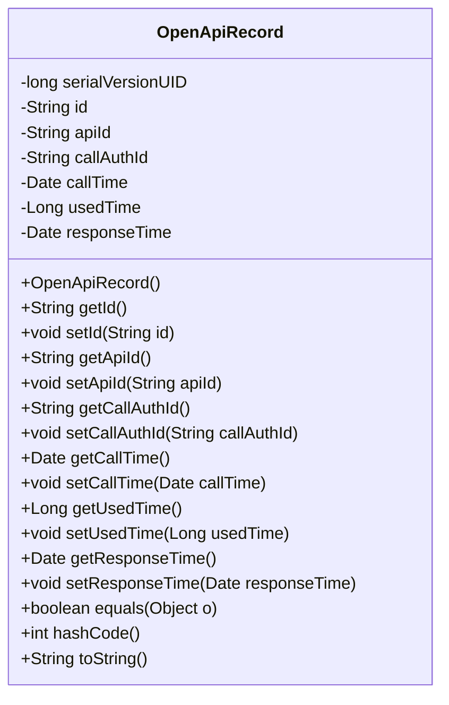
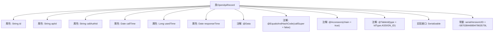

# 基础信息

|      |      |
|------|------|
| 名称 | OpenApiRecord |
| 编码语言 | .java |
| 代码路径 | JeecgBoot/jeecg-boot/jeecg-module-system/jeecg-system-biz/src/main/java/org/jeecg/modules/openapi/entity/OpenApiRecord.java |
| 包名 | org.jeecg.modules.openapi.entity |
| 依赖项 | ['com.baomidou.mybatisplus.annotation.IdType', 'com.baomidou.mybatisplus.annotation.TableId', 'lombok.Data', 'lombok.EqualsAndHashCode', 'lombok.experimental.Accessors', 'java.io.Serializable', 'java.util.Date'] |
| 概述说明 | OpenApiRecord类记录接口ID、调用ID、时间、耗时及响应时间。 |

# 说明

OpenApiRecord类主要包含五个关键字段：接口ID用于标识具体的接口，调用ID用于唯一标识每次调用，调用时间记录调用的具体时间点，耗时表示调用所花费的时间长度，响应时间则指从发起调用到接收到响应的时间间隔。这些字段共同构成了对接口调用过程的全面记录，便于后续分析和优化。

# 类列表 Class Summary

| 名称   | 类型  | 说明 |
|-------|------|-------------|
| OpenApiRecord | class | OpenApiRecord类包含接口ID、调用ID、调用时间、耗时和响应时间等关键字段。 |

## 类 OpenApiRecord

|      |      |
|------|------|
| 访问范围 | @Data;@EqualsAndHashCode(callSuper = false);@Accessors(chain = true);public |
| 类型 | class |
| 名称 | OpenApiRecord |
| 说明 | OpenApiRecord类包含接口ID、调用ID、调用时间、耗时和响应时间等关键字段。 |

### UML类图

**描述：**  
`OpenApiRecord` 类是一个用于记录开放API调用信息的实体类，实现了 `Serializable` 接口以确保对象可序列化。类中包含多个私有字段，如 `id`、`apiId`、`callAuthId` 等，分别用于存储接口的唯一标识、API ID、调用授权ID等信息。类提供了这些字段的getter和setter方法，并重写了 `equals`、`hashCode` 和 `toString` 方法，以支持对象的比较、哈希计算和字符串表示。该类主要用于记录API调用的详细日志信息。

### 内部方法调用关系图

这段代码定义了一个名为 `OpenApiRecord` 的类，该类实现了 `Serializable` 接口，表明其实例可以被序列化。类中包含多个属性，如 `id`、`apiId`、`callAuthId`、`callTime`、`usedTime` 和 `responseTime`，分别用于存储不同的数据。类上使用了 `@Data`、`@EqualsAndHashCode` 和 `@Accessors` 注解，分别用于自动生成 getter/setter 方法、equals 和 hashCode 方法，以及支持链式调用。`id` 属性上使用了 `@TableId` 注解，指定其为主键，并采用 `IdType.ASSIGN_ID` 策略生成。类中还定义了一个 `serialVersionUID` 常量，用于序列化时的版本控制。

### 字段列表 Field List

| 名称  | 类型  | 说明 |
|-------|-------|------|
| serialVersionUID = -5870384488947863579L | long | 定义私有静态长整型序列化版本号。 |
| apiId | String | 定义私有字符串变量apiId。 |
| callTime | Date | 私有日期类型变量callTime。 |
| callAuthId | String | 私有字符串变量callAuthId的声明。 |
| id | String | 表主键使用自定义ID生成策略。 |
| usedTime | Long | 使用时间字段类型为长整型。 |
| responseTime | Date | 响应时间字段声明为私有日期类型。 |

### 方法列表 Method List

| 名称  | 类型  | 说明 |
|-------|-------|------|

