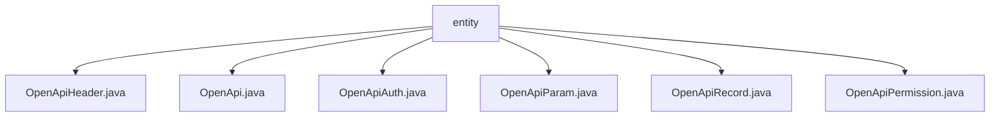

# 基础信息

|      |      |
|------|------|
| 名称 | entity |
| 编码语言 | .java |
| 代码路径 | JeecgBoot/jeecg-boot/jeecg-module-system/jeecg-system-biz/src/main/java/org/jeecg/modules/openapi/entity |
| 包名 | JeecgBoot.jeecg-boot.jeecg-module-system.jeecg-system-biz.src.main.java.org.jeecg.modules.openapi.entity |
| 概述说明 | OpenApi类定义了接口结构，包含ID、名称、请求方式等字段，用于管理API接口。OpenApiHeader类描述头信息，包含ID、键、必填标志等。OpenApiAuth类管理认证信息，包含ID、名称、密钥等。OpenApiParam类定义API参数，包含ID、apiId、paramKey等。OpenApiRecord类记录接口调用，包含接口ID、调用ID、调用时间等。OpenApiPermission类管理权限，包含ID、接口ID、认证ID等。 |

# 说明

## 概述

该代码模块主要围绕OpenAPI的管理和操作展开，涉及API的头信息、参数、认证、调用记录以及权限管理等多个方面。模块中的各个类通过定义关键字段，确保API的完整性、安全性和可管理性。主要类包括`OpenApiHeader`、`OpenApi`、`OpenApiAuth`、`OpenApiParam`、`OpenApiRecord`和`OpenApiPermission`，这些类共同构成了一个完整的API管理系统。

## 主要业务场景

1. **API头信息管理**：
   - 通过`OpenApiHeader`类管理API请求或响应中的头信息，包括头信息的唯一标识、关联的接口ID、头信息名称、是否必填、默认值以及说明等字段，确保头信息的完整性和可配置性。

2. **API接口管理**：
   - `OpenApi`类用于定义和管理API接口的基本信息，包括接口的唯一标识、名称、请求方式、路径、黑名单、请求头、参数以及接口状态等字段，确保接口的可访问性和安全性。

3. **API认证管理**：
   - `OpenApiAuth`类用于存储和管理API认证相关的信息，包括认证的唯一标识、名称、密钥、用户ID以及时间戳等字段，确保API认证过程的安全性和可追溯性。

4. **API参数管理**：
   - `OpenApiParam`类用于定义和管理API参数，包括参数的唯一标识、所属API的ID、参数键名、是否必填、默认值以及备注等字段，确保参数的完整性和可配置性。

5. **API调用记录管理**：
   - `OpenApiRecord`类用于记录API的调用过程，包括接口ID、调用ID、调用时间、耗时以及响应时间等字段，便于后续对接口调用过程进行分析和优化。

6. **API权限管理**：
   - `OpenApiPermission`类用于管理API的访问权限，包括权限的唯一标识、接口ID、认证ID、创建人、创建时间、更新人以及更新时间等字段，确保权限的可控性和可追溯性。

### 包内部结构视图

该流程图展示了`entity`文件夹下的所有文件及其层级关系。`entity`作为根节点，包含了多个Java文件，包括`OpenApiHeader.java`、`OpenApi.java`、`OpenApiAuth.java`、`OpenApiParam.java`、`OpenApiRecord.java`和`OpenApiPermission.java`。这些文件均直接隶属于`entity`文件夹，没有进一步的子目录结构。

# 文件列表 File List

| 名称   | 类型  | 说明 |
|-------|------|-------------|
| [OpenApiPermission.java](OpenApiPermission.md) | file | OpenApiPermission类含ID、接口ID、认证ID等字段及创建、更新时间信息。 |
| [OpenApi.java](OpenApi.md) | file | OpenApi类实现序列化，包含ID、名称、请求方式、路径、黑名单、请求头、参数和状态字段。 |
| [OpenApiRecord.java](OpenApiRecord.md) | file | OpenApiRecord类记录接口ID、调用ID、时间、耗时及响应时间。 |
| [OpenApiParam.java](OpenApiParam.md) | file | OpenApiParam类包含id、apiId、paramKey、required、defaultValue和note字段。 |
| [OpenApiAuth.java](OpenApiAuth.md) | file | OpenApiAuth类含ID、名称、密钥、用户ID及时间戳字段。 |
| [OpenApiHeader.java](OpenApiHeader.md) | file | OpenApiHeader类包含ID、接口ID、键、必填标志、默认值和说明字段。 |

