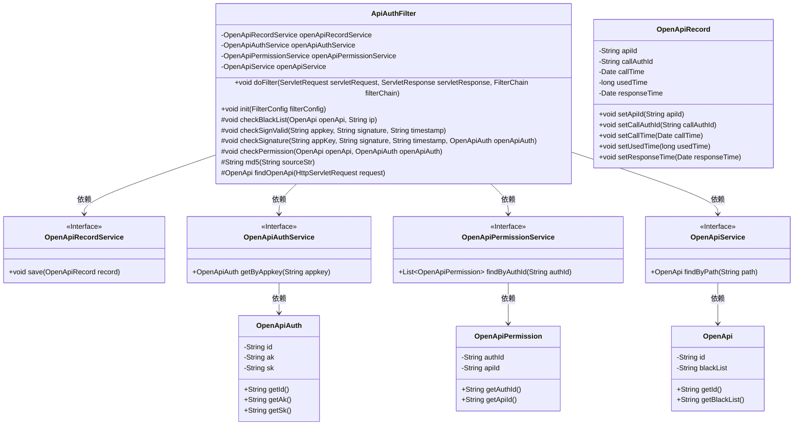
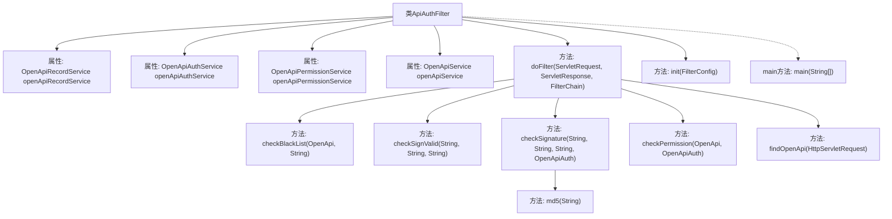
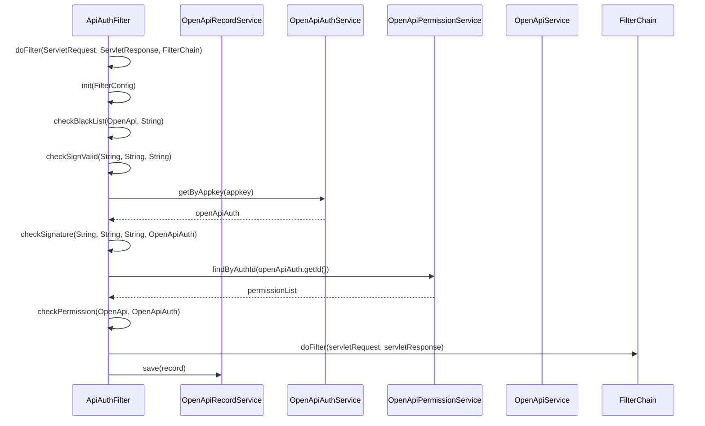

# 基础信息

|      |      |
|------|------|
| 名称 | ApiAuthFilter |
| 编码语言 | .java |
| 代码路径 | JeecgBoot/jeecg-boot/jeecg-module-system/jeecg-system-biz/src/main/java/org/jeecg/modules/openapi/filter/ApiAuthFilter.java |
| 包名 | org.jeecg.modules.openapi.filter |
| 依赖项 | ['lombok.extern.slf4j.Slf4j', 'org.jeecg.common.exception.JeecgBootException', 'org.jeecg.modules.openapi.entity.OpenApi', 'org.jeecg.modules.openapi.entity.OpenApiAuth', 'org.jeecg.modules.openapi.entity.OpenApiPermission', 'org.jeecg.modules.openapi.entity.OpenApiRecord', 'org.jeecg.modules.openapi.service.OpenApiAuthService', 'org.jeecg.modules.openapi.service.OpenApiPermissionService', 'org.jeecg.modules.openapi.service.OpenApiRecordService', 'org.jeecg.modules.openapi.service.OpenApiService', 'org.springframework.util.StringUtils', 'org.springframework.web.context.WebApplicationContext', 'javax.servlet', 'javax.servlet.http.HttpServletRequest', 'java.io.IOException', 'java.security.MessageDigest', 'java.util.Arrays', 'java.util.Date', 'java.util.List'] |
| 概述说明 | ApiAuthFilter实现Filter接口，处理API认证、签名验证、权限检查及调用信息记录。 |

# 说明

ApiAuthFilter实现了Filter接口，主要用于API的认证、签名验证、权限检查以及调用信息的记录。该过滤器确保API请求的安全性，验证用户身份和请求签名的有效性，同时检查用户权限，确保只有授权用户才能访问特定资源。此外，它还记录每次API调用的详细信息，便于后续审计和分析。

# 类列表 Class Summary

| 名称   | 类型  | 说明 |
|-------|------|-------------|
| ApiAuthFilter | class | ApiAuthFilter实现Filter接口，用于API认证、签名验证、权限检查和记录调用信息。 |

## 类 ApiAuthFilter

|      |      |
|------|------|
| 访问范围 | @Slf4j;public |
| 类型 | class |
| 名称 | ApiAuthFilter |
| 说明 | ApiAuthFilter实现Filter接口，用于API认证、签名验证、权限检查和记录调用信息。 |

### UML类图

该代码定义了一个`ApiAuthFilter`类，用于处理API请求的认证和权限校验。它依赖多个服务类，如`OpenApiRecordService`、`OpenApiAuthService`、`OpenApiPermissionService`和`OpenApiService`，分别用于记录API调用、认证信息、权限校验和API路径查找。`ApiAuthFilter`类通过`doFilter`方法处理请求，依次进行IP黑名单校验、签名验证、认证信息核验和权限校验，最终记录API调用信息。

### 内部方法调用关系图

这段代码实现了一个名为 `ApiAuthFilter` 的过滤器类，主要用于处理API请求的认证和授权。代码中包含了多个方法，分别用于初始化过滤器、执行过滤逻辑、检查IP黑名单、验证签名、验证认证信息、检查权限等。流程图展示了类内部的函数调用关系，时序图则详细描述了各个方法之间的调用顺序和数据流动。

### 字段列表 Field List

| 名称  | 类型  | 说明 |
|-------|-------|------|
| openApiAuthService | OpenApiAuthService | 私有OpenApiAuthService实例变量。 |
| openApiRecordService | OpenApiRecordService | 私有变量openApiRecordService实例化。 |
| openApiService | OpenApiService | 声明一个私有OpenApiService实例变量。 |
| openApiPermissionService | OpenApiPermissionService | 私有变量openApiPermissionService用于OpenApi权限服务。 |

### 方法列表 Method List

| 名称  | 类型  | 说明 |
|-------|-------|------|
| checkPermission | void | 检查appKey是否授权访问指定API，未授权则抛出异常。 |
| main | void | Java代码生成时间戳并计算MD5签名。 |
| doFilter | void | 过滤器处理请求，验证IP、签名、认证和权限，记录调用信息。 |
| md5 | String | Java方法生成MD5哈希值，处理异常并返回结果字符串。 |
| checkBlackList | void | 检查IP是否在黑名单中，若在则抛出异常阻止访问。 |
| findOpenApi | OpenApi | 该方法通过请求URI获取路径，并调用服务查找对应的OpenApi。 |
| checkSignature | void | 验证appKey和signature，确保认证信息正确。 |
| init | void | 初始化过滤器，获取上下文并注入相关服务。 |
| checkSignValid | void | 检查appkey、signature、timestamp是否为空或非法，并验证签名是否过期。 |

