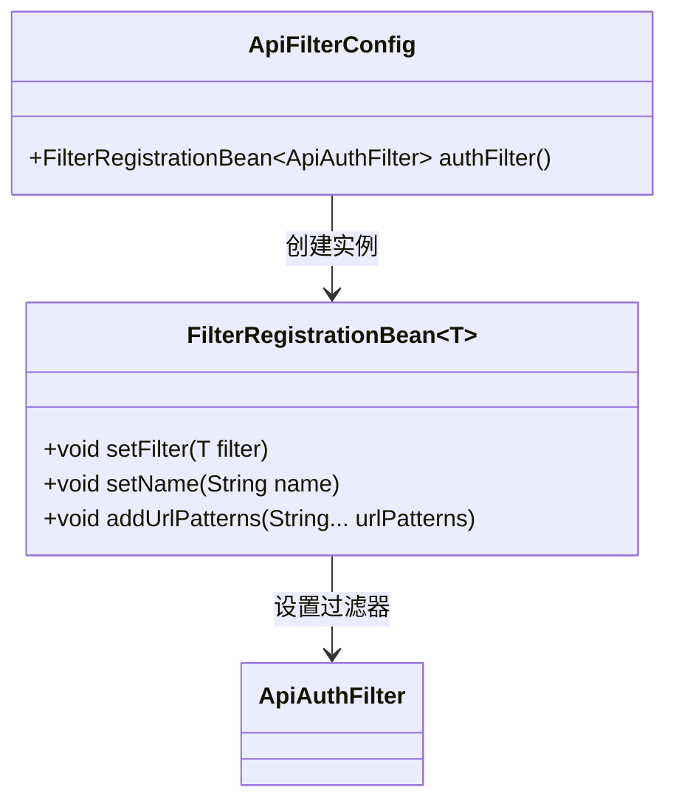
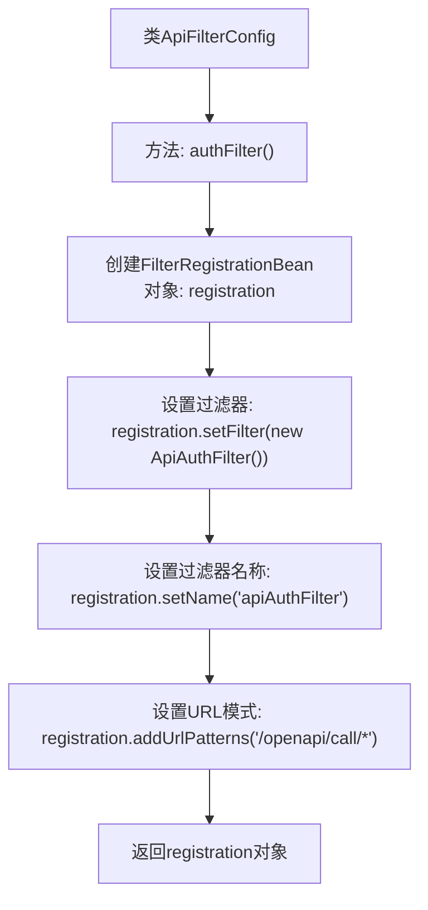

# 基础信息

|      |      |
|------|------|
| 名称 | ApiFilterConfig |
| 编码语言 | .java |
| 代码路径 | JeecgBoot/jeecg-boot/jeecg-module-system/jeecg-system-biz/src/main/java/org/jeecg/modules/openapi/filter/ApiFilterConfig.java |
| 包名 | org.jeecg.modules.openapi.filter |
| 依赖项 | ['org.springframework.boot.web.servlet.FilterRegistrationBean', 'org.springframework.context.annotation.Bean', 'org.springframework.context.annotation.Configuration'] |
| 概述说明 | 注册API加密过滤器，用于/openapi/call/*路径。 |

# 说明

注册API加密过滤器，专门应用于/openapi/call/*路径。该过滤器旨在对通过该路径的API调用进行加密处理，确保数据传输的安全性。通过这一机制，可以有效保护API通信过程中的敏感信息，防止数据泄露和未经授权的访问。该过滤器的应用范围明确，仅针对指定路径的API调用，确保系统其他部分不受影响，同时提供针对性的安全防护。

# 类列表 Class Summary

| 名称   | 类型  | 说明 |
|-------|------|-------------|
| ApiFilterConfig | class | 注册API加密过滤器，应用于/openapi/call/*路径。 |

## 类 ApiFilterConfig

|      |      |
|------|------|
| 访问范围 | @Configuration;public |
| 类型 | class |
| 名称 | ApiFilterConfig |
| 说明 | 注册API加密过滤器，应用于/openapi/call/*路径。 |

### UML类图

**描述：**
`ApiFilterConfig` 类是一个配置类，用于注册 `ApiAuthFilter` 过滤器。它通过 `FilterRegistrationBean` 来配置过滤器的名称和 URL 模式。`FilterRegistrationBean` 是一个泛型类，用于注册和配置过滤器，而 `ApiAuthFilter` 是具体的过滤器实现类。这个配置类的作用是将 `ApiAuthFilter` 过滤器应用到指定的 URL 路径上，确保请求在进入特定路径时经过该过滤器的处理。

### 内部方法调用关系图

这段代码定义了一个名为 `ApiFilterConfig` 的配置类，其中包含一个方法 `authFilter()`。该方法注册了一个名为 `apiAuthFilter` 的过滤器，并将其应用于匹配 `/openapi/call/*` 的URL模式。通过 `FilterRegistrationBean`，过滤器被配置并注册到Spring容器中，确保在请求处理时能够正确应用该过滤器。

### 字段列表 Field List

| 名称  | 类型  | 说明 |
|-------|-------|------|

### 方法列表 Method List

| 名称  | 类型  | 说明 |
|-------|-------|------|
| authFilter | FilterRegistrationBean<ApiAuthFilter> | 注册名为apiAuthFilter的过滤器，应用于/openapi/call/*路径。 |

