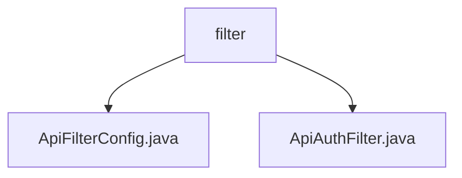

# 基础信息

|      |      |
|------|------|
| 名称 | filter |
| 编码语言 | .java |
| 代码路径 | JeecgBoot/jeecg-boot/jeecg-module-system/jeecg-system-biz/src/main/java/org/jeecg/modules/openapi/filter |
| 包名 | JeecgBoot.jeecg-boot.jeecg-module-system.jeecg-system-biz.src.main.java.org.jeecg.modules.openapi.filter |
| 概述说明 | 注册API加密过滤器保护/openapi/call/*路径数据，ApiAuthFilter实现认证、签名验证、权限检查及调用记录。 |

# 说明

## 概述
该代码模块专注于API的安全性和认证机制，主要包含两个关键过滤器：`ApiFilterConfig`和`ApiAuthFilter`。这些过滤器被设计用于保护API调用的安全性，确保数据传输的加密性、用户身份的有效性、请求签名的合法性以及权限的合规性。通过这两个过滤器的协同工作，模块为指定的API路径提供了全面的安全防护，同时不影响系统的其他部分。

## 主要业务场景
1. **API加密处理**：`ApiFilterConfig`过滤器专门应用于`/openapi/call/*`路径，负责对通过该路径的API调用进行加密处理。这确保了在API通信过程中，敏感信息不会被泄露，防止未经授权的访问和数据篡改。该过滤器的应用范围明确，仅针对指定路径的API调用，确保系统其他部分不受影响。

2. **API认证与权限检查**：`ApiAuthFilter`实现了`Filter`接口，主要用于API的认证、签名验证、权限检查以及调用信息的记录。该过滤器确保API请求的安全性，验证用户身份和请求签名的有效性，同时检查用户权限，确保只有授权用户才能访问特定资源。此外，它还记录每次API调用的详细信息，便于后续审计和分析。

这两个过滤器共同构成了该模块的核心功能，为API调用提供了多层次的安全保障，适用于需要严格保护API通信和用户权限的业务场景。

### 包内部结构视图

该流程图展示了`filter`文件夹下的文件层级关系。`filter`文件夹包含两个文件：`ApiFilterConfig.java`和`ApiAuthFilter.java`。这两个文件均位于`filter`目录下，反映了它们在项目中的组织结构。

# 文件列表 File List

| 名称   | 类型  | 说明 |
|-------|------|-------------|
| [ApiAuthFilter.java](ApiAuthFilter.md) | file | ApiAuthFilter实现Filter接口，处理API认证、签名验证、权限检查及调用信息记录。 |
| [ApiFilterConfig.java](ApiFilterConfig.md) | file | 注册API加密过滤器，用于/openapi/call/*路径。 |

