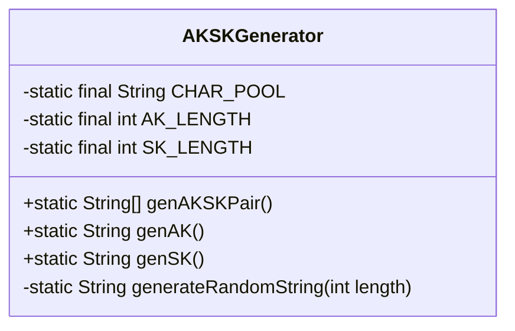
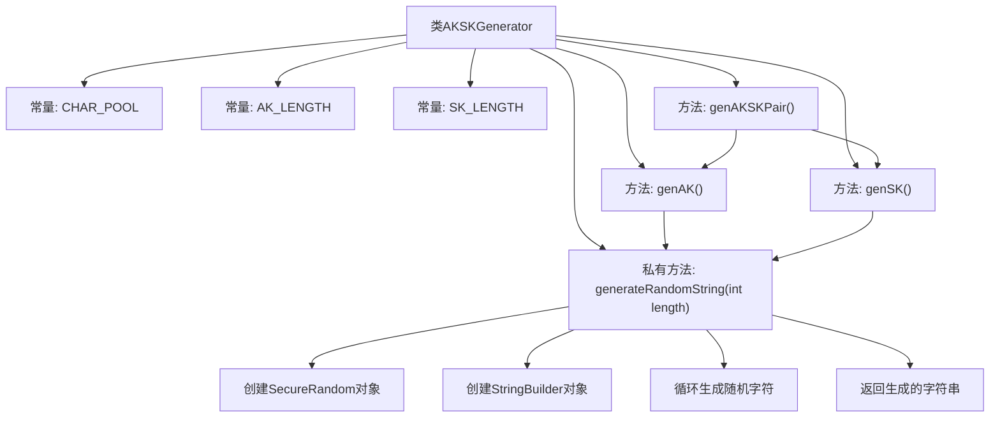

# 基础信息

|      |      |
|------|------|
| 名称 | AKSKGenerator |
| 编码语言 | .java |
| 代码路径 | JeecgBoot/jeecg-boot/jeecg-module-system/jeecg-system-biz/src/main/java/org/jeecg/modules/openapi/generator/AKSKGenerator.java |
| 包名 | org.jeecg.modules.openapi.generator |
| 依赖项 | ['java.security.SecureRandom'] |
| 概述说明 | AKSKGenerator类生成16位AK和32位SK随机字符串对。 |

# 说明

AKSKGenerator类用于生成一对随机字符串，其中AK（Access Key）为16位，SK（Secret Key）为32位。该类的核心功能是生成随机的、安全的字符串对，通常用于身份验证或密钥管理场景。生成的AK和SK具有足够的长度和随机性，以确保其安全性和唯一性。该类的设计旨在满足对密钥生成的高安全性和可靠性需求，适用于需要严格身份验证和密钥管理的应用场景。

# 类列表 Class Summary

| 名称   | 类型  | 说明 |
|-------|------|-------------|
| AKSKGenerator | class | AKSKGenerator类生成16位AK和32位SK随机字符串对。 |

## 类 AKSKGenerator

|      |      |
|------|------|
| 访问范围 | public |
| 类型 | class |
| 名称 | AKSKGenerator |
| 说明 | AKSKGenerator类生成16位AK和32位SK随机字符串对。 |

### UML类图

**描述：**
`AKSKGenerator` 类用于生成随机的 Access Key (AK) 和 Secret Key (SK) 对。类中包含三个公有方法：`genAKSKPair()` 用于生成 AK 和 SK 对，`genAK()` 用于生成单独的 AK，`genSK()` 用于生成单独的 SK。`generateRandomString(int length)` 是一个私有方法，用于生成指定长度的随机字符串。该类通过 `SecureRandom` 确保生成的字符串具有高随机性和安全性。

### 内部方法调用关系图

这段代码定义了一个名为`AKSKGenerator`的类，用于生成随机的AK（Access Key）和SK（Secret Key）对。`genAKSKPair()`方法返回一个包含AK和SK的数组，`genAK()`和`genSK()`分别生成AK和SK。`generateRandomString(int length)`是一个私有方法，用于生成指定长度的随机字符串。代码通过`SecureRandom`和`StringBuilder`实现随机字符串的生成，确保了密钥的随机性和安全性。

### 字段列表 Field List

| 名称  | 类型  | 说明 |
|-------|-------|------|
| CHAR_POOL = "ABCDEFGHIJKLMNOPQRSTUVWXYZabcdefghijklmnopqrstuvwxyz0123456789" | String | 定义包含大小写字母和数字的字符池常量。 |
| SK_LENGTH = 32 | int | 定义长度为32的静态整型常量SK_LENGTH。 |
| AK_LENGTH = 16 | int | 定义了一个长度为16的私有静态整型常量AK_LENGTH。 |

### 方法列表 Method List

| 名称  | 类型  | 说明 |
|-------|-------|------|
| genAKSKPair | String[] | 生成AK和SK对的方法。 |
| generateRandomString | String | 生成指定长度的随机字符串。 |
| genSK | String | 生成随机字符串作为SK。 |
| genAK | String | 生成随机字符串并添加前缀"ak-"的函数。 |

