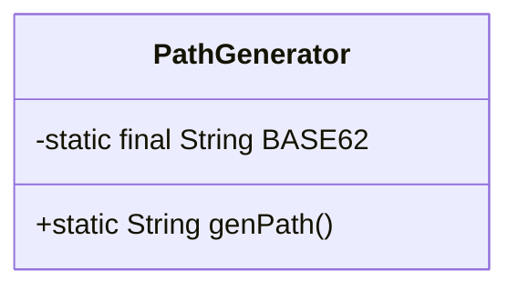
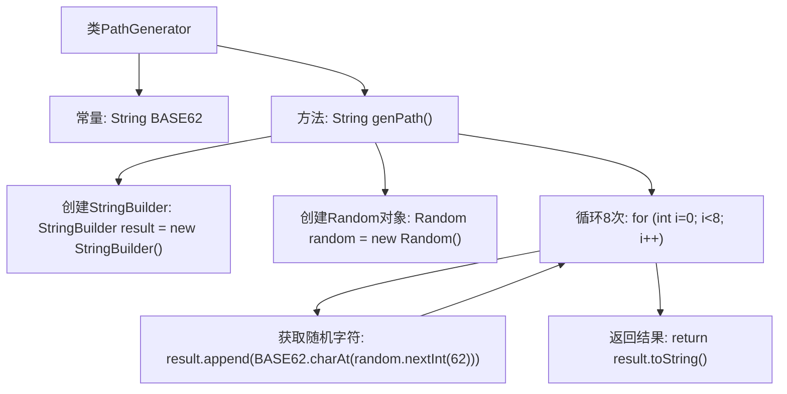

# 基础信息

|      |      |
|------|------|
| 名称 | PathGenerator |
| 编码语言 | .java |
| 代码路径 | JeecgBoot/jeecg-boot/jeecg-module-system/jeecg-system-biz/src/main/java/org/jeecg/modules/openapi/generator/PathGenerator.java |
| 包名 | org.jeecg.modules.openapi.generator |
| 依赖项 | ['lombok.experimental.UtilityClass', 'java.util.Random'] |
| 概述说明 | PathGenerator类生成8位Base62随机字符串。 |

# 说明

PathGenerator类的主要功能是生成一个8位长度的Base62随机路径字符串。Base62编码使用62个字符，包括数字0-9、大写字母A-Z和小写字母a-z，确保生成的字符串具有较高的随机性和唯一性。该类的设计旨在提供一种高效且可靠的方式，生成用于路径标识的随机字符串，适用于需要短且唯一标识符的场景。

# 类列表 Class Summary

| 名称   | 类型  | 说明 |
|-------|------|-------------|
| PathGenerator | class | PathGenerator类生成8位Base62随机路径字符串。 |

## 类 PathGenerator

|      |      |
|------|------|
| 访问范围 | @UtilityClass;public |
| 类型 | class |
| 名称 | PathGenerator |
| 说明 | PathGenerator类生成8位Base62随机路径字符串。 |

### UML类图

这段代码定义了一个名为 `PathGenerator` 的工具类，用于生成随机的路径字符串。该类包含一个私有的静态常量 `BASE62`，用于存储 Base62 字符集。`genPath` 方法是一个公有的静态方法，它使用 `Random` 类生成一个长度为 8 的随机字符串，字符串中的每个字符都来自 `BASE62` 字符集。这个类的主要作用是生成随机的、唯一的路径标识符，通常用于文件路径、URL 路径等场景。

### 内部方法调用关系图

这段代码定义了一个名为`PathGenerator`的类，其中包含一个生成随机路径的静态方法`genPath`。该方法使用`StringBuilder`和`Random`类生成一个由8个随机字符组成的字符串，字符集为Base62（包含大小写字母和数字）。流程图展示了从创建`StringBuilder`和`Random`对象，到循环生成随机字符，最后返回结果的完整过程。

### 字段列表 Field List

| 名称  | 类型  | 说明 |
|-------|-------|------|
| BASE62 = "ABCDEFGHIJKLMNOPQRSTUVWXYZabcdefghijklmnopqrstuvwxyz0123456789" | String | BASE62包含大小写字母和数字的常量字符串。 |

### 方法列表 Method List

| 名称  | 类型  | 说明 |
|-------|-------|------|
| genPath | String | 生成8位随机字符路径的静态方法。 |

