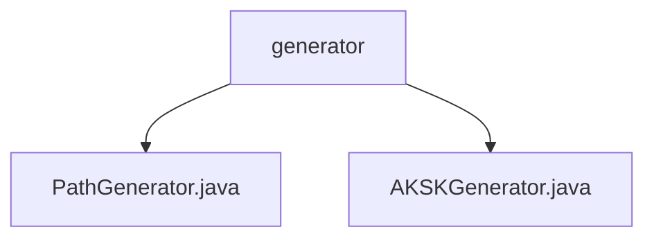

# 基础信息

|      |      |
|------|------|
| 名称 | generator |
| 编码语言 | .java |
| 代码路径 | JeecgBoot/jeecg-boot/jeecg-module-system/jeecg-system-biz/src/main/java/org/jeecg/modules/openapi/generator |
| 包名 | JeecgBoot.jeecg-boot.jeecg-module-system.jeecg-system-biz.src.main.java.org.jeecg.modules.openapi.generator |
| 概述说明 | PathGenerator生成8位Base62随机路径，AKSKGenerator生成16位AK和32位SK随机密钥对。 |

# 说明

## 概述

该代码模块主要包含两个类：`PathGenerator` 和 `AKSKGenerator`，分别用于生成不同类型的随机字符串。`PathGenerator` 类专注于生成8位长度的Base62随机路径字符串，而 `AKSKGenerator` 类则用于生成一对随机的Access Key（AK）和Secret Key（SK）。这两个类都设计用于提供高效、可靠且安全的随机字符串生成功能，适用于需要短且唯一标识符或严格身份验证和密钥管理的场景。

## 主要业务场景

1. **路径标识生成**：`PathGenerator` 类生成的8位Base62随机路径字符串适用于需要短且唯一标识符的场景，例如URL短链、文件路径标识等。Base62编码确保了生成的字符串具有较高的随机性和唯一性，适合在需要高效生成标识符的业务中使用。

2. **身份验证与密钥管理**：`AKSKGenerator` 类生成的16位AK和32位SK对适用于需要严格身份验证和密钥管理的场景，例如API访问控制、密钥分发等。生成的AK和SK具有足够的长度和随机性，确保了其安全性和唯一性，适合在高安全要求的应用中使用。

这两个类的设计都旨在满足对随机字符串生成的高效性、可靠性和安全性需求，适用于多种需要唯一标识符或密钥管理的业务场景。

### 包内部结构视图

该流程图展示了 `generator` 文件夹下的两个文件 `PathGenerator.java` 和 `AKSKGenerator.java` 的层级关系。`generator` 是这两个文件的父目录，文件位于同一层级，清晰地反映了它们的组织结构。

# 文件列表 File List

| 名称   | 类型  | 说明 |
|-------|------|-------------|
| [PathGenerator.java](PathGenerator.md) | file | PathGenerator类生成8位Base62随机字符串。 |
| [AKSKGenerator.java](AKSKGenerator.md) | file | AKSKGenerator类生成16位AK和32位SK随机字符串对。 |

