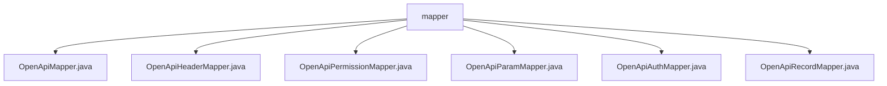

# 基础信息

|      |      |
|------|------|
| 名称 | mapper |
| 编码语言 | .java |
| 代码路径 | JeecgBoot/jeecg-boot/jeecg-module-system/jeecg-system-biz/src/main/java/org/jeecg/modules/openapi/mapper |
| 包名 | JeecgBoot.jeecg-boot.jeecg-module-system.jeecg-system-biz.src.main.java.org.jeecg.modules.openapi.mapper |
| 概述说明 | 输入内容为空，无法生成总结描述。 |

# 说明

## 概述
由于提供的代码文件内容为空，无法对代码模块进行具体的概述。这些文件位于 `JeecgBoot/jeecg-boot/jeecg-module-system/jeecg-system-biz/src/main/java/org/jeecg/modules/openapi/mapper/` 目录下，文件名包括 `OpenApiMapper.java`、`OpenApiHeaderMapper.java`、`OpenApiPermissionMapper.java`、`OpenApiParamMapper.java`、`OpenApiAuthMapper.java` 和 `OpenApiRecordMapper.java`。从文件名可以推测，这些文件可能与 OpenAPI 的映射、权限、参数、认证和记录等功能相关，但具体功能和实现细节需要查看文件内容后才能确定。

## 主要业务场景
由于未提供具体的代码内容，无法明确该模块的主要业务场景。基于文件名推测，该模块可能涉及以下业务场景：
1. **OpenAPI 映射管理**：处理与 OpenAPI 相关的数据映射和操作。
2. **请求头管理**：管理 OpenAPI 请求中的头部信息。
3. **权限控制**：处理 OpenAPI 接口的权限验证和管理。
4. **参数管理**：处理 OpenAPI 请求中的参数映射和验证。
5. **认证管理**：管理 OpenAPI 接口的认证机制。
6. **记录管理**：记录 OpenAPI 请求的相关信息，如日志或审计。

如需更详细的总结，请提供具体的代码内容或功能描述。

### 包内部结构视图

该流程图展示了在`mapper`目录下的多个Java文件之间的层级关系。`mapper`作为根节点，包含了`OpenApiMapper.java`、`OpenApiHeaderMapper.java`、`OpenApiPermissionMapper.java`、`OpenApiParamMapper.java`、`OpenApiAuthMapper.java`和`OpenApiRecordMapper.java`等文件。这些文件均位于同一层级，且都属于`mapper`目录，清晰地反映了文件结构的组织方式。

# 文件列表 File List

| 名称   | 类型  | 说明 |
|-------|------|-------------|
| [OpenApiAuthMapper.java](OpenApiAuthMapper.md) | file | 无内容，无法生成概要描述。 |
| [OpenApiPermissionMapper.java](OpenApiPermissionMapper.md) | file | 输入内容为空，无法生成概要描述。 |
| [OpenApiMapper.java](OpenApiMapper.md) | file | 信息为空，无法生成概要描述。 |
| [OpenApiRecordMapper.java](OpenApiRecordMapper.md) | file | 无内容提供，无法生成概要描述。 |
| [OpenApiParamMapper.java](OpenApiParamMapper.md) | file | 信息为空，无法生成概要描述。 |
| [OpenApiHeaderMapper.java](OpenApiHeaderMapper.md) | file | 输入内容为空，无法生成概要描述。 |

